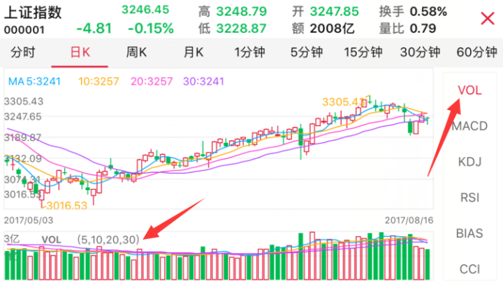
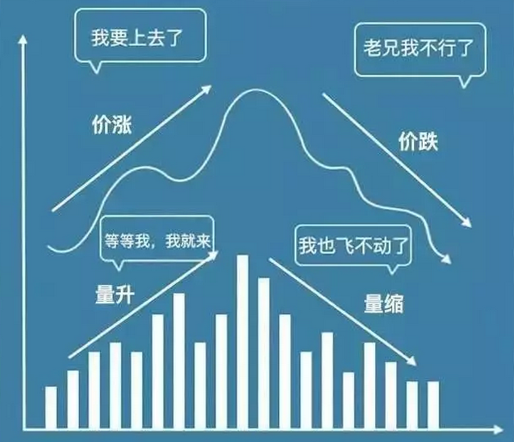
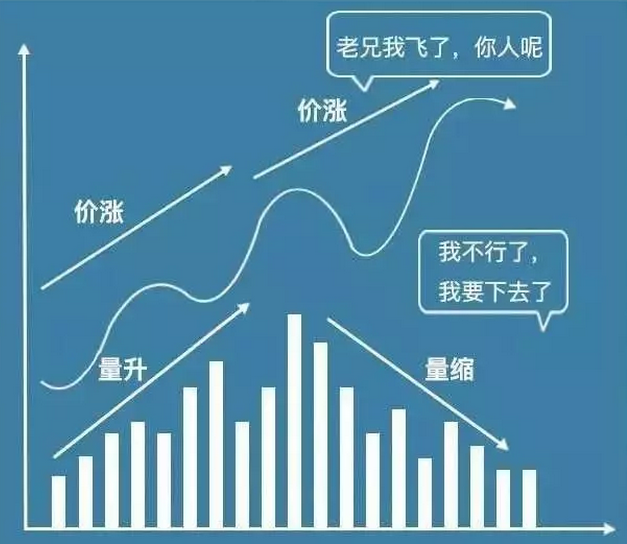
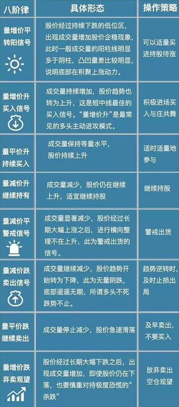

## 成交量

股市中有句老话：“技术指标千千万万，只有成交量才是老老实实的。”可以说，成交量的大小，直接表明了市场上多空双方对市场某一时刻的技术形态最终的认同程度，通常人们说的大盘成交量指的是成交金额，说明市场的活跃度和资金规模。

**股市成交量为股票买卖双方达成交易的数量，是单边的**，例如，某只股票成交量为十万股，这是表示以买卖双方意愿达成的，在计算时成交量是十万股，即：**买方买进了十万股，同时卖方卖出十万股**。而计算交易量则双边计算，例如买方十万股加卖方十万股，计为二十万股。股市成交量反映成交的数量多少。一般可用成交股数和成交金额两项指标来衡量。目前深沪股市两项指标均能显示出来。

**广义的成交量包括成交股数、成交金额、换手率；狭义的也是最常用的是仅指成交股数**。

如一创智富通小智从平安证券今日截的指数K线图，下面的**VOL指标**的红绿条形柱便是代表对应日期的成交量和走势。需注意右边默认的可能为MACD指标哦

股市成交量分为**异常放量、温和放量、温和缩量、异常紧缩等四种概念**。异常放量与温和放量等两种，一般而言是主力与股民介入的态度积极。温和缩量与异常紧缩，一般而言是主力与股民对该股票的态度观望

### 量价关系

一般来说，正常是好基友相亲相爱，也就是我们常能听到的“量增价升“，但一旦闹掰也可能会相恨相杀，从而“量缩价跌”。这两种就是**温和放量与温和缩量**

但是也很可能出现相反的情况：

上面这个情况就是异常放量和异常缩量，也即是量价背离。

### 量价关系规律

如此一来，就能总结出一些技术规律。

#### 量增价平

 所谓“量增价平”，指的是在成交量放大的情况下，股价却投有上涨，股价几乎是维持在一定的价位水平上下波动；或者是大盘在成交量放大的情况下，指数却没有出现上涨，而是在原来的点位上下波动的情况。

 量增价平的原因在于**市场分歧增大**，部分投资者看好后市上涨，而另外部分投资者认为股价已经运行到了顶部。看多的投资者大量买入股票，而看空的投资者则卖出股票，这造成了成交量的增加，但是股价却很难涨上去。一般量增价平持续的时间都不会很长，而且通常是**行情即将转折的信号**，后市很快就会做出选择。

当股价下跌很深，量价关系转为量增价平时，**代表股价有可能在此进行止跌打底的行为**，但是股价不会立即上涨，因此投资人宜待底部形态确立后再伺机介入。**这种量价关系往往是主力开始介入的信号**。除非对这种现象能够分辨，否则仍是等待多头明确的攻击信号。

 而当量增价平出现在多头主升段的中、末期，应持观望态度，因为这种现象往往是走势回调的征兆，操作者应该注意卖出时机，尤其是股价上涨在测量的相对满足点附近，代表卖压己经渐渐转强，行情可能出现止涨，进入盘跌走势。