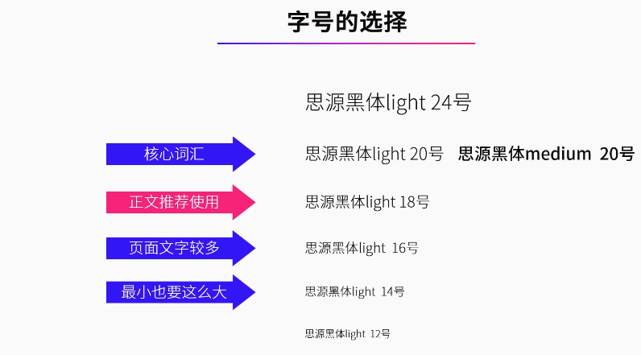
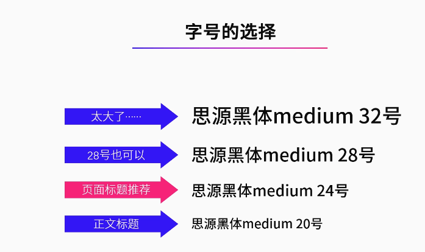
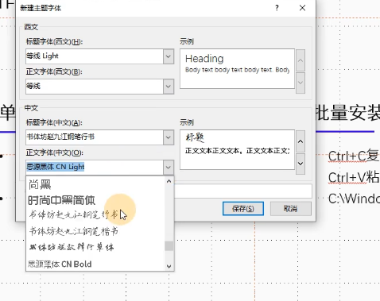

## ppt字号

正文的字体，普遍建议用18号其实。核心词汇可以用20号

对于标题，则推荐可以24号

### 统一文字样式

每一页ppt，不同层级信息的文字样式要是相同的。

### 主题字体

在ppt设计栏里，可以变更各个层级的字体样式，会对整个ppt生效

### 嵌入字体

假如用到了新的ppt 字体，可以在做完ppt以后选择嵌入字体文件。文件->选项->保存->将字体嵌入文件