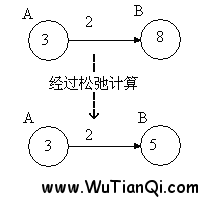

## BellmanFord
Bellman - ford算法是求**含负权图**的单源最短路径的一种算法，效率较低，代码难度较小。其原理为连续进行松弛，在每次松弛时把每条边都更新一下，若在n-1次松弛后还能更新，则说明图中有负环，因此无法得出结果，否则就完成。

Dijkstra算法是处理单源最短路径的有效算法，但它局限于边的权值非负的情况，若图中出现权值为负的边，Dijkstra算法就会失效，求出的最短路径就可能是错的。

给定图G(V, E)（其中V、E分别为图G的顶点集与边集），源点s，数组Distant\[i\]记录从源点s到顶点i的最短路径长度。

**对于每一条边e(u, v)**

如果Distant\[u\] + w(u, v) < Distant\[v\]，则另Distant\[v\] = Distant\[u\]+w(u, v)。w(u, v)为边e(u,v)的权值；

若上述操作没有对Distant进行更新，说明最短路径已经查找完毕，或者部分点不可达，跳出循环。否则执行下次循环

算法描述如下

``` c
for(i = 0; i < |V|; i++)
    for each edge(u, v) ∈  E
        RELAX(u, v)
```

**zwlj:本质上就是对每条边进行松弛操作，然后进行V轮，V是点的数目。**

### 松弛操作
其实所谓的松弛操作就是刚才那条公式，这里给个图一目了然。



Distant\[u\] + w(u, v) < Distant\[v\]，则令Distant\[v\] = Distant\[u\]+w(u, v)。w(u, v)为边e(u,v)的权值；

还要注意distant数组都是以某个点s为源点的最短距离。

### 检验负权回路
BF算法可以用来检验负权回路，负权回路就是整个回路的权值和是负数的回路。

我们在第\[v\]次更新中若没有新的松弛，则输出结果，若依然存在松弛(就是还能更新)，则输出‘CAN'T'表示无解。同时，我们还可以通过“断点”找到负权回路。

### 总结
算法的过程比较简单，就是循环N-1轮(N是点的数目),每一轮都对每条边进行松弛操作(利用松弛公式),如果还没到N-1轮就不能更新了，说明已经更新完毕找出了最短路。

最后，还是要进行第N轮松弛操作，这个目的是为了检验有没有负权回路。如果发现distance数组还能更新，说明存在负权回路，输出错误信息。

找出单源最短路,**复杂度为O(VE)**,如果每一轮松弛操作更新一个二维的distance\[x,y\]数组找出所有点的最短路，那就需要O(V^2E)
