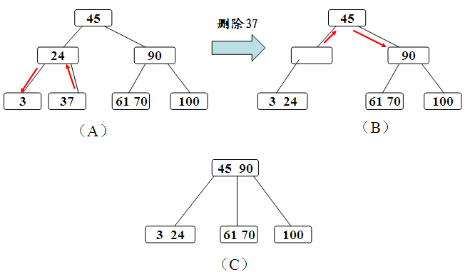

## B树
B树（英语：B-tree）B即Balanced，是一种自平衡的树，能够保持数据有序。概括来说是一个
**一般化的二叉查找树（binary search tree）**，可以拥有多于2个子节点。

**注意b-树就是b树**

但是我们要面对这样一个实际问题，大规模数据存储中，实现索引查询是在这样一个实际背景下的，即树节点存储的元素数量是有限的（如果元素数量非常多的话，查找就退化成节点内部的线性查找了），这样导致二叉查找树结构由于树的深度过大而造成磁盘I/O读写过于频繁，进而导致查询效率低下，那么如何减少树的深度，一个基本的想法就是：**采用多叉树结构**。

在大规模数据存储方面，**大量数据存储在外存磁盘中**，而在外存磁盘中读取/写入块(block)中某数据时，首先需要定位到磁盘中的某块，如何有效地查找磁盘中的数据，需要一种合理高效的外存数据结构，就是下面所要重点阐述的B-tree结构，以及相关的变种结构：B+-tree结构和B*-tree结构

### b-树
**注意b-树就是b树**，-不是减号，是英文里的连字符号。也又可以认为b树是b-树和b+树的统称。

B 树是为了磁盘或其它存储设备而设计的一种多叉（下面你会看到，相对于二叉，B树每个内结点有多个分支，即多叉）平衡查找树

那为什么又说B树与红黑树很相似呢?因为与红黑树一样，一棵含n个结点的B树的高度也为O（lgn），但可能比一棵红黑树的高度小许多，应为它的分支因子比较大。所以，B树可以在O（logn）时间内，实现各种如插入（insert），删除（delete）等动态集合操作

如下图所示，即是一棵B树，一棵关键字为英语中辅音字母的B树，现在要从树种查找字母R（包含n[x]个关键字的内结点x，x有n[x]+1]个子女（也就是说，一个内结点x若含有n[x]个关键字，那么x将含有n[x]+1个子女）。所有的叶结点都处于相同的深度，带阴影的结点为查找字母R时要检查的结点）：

从上图能轻易的看到，一个内结点x若含有n[x]个关键字，那么x将含有n[x]+1个子女。如含有2个关键字D H的内结点有3个子女，而含有3个关键字Q T X的内结点有4个子女。

一棵m阶的B树满足下列条件：

 1. 树中每个结点至多有m个孩子；
 2. 除根结点和叶子结点外，其它每个结点至少有m/2(向上取整)个孩子；
 3. 若根结点不是叶子结点，则至少有2个孩子；
 4. 所有叶子结点都出现在同一层，叶子结点不包含任何关键字信息；
 5. 有k个孩子的非终端结点恰好包含有k-1个关键字。

B树中，每个结点中关键字从小到大排列，并且当该结点的孩子是非叶子结点时，**该k-1个关键字正好是k个孩子包含的关键字的值域的分划**。

也就是说每个节点刚好利用k个关键字把值域分成k+1份，每一份又可以递归下去成为一个子节点域。

如图，比如我要找28这个节点。

我们会先从根节点的关键字里面开始找，关键字已经排好序，在关键字里二分查找，发现没有28。那么我们发现28在17和35中间，到p2对应的中间值域子节点里去找。二分查找后发现还是没有，那就继续进入到叶子结点里，最后找到28.

B-树的特性：

 1. 关键字集合分布在整颗树中；
 2. 任何一个关键字出现且只出现在一个结点中；
 3. 搜索有可能在非叶子结点结束；
 4. **其搜索性能等价于在关键字全集内做一次二分查找**
 5. 自动层次控制；

#### b-树的插入

6 10 4 14 5 11 15 3 2 12 1 7 8 8 6 3 6 21 5 15 15 6 32 23 45 65 7 8 6 5 4

总结起来，规律便是

首先是在恰当的叶子结点中添加关键码，如果该结点中关键码不超过m-1个，则插入成功。否则要把这个结点分裂为两个。并把中间的一个关键码拿出来插到结点的父结点里去。父结点也可能是满的，就需要再分裂，再往上插。最坏的情况，这个过程可能一直传到根，如果需要分裂根，由于根是没有父结点的，这时就**建立一个新的根结点**。插入可能导致B树朝着根的方向生长。

#### b-树的删除

在B-树上删除关键字k的过程分两步完成：

 1. 利用前述的B-树的查找算法找出该关键字所在的结点。然后根据 k所在结点是否为叶子结点有不同的处理方法。
 2. 若该结点为非叶结点，且被删关键字为该结点中第i个关键字key[i]，则可从指针son[i]所指的子树中找出最小关键字Y，代替key[i]的位置，然后在叶结点中删去Y(找被删节点下的最小节点)。

因此，把在非叶结点删除关键字k的问题就变成了删除叶子结点中的关键字的问题了。

调整过程为：用图来解释吧

**1. 被删关键字Ki所在结点的关键字数目不小于ceil(m/2)，则只需从结点中删除Ki和相应指针Ai，树的其它部分不变。**

 **2. 被删关键字Ki所在结点的关键字数目等于ceil(m/2)-1，则需调整。调整过程将右（左）兄弟结点中最小（大）关键字上移至双亲结点。而将双亲结点中小（大）于该上移关键字的关键字下移至被删关键字所在结点中。**

**3. 被删关键字Ki所在结点和其相邻兄弟结点中的的关键字数目均等于ceil(m/2)-1，假设该结点有右兄弟，且其右兄弟结点地址由其双亲结点指针Ai所指。则在删除关键字之后，它所在结点的剩余关键字和指针，加上双亲结点中的关键字Ki一起，合并到Ai所指兄弟结点中（若无右兄弟，则合并到左兄弟结点中）。如果因此使双亲结点中的关键字数目少于ceil(m/2)-1，则依次类推**

