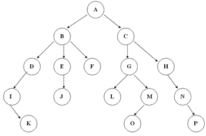

## 二叉树的基本性质

首先明确概念：

 - **节点的度**：一个节点含有的**子树的个数**称为该节点的度；
 - **树的度**：一棵树中，**最大的节点的度** 称为树的度；
 - **节点深度**：对于任意节点n,n的深度为从根到n的唯一路径长，根的深度为1(也有时候被标为0)；
 - **树的深度**：最深的叶子节点的深度
 - **高度**：对于任意节点n,n的高度为从n到一片树叶的最长路径长，所有树叶的高度为1((也有时候被标为0))；
 - **树的高度**：根节点的高度，其实跟树的深度是一个东西。

深度跟高度的本质区别就是一个往上数，一个往下数，所以也要注意，**深度相同的某个节点，他们的高度也许是不同的**。

根据概念，上图中，B的深度是2，，D的深度是3且高度是3.

### 性质

二叉树有以下基本性质：

1. 在二叉树中，第i层的结点总数最多有2^(i-1),i>=1

2. n个节点完全二叉树只有一种

3. 在深度为K的二叉树中最多有2的(K次方)减一个结点,也就是2^k-1,K>=1，**最少有K个结点--也就是一条直线**。

4. **在任意一棵二叉树中，若叶子节点的个数为n0，度为2的结点数为n2，则n0=n2+1**

性质3有如下证明：

证明：因为二叉树中所有结点的度数均不大于2，所以结点总数(记为n)="0度结点数(n0)" + "1度结点数(n1)" + "2度结点数(n2)"。由此，得到等式一。、

`(等式一) n=n0+n1+n2`

　     另一方面，树的每个节点都是某个节点的孩子，所以有，0度结点没有孩子，1度结点有一个孩子，2度结点有两个孩子，故二叉树中孩子结点总数是：n1+2n2。此外，只有根不是任何结点的孩子。故二叉树中的结点总数又可表示为等式二。

`(等式二) n=n1+2n2+1`

由(等式一)和(等式二)计算得到：n0=n2+1。原命题得证！
