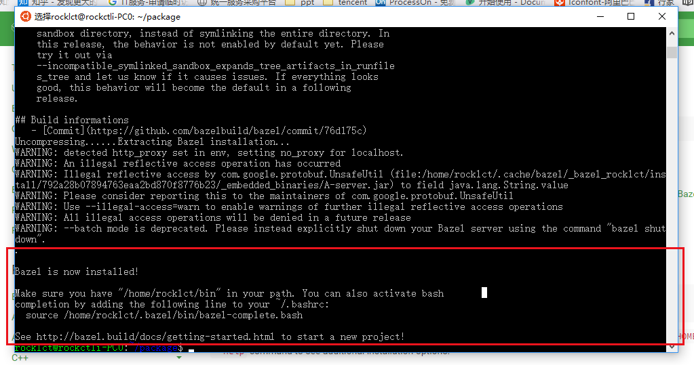

## bazel基础
Bazel是一个类似于Make Maven Gradle的编译工具，是Google为其内部软件开发的特点量身定制的工具，如今Google使用它来构建内部大多数的软件。Google认为直接用Makefile构建软件速度太慢，结果不可靠，所以构建了一个新的工具叫做Bazel，Bazel的规则层级更高。

### bazel安装
这里介绍一下bazel安装在unix系统上。

推荐可以用binary installer来安装bazel

先下载到installer sh文件,准备好

接着安装依赖

```
sudo apt-get install pkg-config zip g++ zlib1g-dev unzip python
```

然后赋予权限，执行安装脚本：

```
chmod +x bazel-<version>-installer-linux-x86_64.sh
./bazel-<version>-installer-linux-x86_64.sh --user
```

The --user flag installs Bazel to the $HOME/bin directory on your system and sets the .bazelrc path to $HOME/.bazelrc. Use the --help command to see additional installation options.




执行后提示bazel安装完毕。

#### 工作区workspace
工作区是一个存放了所有源代码和Bazel编译输出文件的目录，也就是整个项目的根目录。同时它也包含一些Bazel认识的文件：

 - WORKSPACE文件，用于指定当前文件夹就是一个Bazel的工作区。所以WORKSPACE文件总是存在于项目的根目录下。
 - 一个或多个BUILD文件，用于告诉Bazel怎么构建项目的不同部分。（如果工作区中的一个目录包含BUILD文件，那么它就是一个package。）

那么要指定一个目录为Bazel的工作区，就只要在该目录下创建一个空的WORKSPACE文件即可。

当Bazel编译项目时，所有的输入和依赖项都必须在同一个工作区。属于不同工作区的文件，除非linked否则彼此独立。


#### 理解BUILD文件
一个BUILD文件包含了几种不同类型的指令。其中最重要的是编译指令，它告诉Bazel如何编译想要的输出，比如可执行二进制文件或库。BUILD文件中的每一条编译指令被称为一个target，它指向一系列的源文件和依赖，一个target也可以指向别的target。

举个例子，下面这个hello-world的target利用了Bazel内置的cc_binary编译指令，来从hello-world.cc源文件（没有其他依赖项）构建一个可执行二进制文件。指令里面有些属性是强制的，比如name，有些属性则是可选的，srcs表示的是源文件。

```
cc_binary(
    name = "hello-world",
    srcs = ["hello-world.cc"],
)
```

执行bazel build指令可以很方便让我们编译完一个工程。bazel build以后可执行文件会存入生成的bazel-bin目录当中。

具体的操作指引，可到官方文档查看。

### Clion中使用Bazel
Clion可以帮助我们直接导入bazel工程，当然这个工程项目要我们自己创建，我们直接开个文件夹，然后建立个新的文件叫WORKSPACE就可以了。


### 参考

[bazel文档](https://docs.bazel.build/versions/master/install-ubuntu.html)
