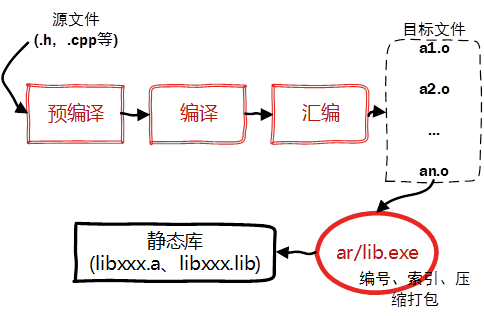
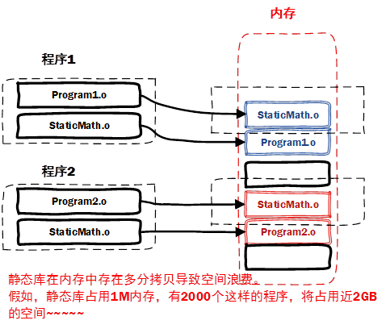
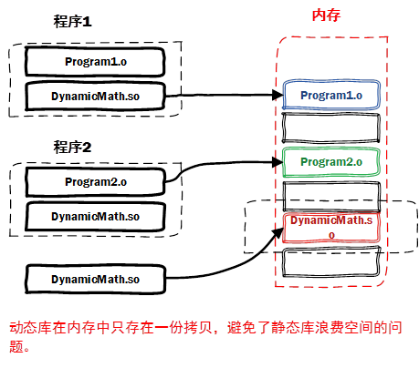

## 静态库与动态库
本质上来说库是一种可执行代码的二进制形式，可以被操作系统载入内存执行。

**库有两种：静态库（.a、.lib）和动态库（.so、.dll）**。


静态动态区别来自链接阶段如何处理库。

### 静态库
之所以成为【静态库】，是因为在链接阶段，会将汇编生成的目标文件.o与引用到的库**一起链接打包**到可执行文件中。因此对应的链接方式称为静态链接。

试想一下，静态库与汇编生成的目标文件一起链接为可执行文件，那么静态库必定跟.o文件格式相似。其实一个静态库可以简单看成是一组目标文件（.o/.obj文件）的集合，即很多目标文件经过压缩打包后形成的一个文件。

静态库特点总结：

 - 静态库对函数库的链接是放在编译时期完成的。

 - 程序在运行时与函数库再无瓜葛，移植方便。

 - 浪费空间和资源，因为所有相关的目标文件与牵涉到的函数库被链接合成一个可执行文件。

Linux下使用ar工具、Windows下vs使用lib.exe，将目标文件压缩到一起，并且对其进行编号和索引，以便于查找和检索。一般创建静态库的步骤如图所示：




### 动态库
静态库，容易使用和理解，也达到了代码复用的目的，那为什么还需要动态库呢？



从上图我们也可以知道

 -  空间浪费是静态库的一个问题(zwlj:上图中不同的程序都自带了一个StaticMath.o,相当于都打包了一个math库)。
 - 另一个问题是静态库对程序的更新、部署和发布页会带来麻烦。如果静态库liba.lib更新了，所以使用它的应用程序都需要重新编译、发布给用户（对于玩家来说，可能是一个很小的改动，却导致整个程序重新下载，全量更新）。

**动态库在程序编译时并不会被连接到目标代码中，而是在程序运行是才被载入**。不同的应用程序如果调用相同的库，那么在内存里**只需要有一份该共享库的实例**，规避了空间浪费问题。

也就是单独这份库，被分出来，运行时才去调用。

动态库在程序运行是才被载入，也解决了静态库对程序的更新、部署和发布页会带来麻烦。用户只需要更新动态库即可，**增量更新**。




总而言之动态库的特点为：

 - 动态库把对一些库函数的链接载入推迟到程序**运行的时期**。

 - 可以实现进程之间的**资源共享**。（因此动态库也称为共享库）

 - 将一些程序升级变得简单。

 - 甚至可以真正做到链接载入完全由程序员在程序代码中控制（显示调用）。

Window与Linux执行文件格式不同，在创建动态库的时候有一些差异。

 - 在Windows系统下的执行文件格式是PE格式，动态库需要一个DllMain函数做出初始化的入口，通常在导出函数的声明时需要有_declspec(dllexport)关键字。

 - Linux下gcc编译的执行文件默认是ELF格式，不需要初始化入口，亦不需要函数做特别的声明，编写比较方便

**动态链接库的名字形式为 libxxx.so，前缀是lib，后缀名为“.so”**。

### 静态&动态库的使用
静态库的使用其实很直接，我们有了.a文件之后，直接用-I指定头文件目录，-L -l指定库目录和库名即可使用。

```

gcc -c main.c -o main.o  //生成某个静态库libxxx.a
gcc main.o -o name -L. -lxxx
```

动态库的使用则有两种，一种是显示动态调用，也就是动态加载，一种是跟静态库一样的用法，即隐式调用，但是有一点，在隐式调用的时候必须要让程序找到调用函数所在的动态库

这个搜索路径是可查的：比如运行more /etc/ld.so.conf

```
/usr/kerberos/lib    

/usr/X11R6/lib    

/usr/lib/sane    

/usr/lib/qt-3.1/lib    

/usr/lib/mysql    

/usr/lib/qt2/lib    

/usr/local/lib    

/usr/local/BerkeleyDB.4.3/lib
```

ld.so.conf是系统对动态链接库进行查找的路径配置文件，也就是说该文件是系统链接工具/usr/bin/ld查找动态链接库的地图，所以，要达到我们的目的有以下几种方法：

1. 将自己的动态链接库文件拷到以上路径的目录下(`cp libwx.so.1 /usr/local/lib`)
2. 将自己动态链接库文件的路径加入到该文件中(`vi /etc/ld.so.conf`)
3. 把当前路径加入环境变量LD_LIBRARY_PATH，其实就是/usr/bin/ld的环境变量(`export LD_LIBRARY_PATH=.:$LD_LIBRARY_PATH`)

所以指定动态库的时候，会先去指定目录找。你光是-L指定还是不行的。

**gcc默认先找动态链接，再找静态链接的库**，如果.so和.a的文件同时存在，且都可以被查找识别到，那么就会优先动态链接。所以要不就用static参数强制静态链接，要不就不指定动态地址使其无法找到so文件。

#### gcc参数设定(部分静态，部分动态)
gcc使用-Wl传递连接器参数，ld使用-Bdynamic强制连接动态库，-Bstatic强制连接静态库。所以部分静态，部分动态连接这么写：

```
gcc ... -Wl,-Bstatic -l<your-static-lib> -Wl,-Bdynamic -l<your-dynamic-lib> ...
```

举个例子，你想动态连接libA.so同时静态连接libB.a，(先保证你的连接路径-L里面能找到对应的静态或者动态库)，这么写：

```
gcc ... -Wl,-Bstatic -lA -Wl,-Bdynamic -lB ...
```

这里需要注意，强制静态或者动态连接标记之后的链接库 **都将按照前面最近的一个标记进行链接**，所以如果后面出现了一个libC，没有指定连接标记，那么libC将会被动态连接：

```
//离dynamic最近
gcc ... -Wl,-Bstatic -lA -Wl,-Bdynamic -lB ... -lC
```

如果参数里面没指定强制的连接方式标记，那么gcc将按照默认的优先级去链接，优先动态链接，所以如果你这么写，且同时存在libC.so和libC.a那么 **libC将被动态链接**：

```
gcc ... -lC
```

比较好的行为应该这样:

```
LIBS += -l<auto-link-lib>

STATIC_LIBS += -l<static-lib>

DYN_LIBS += -l<dynamic-lib>

LDFLAGS := ${LIBS} -Wl,-Bstatic ${STATIC_LIBS} -Wl,-Bdynamic ${DYN_LIBS}
```

这样当你不关心怎么连接的时候用LIBS，当你想静态连接的时候用STATIC_LIBS，当你想动态连接的时候用DYN_LIBS。

#### -ldl参数
我们有时经常会见到-ldl，这倒不是特殊的参数，而是引入了dl这个库而已。我们需要动态加载so文件，则必须要引入dl这个库才能继续操作。
