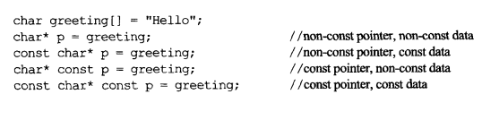
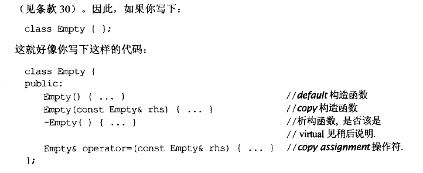
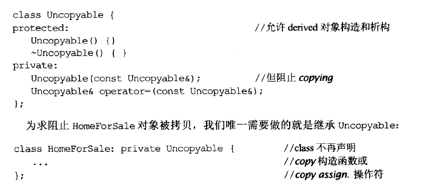
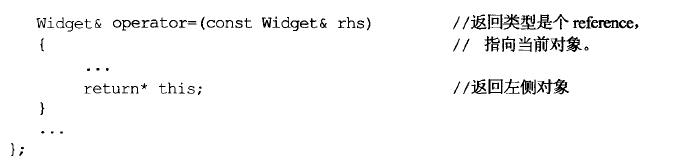
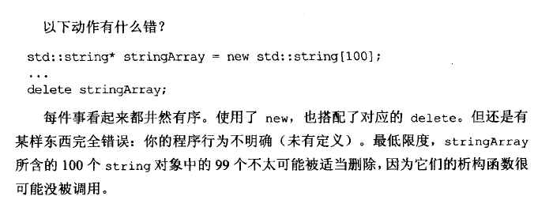
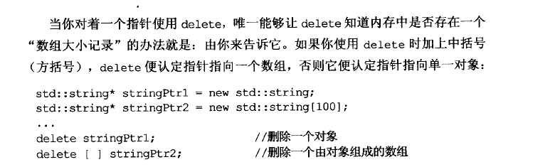
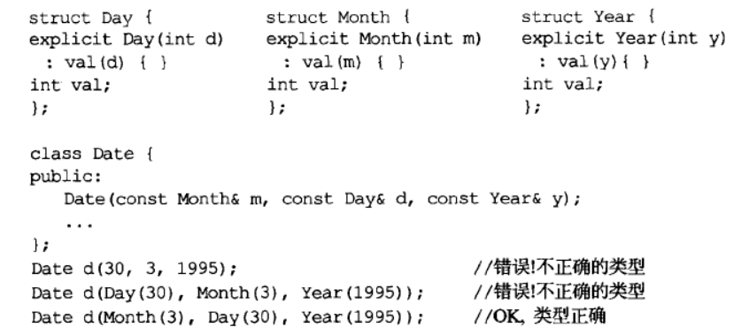
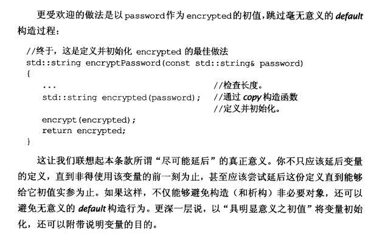

# Effective C++阅读总结

## 基本篇

### 以const,enum,inline替换#define(原则02)
预编译时的信息不会被带到符号表

 - 对于单纯常量,最好以const对象或enums替换#defines.
 - 对于形似函数的宏(macros) ,最好改用inline函数替换#defines。

### 尽可能用const(原则3)



const的相关功能其实之前的const笔记里都有阐述，它高速编译器对变量加了一个语义约束。强制保证某个值不变，编译器确保这条约束不被违反。

### 对象使用前先被初始化(原则4)
尽量使用初始化列表的方式对对象初始化，不要在里面直接进行赋值初始化。

### 了解c++类生成行为(原则5)
编译器会默认为类指定一个 

 - 构造函数
 - copy构造函数
 - copy assignment构造函数(也就是等号构造函数)
 - 析构函数



### 用Uncopyable来拒绝编译器的默认机能(原则6)
简而言之就是，如果不想类的copy构造函数和copy assignment函数被调用，最好的方式就是做一个Uncopyable基类，然后去继承它。



### 多态的基类记得声明virtual析构函数(原则7)
不加的话编译器找不准析构函数，可能会导致衍生类不被清理干净。

但同时也要注意，如果类设计成不会被集成，用virtual修饰析构函数是一个馊主意，因为这会增加对象体积。

### 析构函数不要吐出异常-8
异常吐出之后被吞掉，可能会带来一些严重的后果。

总而言之之析构函数绝对不要吐出异常，**析构函数应该捕捉任何异常，然后吞下**。

### 不要在构造和析构过程中调用virtual函数-9
因为一个对象在构造好以前，你就调用它的virtual，这时候这个virtual函数是不会被定为到最下面的deriverd类的。在构造过程完成之前，virtual函数还不virtual。

总之，构造和析构期间不要调用virtual函数，因为这类调用从不下降至derived class

### operator=要返回一个自身指针的引用-10



行规

### new和delete要匹配 -16



所以



## 设计原则篇

### 接口参数类型可以更具体-18
比如我们在设计日期类时,可以设计成：

``` c++
class Date{
    public: Date(int day,int month, int year);
}
```

但是这样设计，在人构造Date对象的时候，很容易令人记错参数顺序，或者给出了不合适的值。所以我们可以设计成传递进入三个结构体来传参。



### 参数尽量传引用而不是传值 -19
pass-by-value操作非常昂贵，且容易出现一些问题，比如类型切割。

### 返回对象时，不要妄想返回reference

因为返回的时候，这个对象可能已经被销毁了。

### 成员变量声明为private -22
这个也没什么好说的，安全

### 宁愿用外部函数代替成员函数和友元函数
什么意思呢，比如clear方法既能写进类里作为成员函数，也能作为外部函数，那么就更应该选择外部的函数。因为应该让更少的函数接触的类的内部private变量。

## 实现相关

### 尽可能延后变量的定义式-26
也就是说，假如我们在函数内要用到一个变量，我们要尽可能的延后定义它，并且最好就是直接在定义的时候就给它赋初值。



**如果是在循环内定义变量，那就要评估下成本了，因为还涉及到一个可维护性的问题，大多数情况下还是建议写在循环内部**

### 尽量少做转型-27
rt

而且尽量使用C++的新式转型

### 彻底了解inline-30
inline允许编译器进行一些展开优化，但是这么做也很可能增加目标码(object code)的大小。

所以一定要评估好用inline函数的风险。

## 面向对象相关

### 不重新定义non virtual函数
rt