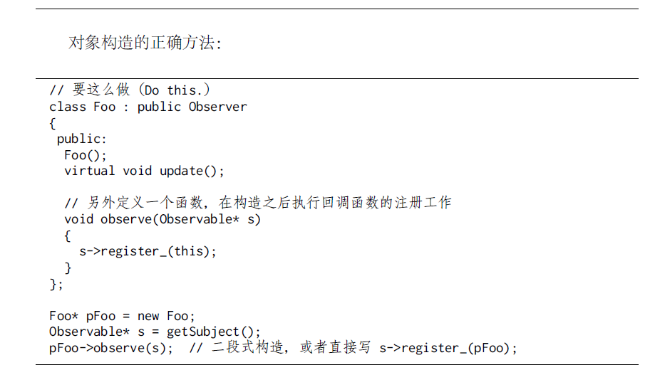

## 线程安全的对象生命期管理

，C++ 标准库里的大多数class 都不是线程安全的，包括std::string、std::vector、std::map 等，因为这些class 通常需要在外部加锁才能供多个线程同时访问。

因此C++中，多线程要做到安全，一定要在各个方面都做好把控。对象生命周期的各个步骤

### 对象的创建
对象构造要做到线程安全，唯一的要求是在构造期间不要泄露this 指针(zwlj:就是不要把指针给出去)

 - 不要在构造函数中注册任何回调；
 - 也不要在构造函数中把this 传给跨线程的对象；
 - **即便在构造函数的最后一行也不行**。

之所以这样规定，是因为在构造函数执行期间对象还没有完成初始化，如果this
被泄露（escape）给了其他对象（其自身创建的子对象除外），那么别的线程有可能
访问这个半成品对象，这会造成难以预料的后果。

所以比较好的实践，是二段式构造。也就是构造函数不要做任何指针外放操作，操作放到外面来

### 对象销毁
mutex 只能保证函数一个接一个地执行。

**成员函数用来保护临界区的互斥器本身必须是有效的。而析构函数破坏了这一假设，它会把mutex 成员变量销毁掉。悲剧啊！**

因此销毁不能通过简单的这个mutex锁来保护。准确来说，应该是作为数据成员的mutex不能保护析构。

所以遇到这种时候，一般要求对象本身是用智能指针来管理的。