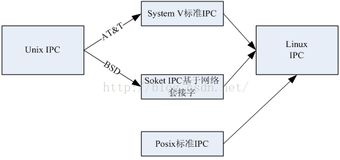
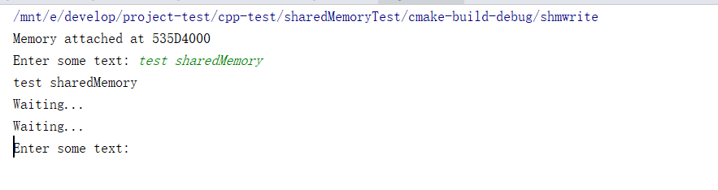
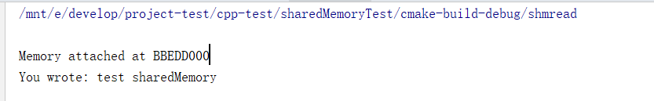

## C++共享内存

共享内存首先为一块实际物理内存，该块物理内存地址被影射到对应的不同进程地址空间中，如此不同的进程都可见共享内存中的所有数据。

从大型软件系统角度讲，共享内存的应用往往是进程通信的最好选择，尤其是需要处理大数据量的分布式实时系统。

在讲共享内存之前，还要先简单了解一下Linux的IPC标准，在操作系统笔记里也有提到，IPC就是进程间通信，有很多方法，但是这些方法其实都遵循不同的标准。



上面的图，是IPC标准的演进图。

 Linux系统中进程通信IPC基本从Unix系统继承而来。由于Unix系统最初发展产生分支，主要由当前AT&T贝尔实验室以及BSD两个机构分别实现两个版本的Unix系统。从IPC进程通信的角度来讲，AT&T版本的Unix主要发展形成**SystemV标准的IPC通信方式**，该方式仅仅限制于单台主机内部不同进程通信；而BSD机构版本的Unix则发展出**可以进行不同主机不同进程通信基于socket的进程通信方式**。

 为了摆脱不同版本的Unix差异性便于不同版本之间的可移植性，发展而来的新独立的Posix标准。Linux操作系统由于是基于Unix操作系统基础上发展而来的，除了支持Unix不同标准外，也很好的遵循了Posix标准。
 
 **从进程通信的角度看，Linux系统共支持三种不同标准通信方式。第一个是继承至AT&T机构Unix版本的SystemV的IPC方式，第二个支持BSD版本Unix基于socket不同主机通信方式，另外还支持Posix标准下的IPC通信方式。**


### 共享内存创建管理

 Linux系统中共享内存为一块实际分配的内存区域，该内存区域可以被映射到不同进程的地址空间，被不同的进程所共享。共享内存是进程IPC通信中最快的方式，读写只需将通信的数据直接从映射的共享内存执行单次拷贝即可。

 Linux中也提供了一组函数接口用于使用共享内存，而且使用共享共存的接口还与信号量的非常相似，而且比使用信号量的接口来得简单。它们声明在头文件 sys/shm.h中。


#### shmget函数
该函数用来创建共享内存，它的原型为：

``` c++
int shmget(key_t key, size_t size, int shmflg);
```

第一个参数，与信号量的semget函数一样，程序需要提供一个参数key（非0整数），它有效地为共享内存段命名，shmget函数成功时返回一个与key相关的共享内存标识符（非负整数），用于后续的共享内存函数。调用失败返回-1.

第二个参数，size以字节为单位指定需要共享的内存容量

shmflg是权限标志，它的作用与open函数的mode参数一样，如果要想在key标识的共享内存不存在时，创建它的话，可以与IPC_CREAT做或操作。共享内存的权限标志与文件的读写权限一样

#### shmat函数
第一次创建完共享内存时，它还不能被任何进程访问，shmat函数的作用就是用来启动对该共享内存的访问，并把共享内存连接到当前进程的地址空间。它的原型如下：

```
void *shmat(int shm_id, const void *shm_addr, int shmflg);
```

第一个参数，shm_id是由shmget函数返回的共享内存标识。
第二个参数，shm_addr指定共享内存连接到当前进程中的地址位置，通常为空，表示让系统来选择共享内存的地址。
第三个参数，shm_flg是一组标志位，通常为0。

调用成功时返回一个指向共享内存第一个字节的指针，如果调用失败返回-1.

#### shmdt函数
该函数用于将共享内存从当前进程中分离。注意，将共享内存分离并不是删除它，只是使该共享内存对当前进程不再可用。它的原型如下：

```
int shmdt(const void *shmaddr);
```

参数shmaddr是shmat函数返回的地址指针，调用成功时返回0，失败时返回-1.

#### shmctl函数
与信号量的semctl函数一样，用来控制共享内存，它的原型如下：

```
int shmctl(int shm_id, int command, struct shmid_ds *buf);
```

第一个参数，shm_id是shmget函数返回的共享内存标识符。

第二个参数，command是要采取的操作，它可以取下面的三个值 ：

 - IPC_STAT：把shmid_ds结构中的数据设置为共享内存的当前关联值，即用共享内存的当前关联值覆盖shmid_ds的值。
 - IPC_SET：如果进程有足够的权限，就把共享内存的当前关联值设置为shmid_ds结构中给出的值
 - IPC_RMID：删除共享内存段

第三个参数，buf是一个结构指针，它指向共享内存模式和访问权限的结构。
shmid_ds结构至少包括以下成员：

``` c++
struct shmid_ds
{
    uid_t shm_perm.uid;
    uid_t shm_perm.gid;
    mode_t shm_perm.mode;
};
```

### 实例
接下来通过代码来更直观的理解共享内存。

代码就分为两个部分，一个是负责写共享内存的程序代码，一个是负责读共享内存的程序代码。

在读写共享内存之前，读写程序必须做好一些约定：比如以什么样的数据结构存取到内存当中。

比方说我们定义了如下结构体shmdata.h：

``` c
struct shared_use_st
{
    int written;//作为一个标志，非0：表示可读，0表示可写
    char text[TEXT_SZ];//记录写入和读取的文本
};
```

然后我们希望现在能把这个数据结构存到共享内存当中。

下面分别是读写程序的代码：

shmread.c:

``` c++
#include <unistd.h>
#include <stdlib.h>
#include <stdio.h>
#include <sys/shm.h>
#include "shmdata.h"

int main()
{
    int running = 1;//程序是否继续运行的标志
    void *shm = NULL;//分配的共享内存的原始首地址
    struct shared_use_st *shared;//指向shm
    int shmid;//共享内存标识符
    //创建共享内存 第一个参数命名 第二个参数size，第三个参数权限
    shmid = shmget((key_t)1234, sizeof(struct shared_use_st), 0666|IPC_CREAT);
    if(shmid == -1)
    {
        fprintf(stderr, "shmget failed\n");
        exit(EXIT_FAILURE);
    }
    //将共享内存连接到当前进程的地址空间
    shm = shmat(shmid, 0, 0);
    if(shm == (void*)-1)
    {
        fprintf(stderr, "shmat failed\n");
        exit(EXIT_FAILURE);
    }
    printf("\nMemory attached at %X\n", (int)shm);
    //设置共享内存
    shared = (struct shared_use_st*)shm;
    shared->written = 0;
    while(running)//读取共享内存中的数据
    {
        //没有进程向共享内存定数据有数据可读取
        if(shared->written != 0)
        {
            printf("You wrote: %s", shared->text);
            sleep(rand() % 3);
            //读取完数据，设置written使共享内存段可写
            shared->written = 0;
            //输入了end，退出循环（程序）
            if(strncmp(shared->text, "end", 3) == 0)
                running = 0;
        }
        else//有其他进程在写数据，不能读取数据
            sleep(1);
    }
    //把共享内存从当前进程中分离
    if(shmdt(shm) == -1)
    {
        fprintf(stderr, "shmdt failed\n");
        exit(EXIT_FAILURE);
    }
    //删除共享内存
    if(shmctl(shmid, IPC_RMID, 0) == -1)
    {
        fprintf(stderr, "shmctl(IPC_RMID) failed\n");
        exit(EXIT_FAILURE);
    }
    exit(EXIT_SUCCESS);
}
```

代码有点长，但是理清逻辑就很简单，根据前面讲的shm api，调用shmget创建共享内存，并且分配权限，然后连接到当前进程的内存地址，然后循环去读这一块内存(读法就是用结构体指针指向这块共享内存，取数据)，当发现内存被写过了，那就设置标志位，输出数据。

接下来看看写共享内存的代码：

``` c++
#include <unistd.h>
#include <stdlib.h>
#include <stdio.h>
#include <string.h>
#include <sys/shm.h>
#include "shmdata.h"

int main()
{
    int running = 1;
    void *shm = NULL;
    struct shared_use_st *shared = NULL;
    char buffer[BUFSIZ + 1];//用于保存输入的文本
    int shmid;
    //创建共享内存
    shmid = shmget((key_t)1234, sizeof(struct shared_use_st), 0666|IPC_CREAT);
    if(shmid == -1)
    {
        fprintf(stderr, "shmget failed\n");
        exit(EXIT_FAILURE);
    }
    //将共享内存连接到当前进程的地址空间
    shm = shmat(shmid, (void*)0, 0);
    if(shm == (void*)-1)
    {
        fprintf(stderr, "shmat failed\n");
        exit(EXIT_FAILURE);
    }
    printf("Memory attached at %X\n", (int)shm);
    //设置共享内存
    shared = (struct shared_use_st*)shm;
    while(running)//向共享内存中写数据
    {
        //数据还没有被读取，则等待数据被读取,不能向共享内存中写入文本
        while(shared->written == 1)
        {
            sleep(1);
            printf("Waiting...\n");
        }
        //向共享内存中写入数据
        printf("Enter some text: ");
        fgets(buffer, BUFSIZ, stdin);
        strncpy(shared->text, buffer, TEXT_SZ);
        //写完数据，设置written使共享内存段可读
        shared->written = 1;
        //输入了end，退出循环（程序）
        if(strncmp(buffer, "end", 3) == 0)
            running = 0;
    }
    //把共享内存从当前进程中分离
    if(shmdt(shm) == -1)
    {
        fprintf(stderr, "shmdt failed\n");
        exit(EXIT_FAILURE);
    }
    sleep(2);
    exit(EXIT_SUCCESS);
}
```

跟读的程序大同小异，也是创建出共享内存之后(注意，这里shmget的第一个参数key_t跟读程序中的id相同，都是1234，以保证映射的是同一块区域。), 用结构体指针去取去写。最后读到end字符串就不写了。

最后clion中执行结果如下：




