## C++ 对象模型
根据C++虚函数机制的笔记我们可以知道，为了支持多态机制，编译器为类添加了一个虚函数指针（vptr）。**虚函数指针一般都放在对象内存布局的第一个位置上，这是为了保证在多层继承或多重继承的情况下能以最高效率取到虚函数表。**

当vprt位于对象内存最前面时，对象的地址即为虚函数指针地址。我们可以取得虚函数指针的地址：

``` c++
Base b(1000);
int * vptrAdree = (int *)(&b);  
cout << "虚函数指针（vprt）的地址是：\t"<<vptrAdree << endl;
```

有此知识基础的前提下，我们就可以来分析C++对象的内存布局。

### 对象模型概述
在C++中，**有两种数据成员（class data members）：static 和nonstatic,以及三种类成员函数（class member functions）:static、nonstatic和virtual**

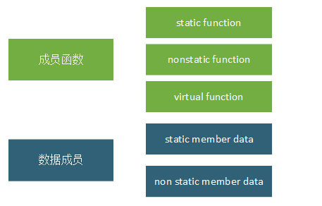

现在我们有一个类Base，它包含了上面这5中类型的数据或函数：

``` c++
class Base
{
public:
 
    Base(int i) :baseI(i){};
  
    int getI(){ return baseI; }
 
    static void countI(){};
 
    virtual ~Base(){}

    virtual void print(void){ cout << "Base::print()"; }
private:
 
    int baseI;
 
    static int baseS;
};
```

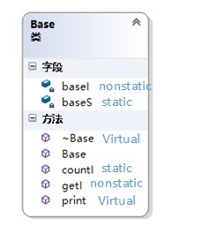

### 非继承下的C++对象模型
在此模型下，nonstatic 数据成员被置于每一个类实例对象中，而static数据成员被置于类对象之外。static与nonstatic函数也都放在类对象之外，而对于virtual 函数，则通过虚函数表+虚指针来支持：

- 每个类生成一个表格，称为虚表（virtual table，简称vtbl）。虚表中存放着一堆指针，这些指针指向该类每一个虚函数。虚表中的函数地址将按声明时的顺序排列
- 每个类对象都拥有一个虚表指针(vptr)，由编译器为其生成。虚表指针的设定与重置皆由类的复制控制（也即是构造函数、析构函数、赋值操作符）来完成。vptr的位置为编译器决定，传统上它被放在所有显示声明的成员之后，**不过现在许多编译器把vptr放在一个类对象的最前端**。
- 另外，虚函数表的前面设置了一个指向type_info的指针，用以支持RTTI（Run Time Type Identification，运行时类型识别）。RTTI是为多态而生成的信息，包括对象继承关系，对象本身的描述等，**只有具有虚函数的对象会生成**。

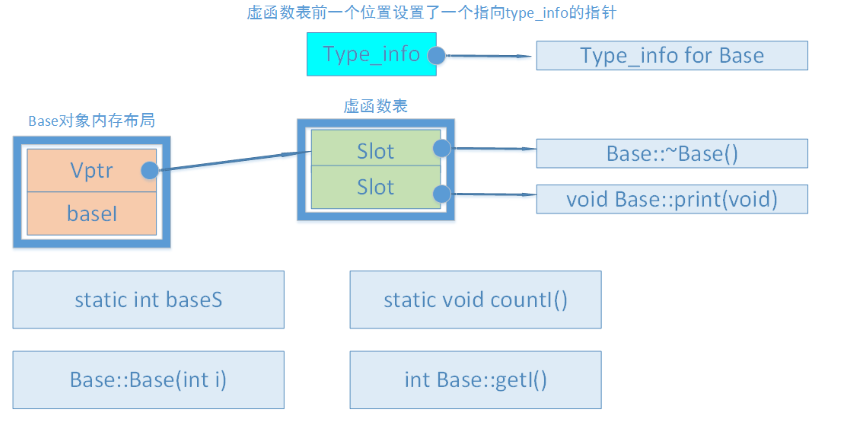

### 继承下的C++对象模型
假如对象存在继承关系，根据之前的虚函数机制笔记，我们知道只不过是在虚函数表里覆盖了父类的虚函数而已。

假如有派生类如下图

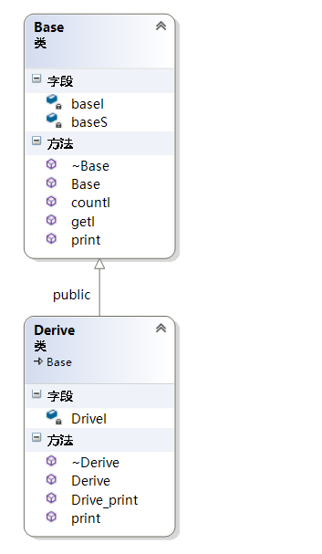

根据之前虚函数机制里所描述的规则：

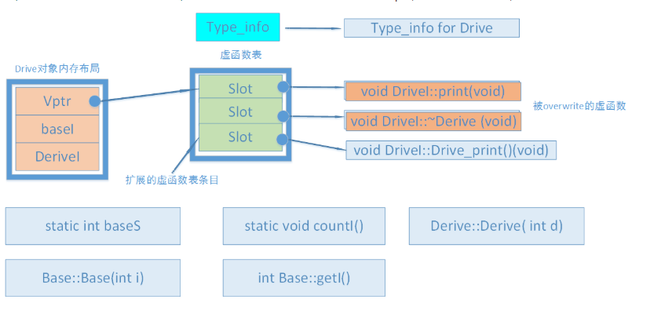

虚函数表里先放父类的虚函数，再放子类的虚函数，覆盖了则进行替换。

### 多重继承的情况
多重继承下：

 - 子类的虚函数被放在声明的第一个基类的虚函数表中。
 - overwrite时，所有基类的print()函数都被子类的print()函数覆盖。
 - 内存布局中，父类按照其声明顺序排列。

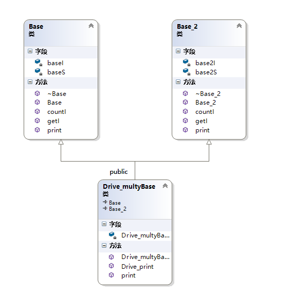

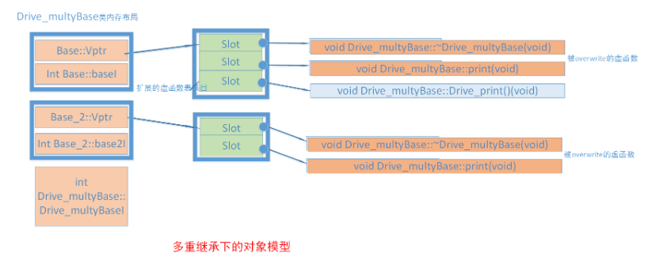

### 菱形继承
菱形继承也称为钻石型继承或重复继承，它指的是基类被某个派生类简单重复继承了多次。这样，派生类对象中拥有多份基类实例（这会带来一些问题）。

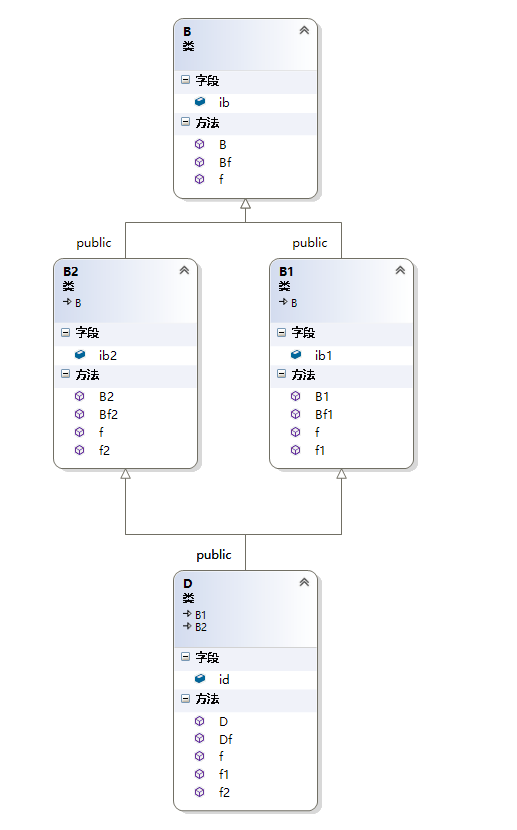

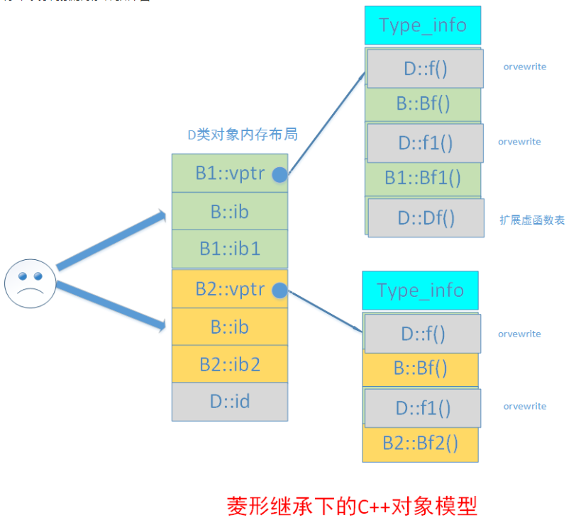

依旧是根据虚函数机制的原则来，先写B1的虚函数表，再是B2的，其中B1有一份B的，B2里面也有一份B的。

从图中可以看到，由于D类间接继承了B类两次，导致D类对象中含有两个B类的数据成员ib，一个属于来源B1类，一个来源B2类。这样不仅增大了空间，更重要的是引起了程序歧义，也就是有了二义性错误。

尽管我们可以通过明确指明调用路径以消除二义性，但二义性的潜在性还没有消除，**我们可以通过虚继承来使D类只拥有一个ib实体**。

### 虚继承
虚继承解决了菱形继承中最派生类拥有多个间接父类实例的情况。虚继承的派生类的内存布局与普通继承很多不同，主要体现在

 - 虚继承的子类，如果本身定义了新的虚函数，则编译器为其生成一个虚函数指针（vptr）以及一张虚函数表。该vptr位于对象内存最前面(**非虚继承是直接扩展了父类虚函数表的**)。
 - 虚继承的子类也单独保留了父类的vprt与虚函数表。这部分内容接与子类内容以一个四字节的0来分界。
 - 虚继承的子类对象中，含有四字节的虚表指针偏移值。


#### 虚基类表
刚才就有提到，如果虚继承的子类定义了新的虚函数，那就会有一个 **(新生成的)虚函数指针vptr** ，而在这个vptr之后，就会有一个隐藏的**虚基类指针vbptr**，这两个指针要分清，一个是指向子类定义的新虚函数，一个是跟父类相关的，每有一个直接父类就会有一个vbptr。

vbptr指针指向的表，第一个值是该表的偏移值，如下图：

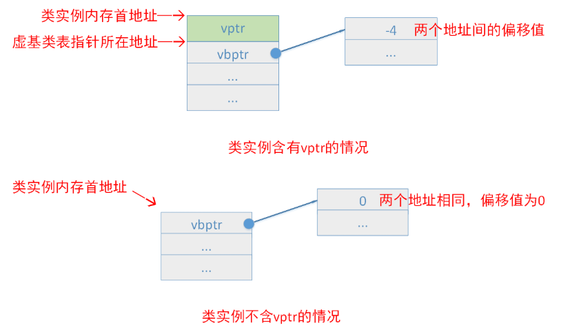

**没有定义新虚函数的情况下(新虚函数也就是这个虚函数在以前的父类都木有)**，就没有vptr，因此偏移量就是0.

**虚基类表的第二、第三...个条目依次为该类的最左虚继承父类、次左虚继承父类...的内存地址相对于虚基类表指针的偏移值**

#### 简单虚继承
好比有

``` c++
//类的内容与前面相同
class B{...}
class B1 : virtual public B
```

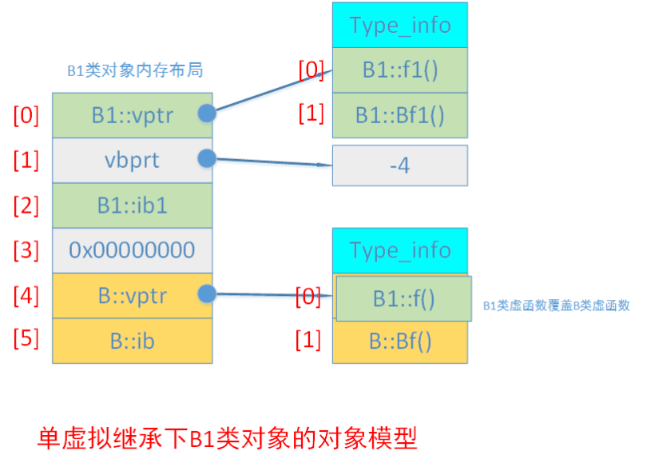

菱形继承则有：

``` c++
class B{...}
class B1: virtual public  B{...}
class B2: virtual public  B{...}
class D : public B1,public B2{...}
```

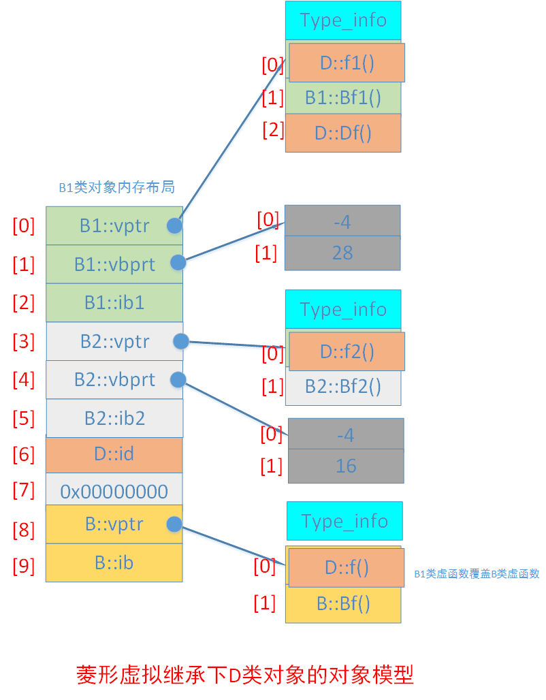

菱形虚拟继承下，最派生类D类的对象模型又有不同的构成了。

 - 在D类对象内存中，基类出现的顺序是：先是B1（最左父类），然后是B2（次左父类），最后是B（虚祖父类）
 - D类对象的数据成员id放在B类前面，两部分数据依旧以0来分隔。
 - 编译器没有为D类生成一个它自己的vptr，而是覆盖并扩展了最左父类的虚基类表，与简单继承的对象模型相同。
 - 超类B的内容放到了D类对象内存布局的最后


所以不难理解，对于B1，父类B的偏移值是28，对于B2，B的相对偏移值就是16