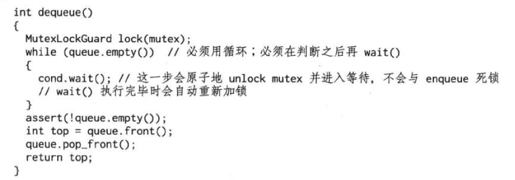

# c++并发基础
C++11 新标准中引入了四个头文件来支持多线程编程，他们分别是\<atomic\> ,\<thread\>,\<mutex\>,\<condition_variable\>和\<future\>。

  - \<atomic\>：该头文主要声明了两个类, std::atomic 和 std::atomic_flag，另外还声明了一套 C 风格的原子类型和与 C 兼容的原子操作的函数。
 - \<thread\>：该头文件主要声明了 std::thread 类，另外 std::this_thread 命名空间也在该头文件中。
 - \<mutex\>：该头文件主要声明了与互斥量(mutex)相关的类，包括 std::mutex 系列类，std::lock_guard, std::unique_lock, 以及其他的类型和函数。
 - \<condition_variable\>：该头文件主要声明了与条件变量相关的类，包括 std::condition_variable 和 std::condition_variable_any。
 - \<future\>：该头文件主要声明了 std::promise, std::package_task 两个 Provider 类，以及 std::future 和 std::shared_future 两个 Future 类，另外还有一些与之相关的类型和函数，std::async() 函数就声明在此头文件中。

## Mutex
Mutex 又称互斥量，C++ 11中与 Mutex 相关的类（包括锁类型）和函数都声明在 \<mutex\> 头文件中，所以如果你需要使用 std::mutex，就必须包含 \<mutex\> 头文件。

Mutex 系列类(四种)

 - std::mutex，最基本的 Mutex 类。
 - std::recursive_mutex，**递归 Mutex 类(也叫可重入锁)**。
 - std::time_mutex，定时 Mutex 类。
 - std::recursive_timed_mutex，定时递归 Mutex 类。

**同一个线程可以多次获取同一个递归锁recursive_mutex，不会产生死锁。而如果一个线程多次获取同一个非递归锁，则会产生死锁。**

Lock 类（两种）

 - std::lock_guard，与 Mutex RAII 相关，方便线程对互斥量上锁。
 - std::unique_lock，与 Mutex RAII 相关，方便线程对互斥量上锁，但提供了更好的上锁和解锁控制。

（译注：**所谓的RAII，全称为Resource Acquisition Is Initialization**，汉语是“资源获取即初始化”。但是这个直译并没有很好地解释这个词组的含义。其实含义并不高深复杂，简单说来就是，在资源获取的时候将其封装在某类的object中，利用"栈资源会在相应object的生命周期结束时自动销毁"来自动释放资源，即，将资源释放写在析构函数中。所以这个RAII其实就是和智能指针的实现是类似的。）【20190722 见RAII笔记】

### lock_guard
lock_guard 对象通常用于管理某个锁(Lock)对象，因此与 Mutex RAII 相关，方便线程对互斥量上锁，即在某个 lock_guard 对象的声明周期内，它所管理的锁对象会一直保持上锁状态；而 lock_guard 的生命周期结束之后，它所管理的锁对象会被解锁(注：**类似 shared_ptr 等智能指针管理动态分配的内存资源** )。

**在 lock_guard 对象构造时，传入的 Mutex 对象(即它所管理的 Mutex 对象)会被当前线程锁住**。在lock_guard 对象被析构时，它所管理的 Mutex 对象会**自动解锁**，由于不需要程序员手动调用 lock 和 unlock 对 Mutex 进行上锁和解锁操作，因此这也是最简单安全的上锁和解锁方式，尤其是在程序抛出异常后先前已被上锁的 Mutex 对象可以正确进行解锁操作，极大地简化了程序员编写与 Mutex 相关的异常处理代码。

### unique_lock
 lock_guard 最大的缺点也是简单，没有给程序员提供足够的灵活度，因此，C++11 标准中定义了另外一个与 Mutex RAII 相关类 unique_lock，该类与 lock_guard 类相似，也很方便线程对互斥量上锁，但它提供了更好的上锁和解锁控制。

unique_lock和lock_guard功能上是一样的，但是unique_lock有丰富的成员函数，后者没有。同时，**unique_lock比lock_guard占用空间和速度慢一些**，因为其要维护mutex的状态。

unique_lock本身还可以std::lock参数，因为其具备lock、unlock、try_lock成员函数,这些函数不仅完成针对mutex的操作还要更新mutex的状态。

zwlj：lockguard使用上更简单，unique_lock则可以让我们手动维护mutex的状态。

## condition_variable

\<condition_variable \> 头文件主要包含了与条件变量相关的类和函数。相关的类包括 std::condition_variable 和 std::condition_variable_any，还有枚举类型std::cv_status。另外还包括函数 std::notify_all_at_thread_exit()

**概念上，一个条件变量就是一个线程队列(queue),** 允许线程挂起，直到共享数据上的某些条件得到满足.

**zwlj:也就是说，等待某个条件满足的线程会挂起进入一个队列，然后这个条件被满足后，这个队列里的某个挂起的线程会被唤醒从而继续操作。**

### 条件变量详解
所谓条件变量，顾名思义就是一个或多个线程等待某个布尔表达式为真。**学名叫管程monitor**。 Java Object内置的wait，notify这些其实就是条件变量。

条件变量只有一种正确使用的方式,几乎不可能用错。对于wait端:

1. 必须与mutex一起使用,该布尔表达式的读写需受此mutex保护。
2. 在mutex已上锁的时候才能调用wait()。
3. 把判断布尔条件和wait()放到while循环中。

一定要用while，不能用if，可能会有spurious wakeup