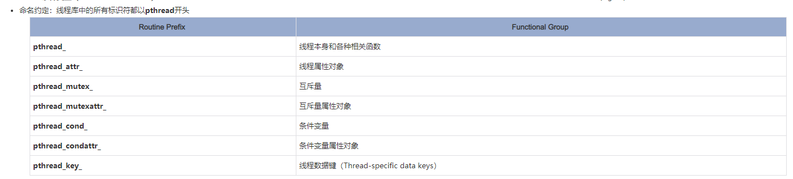

## pthreads基础
在多处理器共享内存的架构中（如：对称多处理系统SMP），线程可以用于实现程序的并行性。历史上硬件销售商实现了各种私有版本的多线程库，使得软件开发者不得不关心它的移植性。对于UNIX系统，IEEE POSIX 1003.1标准定义了一个C语言多线程编程接口。依附于该标准的实现被称为POSIX theads 或 Pthreads。 

为了使用线程所提供的强大优点，需要一个标准的程序接口。对于UNIX系统，IEEE POSIX 1003.1c（1995）标准制订了这一标准接口。依赖于该标准的实现就称为POSIX threads 或者Pthreads。现在多数硬件销售商也提供Pthreads，附加于私有的API。 

Pthreads 被定义为一些C语言类型和函数调用，用pthread.h头（包含）文件和线程库实现。这个库可以是其它库的一部分，如libc。 

Pthreads API中的函数可以非正式的划分为三大类： 

 - 线程管理（Thread management）: 第一类函数直接用于线程：创建（creating），分离（detaching），连接（joining）等等。包含了用于设置和查询线程属性（可连接，调度属性等）的函数。 
 - 互斥量（Mutexes）: 第二类函数是用于线程同步的，称为互斥量（mutexes），是"mutual exclusion"的缩写。Mutex函数提供了创建，销毁，锁定和解锁互斥量的功能。同时还包括了一些用于设定或修改互斥量属性的函数。 
 - 条件变量（Condition variables）：第三类函数处理共享一个互斥量的线程间的通信，基于程序员指定的条件。这类函数包括指定的条件变量的创建，销毁，等待和受信（signal）。设置查询条件变量属性的函数也包含其中。 

线程库中的所有标识符都以pthread开头 



为了可移植性，使用Pthread库时，pthread.h头文件必须在每个源文件中包含。 

### pthread的创建和终止

**pthread_create** 创建一个新线程并使之运行起来。该函数可以在程序的任何地方调用。 

pthread_create(thread,attr,start_routine,arg)  参数： 

 - thread：返回一个不透明的，唯一的新线程标识符。 
 - attr：不透明的线程属性对象。可以指定一个线程属性对象，或者NULL为缺省值。 
 - start_routine：线程将会执行一次的C函数。 
 - arg: 传递给start_routine单个参数，传递时必须转换成指向void的指针类型。没有参数传递时，可设置为NULL。 

一旦创建，线程就称为peers，可以创建其它线程。线程之间没有指定的结构和依赖关系。 

结束线程的方法有一下几种： 

 - 线程从主线程（main函数的初始线程）返回。 
 - 线程调用了pthread_exit函数。  
 - 其它线程使用 pthread_cancel函数结束线程。 
 - 调用exec或者exit函数，整个进程结束。

**当main结束时，其它线程还没有被创建。如果此时没有显式的调用pthread_exit()，当main结束时，进程（和所有线程）都会终止。可以在main中调用pthread_exit()，此时尽管在main中已经没有可执行的代码了，进程和所有线程将保持存活状态**

#### 例子
该例用pthread_create()创建了5个线程。每一个线程都会打印一条“Hello World”的消息，然后调用pthread_exit()终止线程。 

``` c++
#include <pthread.h> 
#include <stdio.h> 
#define NUM_THREADS     5 

void *PrintHello(void *threadid) 
{ 
   int tid; 
   tid = (int)threadid; 
   printf("Hello World! It's me, thread #%d!\n", tid); 
   pthread_exit(NULL); 

} 

int main (int argc, char *argv[]) 
{ 
   pthread_t threads[NUM_THREADS]; 
   int rc, t; 
   for(t=0; t<NUM_THREADS; t++){ 
      printf("In main: creating thread %d\n", t); 
      rc = pthread_create(&threads[t], NULL, PrintHello, (void *)t); 
      if (rc){ 
         printf("ERROR; return code from pthread_create() is %d\n", rc); 
         exit(-1); 
      } 
   } 
   pthread_exit(NULL); 
} 
```

如上例子，主线程中及时调用了pthread_exit(NULL);

### 传递参数
pthread_create()函数允许程序员想线程的start routine传递一个参数。当多个参数需要被传递时，可以通过定义一个结构体包含所有要传的参数，然后用pthread_create()传递一个指向改结构体的指针，来打破传递参数的个数的限制。 
所有参数都应该传引用传递并转化成（void*）。

``` c++
struct thread_data{ 
   int  thread_id; 
   int  sum; 
   char *message; 
}; 
struct thread_data thread_data_array[NUM_THREADS]; 
void *PrintHello(void *threadarg) 
{ 
   struct thread_data *my_data; 
   ... 
   my_data = (struct thread_data *) threadarg; 
   taskid = my_data->thread_id; 
   sum = my_data->sum; 
   hello_msg = my_data->message; 
   ... 
}
int main (int argc, char *argv[]) 
{ 
   ... 
   thread_data_array[t].thread_id = t; 
   thread_data_array[t].sum = sum; 
   thread_data_array[t].message = messages[t]; 
   rc = pthread_create(&threads[t], NULL, PrintHello,  
        (void *) &thread_data_array[t]); 
   ... 
} 
```

如图，提前定义了一个传参结构体。然后pthread_create的时候直接最后一个参数就把指针传递进去了。

### join
“连接”是一种在线程间完成同步的方法。例如： 

pthread_join()函数阻塞调用线程直到threadid所指定的线程终止。 

如果在目标线程中调用pthread_exit()，程序员可以在主线程中获得目标线程的终止状态。 


#### Joinable attr
可连接（Joinable or Not）?  

当一个线程被创建，它有一个属性定义了它是可连接的（joinable）还是分离的（detached）。只有是可连接的线程才能被连接（joined），若果创建的线程是分离的，则不能连接。 
POSIX标准的最终草案指定了线程必须创建成可连接的。然而，并非所有实现都遵循此约定。 
使用pthread_create()的attr参数可以显式的创建可连接或分离的线程，典型四步如下： 
 - 声明一个pthread_attr_t数据类型的线程属性变量 
 - 用 pthread_attr_init()初始化改属性变量 
 - 用pthread_attr_setdetachstate()设置可分离状态属性 
 - 完了后，用pthread_attr_destroy()释放属性所占用的库资源 

#### 例子

这个例子演示了用Pthread join函数去等待线程终止。因为有些实现并不是默认创建线程是可连接状态，例子中显式地将其创建为可连接的。  

``` c++
#include <pthread.h> 
#include <stdio.h> 
#define NUM_THREADS    3 

void *BusyWork(void *null) 

{ 
   int i; 
   double result=0.0; 
   for (i=0; i<1000000; i++) 
   { 
     result = result + (double)random(); 
   } 
   printf("result = %e\n",result); 
   pthread_exit((void *) 0); 
} 

int main (int argc, char *argv[]) 

{ 
   pthread_t thread[NUM_THREADS]; 
   pthread_attr_t attr; 
   int rc, t; 
   void *status; 
   /* Initialize and set thread detached attribute */ 
   pthread_attr_init(&attr); 
   pthread_attr_setdetachstate(&attr, PTHREAD_CREATE_JOINABLE); 
   for(t=0; t<NUM_THREADS; t++) 
   { 
      printf("Creating thread %d\n", t); 
      rc = pthread_create(&thread[t], &attr, BusyWork, NULL);  
      if (rc) 
      { 
         printf("ERROR; return code from pthread_create()  

                is %d\n", rc); 
         exit(-1); 
      } 
   } 
   /* Free attribute and wait for the other threads */ 
   pthread_attr_destroy(&attr); 
   for(t=0; t<NUM_THREADS; t++) 
   { 
      rc = pthread_join(thread[t], &status); 
      if (rc) 
      { 
         printf("ERROR; return code from pthread_join()  

                is %d\n", rc); 
         exit(-1); 

      } 
      printf("Completed join with thread %d status= %ld\n",t, (long)status); 
   } 
   pthread_exit(NULL); 
} 
```