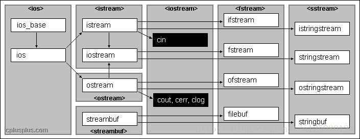

## C++ 标准文件的写入读出(ifstream,ofstream)
头文件 \<fstream\>

c++中有一个stream，所有的I/O都是以这个流类为基础的。继承结构如下图：



 - ”<<”插入器，向流输出数据；
 - ”>>”析取器，向流写入数据；

我们主要讨论ifstream和ofstream
 - ifstream 和ofsteam 包含在头文件fstream中。
 - ofstream 是从内存读到硬盘；
 - ifstream 是从硬盘读到内存。
 - fstream 是可对打开的文件进行读写操作。

### 打开文件
在fstream类中，成员函数open()实现打开文件的操作，从而将数据流和文件进行关联，通过ofstream,ifstream,fstream对象进行对文件的读写操作。

``` c++
fstream file1;
file1.open("c:\\config.sys",ios::binary|ios::in,0);
file1.open("c:\\config.sys"); <=> file1.open("c:\\config.sys",ios::in|ios::out,0);
fstream file1("c:\\config.sys");
ifstream file2("c:\\pdos.def");//以输入方式打开文件
ofstream file3("c:\\x.123");//以输出方式打开文件
```


打开的文件使用完成后一定要关闭，fstream提供了成员函数close()来完成此操作，如：file1.close();就把file1相连的文件关闭。


### 逐行读取文件

``` c++
// 用char数组
ifstream fin("data.txt"); 
const int LINE_LENGTH = 100; 
char str[LINE_LENGTH];  
while( fin.getline(str,LINE_LENGTH) )
{    
    cout << "Read from file: " << str << endl;
}

// 用string
void ReadDataFromFileLBLIntoString()
{
    ifstream fin("data.txt");  
    string s;  
    while( getline(fin,s) )
    {    
        cout << "Read from file: " << s << endl; 
    }
}
```

### eof()函数
C++ eof()函数可以帮助我们用来判断文件是否为空，抑或是判断其是否读到文件结尾。

C++ eof()函数返回true时是读到文件结束符0xFF，而文件结束符是最后一个字符的下一个字符。
