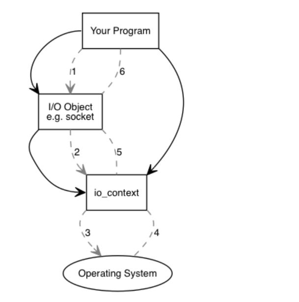

## Boost Asio

Boost C++ 库 Asio，它是异步输入输出的核心。 名字本身就说明了一切：Asio 意即异步输入/输出。 该库可以让 C++ 异步地处理数据，且平台独立。 异步数据处理就是指，任务触发后不需要等待它们完成。 相反，Boost.Asio 会在任务完成时触发一个应用。 异步任务的主要优点在于，在等待任务完成时不需要阻塞应用程序，可以去执行其它任务。

**ps：其实就是异步IO，让所有IO操作都变得不阻塞，简单来说，Boost.Asio是一个跨平台的、主要用于网络和其他一些底层输入/输出编程的C++库。**

异步编程是事件驱动的。虽然启动了一个操作，但是你不知道它何时会结束；它只是提供一个回调给你，当操作结束时，它会调用这个API，并返回操作结果。对于有着丰富经验的QT（诺基亚用来创建跨平台图形用户界面应用程序的库）程序员来说，这就是他们的第二天性。因此，在异步编程中，你只需要一个线程。

### 文档

asio文档很重要，多看看

https://www.boost.org/doc/libs/1_72_0/doc/html/boost_asio/overview/core.html


### io服务&io对象

Boost.Asio 进行异步数据处理的应用程序基于两个概念：I/O 服务和 I/O 对象。

 I/O 服务抽象了操作系统的接口，Boost.Asio使用*io_service*同操作系统的输入/输出服务进行交互，而 I/O 对象则用于初始化特定的操作。

**update：注意！新版asio中，io service这个类已经废弃，现在要用io_context**


理解这个两个概念，比较中重要，这是asio的设计，对应到代码中，如下：

```cpp
#include <boost/asio.hpp> 
 #include <iostream> 
 
 void handler1(const boost::system::error_code &ec) 
 { 
   std::cout << "5 s." << std::endl; 
 } 
 
 void handler2(const boost::system::error_code &ec) 
 { 
   std::cout << "10 s." << std::endl; 
 } 
 
 int main() 
 { 
   boost::asio::io_service io_service; 
   boost::asio::deadline_timer timer1(io_service, boost::posix_time::seconds(5)); 
   timer1.async_wait(handler1); 
   boost::asio::deadline_timer timer2(io_service, boost::posix_time::seconds(10)); 
   timer2.async_wait(handler2); 
   io_service.run(); 
 } 
```

函数 main() 首先定义了一个 I/O 服务 io_service，用于初始化 I/O 对象 timer。而boost::asio::deadline_timer 是一个定时器，是一个io对象。我们创建这个io对象的时候，便把io_service和它绑定了起来。

async_wait() 的好处是，该函数调用会立即返回，而不是等待五秒钟。 一旦闹钟时间到，作为参数所提供的函数就会被相应调用。 因此，应用程序可以在调用了 async_wait() 之后执行其它操作，而不是阻塞在这里。

可以留意到在调用 async_wait() 之后，又在 I/O 服务之上调用了一个名为 run() 的方法。这是必须的，**因为控制权必须被操作系统接管，才能在五秒之后调用 handler() 函数**。

 在 main() 的最后，再次在唯一的 I/O 服务之上调用了 run() 方法。 如前所述，这个函数将阻塞执行，把控制权交给操作系统以接管异步处理。 在操作系统的帮助下，handler1() 函数会在五秒后被调用，而 handler2() 函数则在十秒后被调用。

**一旦特定的 I/O 服务的所有异步操作都完成了**，控制权就会返回给 run() 方法，然后它就会返回。 以上两个例子中，应用程序都会在闹钟到时间后马上结束。

#### 多线程结合

```cpp
 #include <boost/asio.hpp> 
 #include <boost/thread.hpp> 
 #include <iostream> 
 
 void handler1(const boost::system::error_code &ec) 
 { 
   std::cout << "5 s." << std::endl; 
 } 
 
 void handler2(const boost::system::error_code &ec) 
 { 
   std::cout << "5 s." << std::endl; 
 } 
 
 boost::asio::io_service io_service; 
 
 void run() 
 { 
   io_service.run(); 
 } 
 
 int main() 
 { 
   boost::asio::deadline_timer timer1(io_service, boost::posix_time::seconds(5)); 
   timer1.async_wait(handler1); 
   boost::asio::deadline_timer timer2(io_service, boost::posix_time::seconds(5)); 
   timer2.async_wait(handler2); 
   boost::thread thread1(run); 
   boost::thread thread2(run); 
   thread1.join(); 
   thread2.join(); 
 } 
```

上一节中的例子现在变成了一个多线程的应用。 通过使用在 boost/thread.hpp 中定义的 boost::thread 类，它来自于 Boost C++ 库 Thread，我们在 main() 中创建了两个线程。 这两个线程均针对同一个 I/O 服务调用了 run() 方法。 这样当异步操作完成时，这个 I/O 服务就可以使用两个线程去执行句柄函数。

这个例子中的两个计时数均被设为在五秒后触发。 由于有两个线程，所以 handler1() 和 handler2() 可以同时执行。 如果第二个计时器触发时第一个仍在执行，则第二个句柄就会在第二个线程中执行。 如果第一个计时器的句柄已经终止，则 I/O 服务可以自由选择任一线程。

线程可以提高应用程序的性能。 因为线程是在处理器内核上执行的，所以创建比内核数更多的线程是没有意义的。 这样可以确保每个线程在其自己的内核上执行，而没有同一内核上的其它线程与之竞争。

要注意，使用线程并不总是值得的。 以上例子的运行会导致不同信息在标准输出流上混合输出，因为这两个句柄可能会并行运行，访问同一个共享资源：标准输出流 std::cout。 这种访问必须被同步，以保证每一条信息在另一个线程可以向标准输出流写出另一条信息之前被完全写出。 在这种情形下使用线程并不能提供多少好处，如果各个独立句柄不能独立地并行运行。

多次调用同一个 I/O 服务的 run() 方法，是为基于 Boost.Asio 的应用程序增加可扩展性的推荐方法。 另外还有一个不同的方法：不要绑定多个线程到单个 I/O 服务，而是创建多个 I/O 服务。 然后每一个 I/O 服务使用一个线程。 如果 I/O 服务的数量与系统的处理器内核数量相匹配，则异步操作都可以在各自的内核上执行。


```cpp
#include <boost/asio.hpp> 
 #include <boost/thread.hpp> 
 #include <iostream> 
 
 void handler1(const boost::system::error_code &ec) 
 { 
   std::cout << "5 s." << std::endl; 
 } 
 
 void handler2(const boost::system::error_code &ec) 
 { 
   std::cout << "5 s." << std::endl; 
 } 
 
 boost::asio::io_service io_service1; 
 boost::asio::io_service io_service2; 
 
 void run1() 
 { 
   io_service1.run(); 
 } 
 
 void run2() 
 { 
   io_service2.run(); 
 } 
 
 int main() 
 { 
   boost::asio::deadline_timer timer1(io_service1, boost::posix_time::seconds(5)); 
   timer1.async_wait(handler1); 
   boost::asio::deadline_timer timer2(io_service2, boost::posix_time::seconds(5)); 
   timer2.async_wait(handler2); 
   boost::thread thread1(run1); 
   boost::thread thread2(run2); 
   thread1.join(); 
   thread2.join(); 
 } 
 
```

前面的那个使用两个计时器的例子被重写为使用两个 I/O 服务。 这个应用程序仍然基于两个线程；但是现在每个线程被绑定至不同的 I/O 服务。 此外，两个 I/O 对象 timer1 和 timer2 现在也被绑定至不同的 I/O 服务。
这个应用程序的功能与前一个相同。 在一定条件下使用多个 I/O 服务是有好处的，每个 I/O 服务有自己的线程，最好是运行在各自的处理器内核上，这样每一个异步操作连同它们的句柄就可以局部化执行。 如果没有远端的数据或函数需要访问，那么每一个 I/O 服务就象一个小的自主应用。 这里的局部和远端是指象高速缓存、内存页这样的资源。 由于在确定优化策略之前需要对底层硬件、操作系统、编译器以及潜在的瓶颈有专门的了解，所以应该仅在清楚这些好处的情况下使用多个 I/O 服务。


### Boost Asio基本理念

刚才介绍了下io服务和io对象，现在我们再从基本理念出发来观察下asio



除了io对象和io服务，还有一个概念名为io context的东西。它在中间接管io操作，与操作系统做交互。程序有IO操作时，会创建一个IO object对象，然后IO object会交付给io context，最后io context与os交互，取得错误码，在返回给程序。