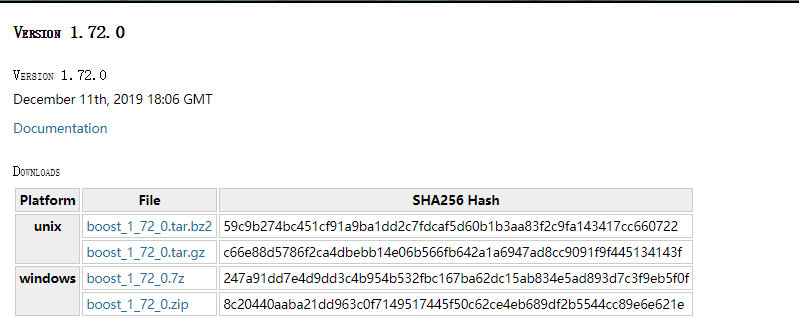
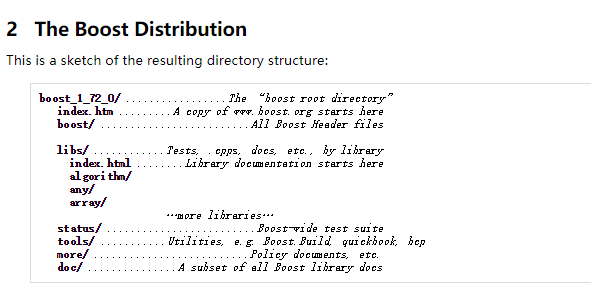
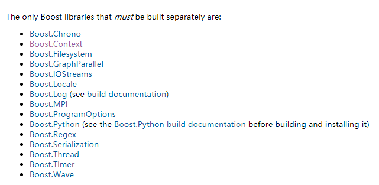

## Boost使用基础


### Boost编译使用

首先我们需要获取Boost的源码，我们去官网。

找到documentation的下载地址，下载最新版本的boost源码

目前我这个时间点：



根据文档提示在unix机器上解压：

```\
tar --bzip2 -xf /path/to/boost_1_72_0.tar.bz2
```

这个boost的源码文件，竟然有100多兆，嘤嘤嘤



解压后，上面是boost的结构。


**重点来了，boost的大部分库都是header-only的！！所以我们只要把这个库解压出来，就能很方便的使用。只需要在添加依赖的时候正确的引入头文件就好，如`#include <boost/whatever.hpp>`**


### 编译特定库

虽然boost大部分库都是header-only的，还是有部分库还是需要编译了才能使用



上面库都是要单独build出来。然后静态或者动态链接进去才能用


具体咋编译呢，主要是：

进入到boost主目录，主目录有一个boostrap文件帮助你编译的

```
./bootstrap.sh --with-libraries=all --prefix=xxx
```

with-libraries可以帮助你选择需要编译出哪些库，不过也不用的担心太多，最后编译出来的库也是分成很多个模块的，绝对不是一个超级大库。但是有些库也许也是不需要编译的，比如Python这些。

prefix选项则当然是安装路径了。全部设定好以后，就可以开始编译安装了

有时候静态库的编译也别忘了加fpic噢

```
./b2 cxxflags=-fpic install
```


之后就能在安装的文件夹里看到include和bin，头文件和对应的库了。


