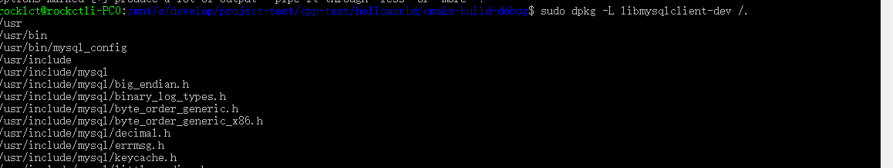

## SOCI
SOCI是一个数据库操作的库，并不是ORM库，它仍旧需要用户编写sql语句来操作数据库，只是使用起来会更加方便

有以下几个特点:


1. 以stream方式输入sql语句
2. 通过into和use语法传递和解析参数
3. 支持连接池，线程安全

git项目地址 https://github.com/SOCI/soci

### 编译安装
我们按照下面操作从git上下载SOCI源码，然后编译。

编译的时候我们就按cmake的标准来走咯：

```
git clone https://github.com/SOCI/soci.git
cd soci
mkdir build
cd build
cmake .. -G "Unix Makefiles" -DCMAKE_INSTALL_PREFIX=/third_party/soci
make install
```

我们先git上拉取了代码。然后根据cmake的外部编译原则，新创建一个build目录存放中间编译文件，并且cmake命令产生make时，指定环境变量PREFIX使得最后make install到指定的soci目录。


如上图，soci库被安装到thirdParty/soci文件夹中，soci目录下有三个子文件夹，cmake，include，lib64.

那么我们在操作soci时，只要在cmake或make文件里指定头文件查找目录为这里include，动态库查找这里的lib64，即可。

需要注意的是，soci要和数据库后端相结合。比如mysql，那么我们必须安装mysql的一些文件，比如`libmysqlclient.so`这个动态库。

在ubuntu下，我们可以根据命令`apt-get install libmysqlclient-dev`,安装对应的mysqlclient组件。安装这个组件后，一些mysql相关的头文件(比如mysql.h)还有静态文件libmysqlclient.so会被默认安装到诸如`/usr/lib/x86_64-linux-gnu`的默认安装位置，如图(用dpkg -L 命令查看)：




这样在程序执行的时候，动态加载库时就能自动去默认位置找到该静态库。
