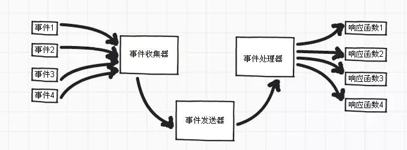

## libevent基础
Libevent 是一个用C语言编写的、轻量级的开源**高性能事件通知库**，主要有以下几个亮点：事件驱动（ event-driven），高性能;轻量级，专注于网络，不如 ACE 那么臃肿庞大；源代码相当精炼、易读；跨平台，支持 Windows、 Linux、 *BSD 和 Mac Os；支持多种 I/O 多路复用技术， epoll、 poll、 dev/poll、 select 和 kqueue 等；支持 I/O，定时器和信号等事件；注册事件优先级。

Libevent 已经被广泛的应用，作为底层的网络库；比如 memcached、 Vomit、 Nylon、 Netchat等等。

zwlj：官网描述，*The libevent API provides a mechanism to execute a callback function when a specific event occurs on a file descriptor or after a timeout has been reached. Furthermore, libevent also support callbacks due to signals or regular timeouts.* 也就是说，libevent就是对文件描述符的读写(我们熟知的事件通知IO模型epoll等等)做了一个封装，把它做成了事件的形式。

所以利用libevent，我们能更好的编写事件循环的代码。利用这种reactor模式的事件驱动模型，我们有以下优点：

1. 响应快，不必为单个同步事件所阻塞；

2. 编程相对简单，可以最大程度的避免复杂的多线程及同步问题，并且避免了多线程/进程的切换开销；

3. 可扩展性，可以方便的通过增加reactor实例个数来充分利用CPU资源；

4. 可复用性，reactor框架本身与具体事件处理逻辑无关，具有很高的复用性。

### libevent库构成

 - libevent_core 所有核心的事件和缓冲功能，包含event_base，evbuffer，bufferevent，工具函数
 - libevent_pthreads 基于pthread可移植线程库的线程和锁，**它独立于libevent_core，这样程序使用libevent时就不需要链接到pthread**，除非是以多线程方式使用libevent。
 - libevent_extra 定义了特定协议HTTP、DNS、RPC
 - libevent 因为历史原因而存在，不要使用这个库，未来版本可能被去掉libevent_core和libevent_extra

libevent不仅仅简单用reator模式包装了io事件，还提供了http dns rpc等协议的解析处理，这样就相当于可以简单实现一个http服务器了。

#### libevent事件处理示意图

