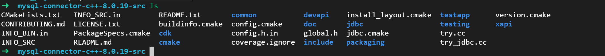

## mysql-connector

先要编译使用这个库

先去官网下载这个库：

https://dev.mysql.com/doc/connector-cpp/8.0/en/

得到tar包以后解压



按照cmake习惯，我们在这个源码目录新建一个build目录，然后cd进去

接着配置mysql-connetor需要的各种参数

其实主要就是依赖boost，所以我们只要指定好boost的头文件地点就可以了。

ps：注意，只有安装jdbc版本的connector才需要boost，否则不需要。我们用不到的话，其实可以不指定boost头文件地址了。

编译指引：https://dev.mysql.com/doc/connector-cpp/8.0/en/connector-cpp-installation-source-prerequisites.html

然后就是要指定好库安装的目的地(以下选项打开了release开关和静态库开关)

```
$cmake .. -DWITH_BOOST=/home/rockctli/src_pkg/boost_1_72_0 -DCMAKE_ENABLE_C++11=1 -DCMAKE_INSTALL_PREFIX=/home/rockctli/src_pkg/mysql-connector -DBUILD_STATIC=ON -DCMAKE_BUILD_TYPE=Release
$make
$make install
```

敲完命令，大功告成

make的话，还可以指定安装包的目的地：

```
make DESTDIR=/install/directory install
```

