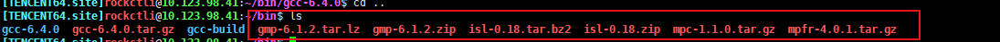
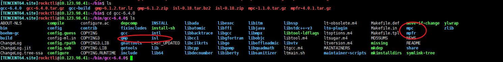
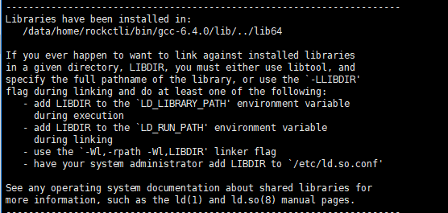

## 编译GCC
写C++无法避免我们需要gcc，这里记录编译GCC的流程

当然，在编译gcc之前，我们系统里当然已经要有一个旧版的gcc了，这样我们才能编译出新版的gcc。

我们先看一看官方给出的gcc所需要的依赖：[gcc依赖](https://gcc.gnu.org/install/prerequisites.html)

我们可以从 [官网gcc包下载地址](https://gcc.gnu.org/pub/gcc/releases/) 处，下载到我们想要版本的gcc tar包。下好以后我们把它解压放到一个地方。

我们有以下几个依赖要提前下好，几乎是属于必备的：

 - gmp
 - mpfr
 - mpc
 - isl

我们在依赖网站上，一一去对应的网站下载好对应的压缩包：



我们一一解压这些压缩包，得到对应的源码文件夹，然后我们把这些文件夹全部移到gcc-xx-xx/这个目录下，以下是命令示范：

```
tar -zxf gcc-4.9.4.tar.gz

tar -zxf mpfr-3.1.6.tar.gz（其他4个类似）

mv mpfr-3.1.6 gcc-4.9.4/mpfr（其他4个类似）
```


接着，我们此时在gcc源码目录已经有了对应的依赖的目录了：



我们此时最好在源码文件夹外mkdir一个新文件夹，用来存放编译后的文件。

我们cd .. 然后mkdir build,此时，我们就应该要最gcc的编译做一些初始设定了，这很重要。我们此时gcc源码目录和build目录同级，在cd进build目录的情况下，我们要执行源码目录的configure程序：

下面是一些配置样例，根据需求来

```
../gcc-6.4.0/configure --prefix=/data/home/rockctli/bin/gcc-6.4.0 --mandir=/data/home/rockctli/bin/gcc-6.4.0/share/man \
 --infodir=/data/home/rockctli/bin/gcc-6.4.0/share/info --with-bugurl=http://bugzilla.redhat.com/bugzilla \
 --enable-bootstrap --enable-shared --enable-threads=posix --enable-checking=release \
 --with-system-zlib --enable-__cxa_atexit --disable-libunwind-exceptions --enable-gnu-unique-object \
 --enable-languages=c,c++ --enable-java-awt=gtk --disable-dssi --with-java-home=/usr/lib/jvm/java-1.5.0-gcj-1.5.0.0/jre \
 --enable-libgcj-multifile --enable-java-maintainer-mode --with-ecj-jar=/usr/share/java/eclipse-ecj.jar --disable-libjava-multilib \
 --with-ppl --with-tune=generic --with-arch-32=i686 --build=x86_64-redhat-linux
```

要注意--prefix参数，--mandir参数，都要根据你新版gcc的位置来定。执行完这个configure程序以后，make文件就会生成在你的build目录下了。此时：

```
make -j8 bootstrap
```

-j参数，指定同时进行make任务的数量，越高越快。我们执行bootstrap过程，生成中间文件，这个过程不短，可能要一个小时。

然后最后执行

```
make install
```

make安装，结束整个编译过程。



可以去源码目录的bin目录下找到新gcc的可执行文件了。

我们还可以在makefile文件里指定gcc的位置：

```
CC = /data/home/rockctli/bin/gcc-6.4.0/bin/gcc
CXX = /data/home/rockctli/bin/gcc-6.4.0/bin/g++
```
