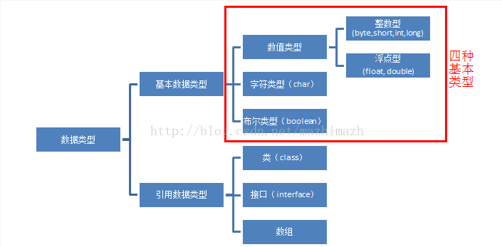

### 数据类型


如图，为java数据类型，注意基本数据类型有**8种**。

注意，基本数据类型也叫**原生类**。

除此之外，java实现了**真数组**。也就是数组元素在内存中连续存放，这体现了java语言的鲁棒性。

#### 整数类型
有四种，它们有**固定的表述范围和字段长度**，且**不受具体的操作系统的影响**，保证了Java的跨平台性。

整数可以表示为三种进制，普通10进制，0开头的8进制(012,056),0x开头的十六进制(0xAA)

整数表示的时候，默认是int类型，后面接l或者L才表示long

四种类型所占字节数


##### 整数类型的强制转换
java中设计byte，short和char的运算的时候都会进行隐式的类型转换成int(初始化时不会)。整数更不用说了，直接就是int。所以当
``` java
byte a=1,b=3; //pass
byte c = a+b; // fail
```
以上代码会编译失败，因为这里a，b，byte被显示提升以后，必须显式强转回byte才不会出错。

此外还需要注意，byte，short的自增不会引起隐式强转

#### 浮点类型
一样有固定范围，保证跨平台。

表现形式有两种，一种普通十进制表示，一种科学计数法表示(3.14e2)

小数数值默认是double，后面接f表示float，如3.14f


#### 字符类型

- 字符类型是用''单引号括起来的单个字符，例如char c = 'w'; char a = '中'，可以看到Java中的char类型是可以表示中文字符的;
- Java字符采用Unicode（全球语言统一编码）编码，每个字符**占2个字节**，因而可用16进制编码形式表示，如：char c = '\u0061'
- Java中允许使用转义字符'\'将其后面的字符转换成其他含义， 如： char c = '\n';  //表示换行

#### 布尔类型
boolean类型的值只有两种：true,false

**boolean类型不可以转换为其他的数据类型**，所以有过C语言编程基础的人可能认为1也能在Java中表示为true，这是错误的。

在C语言中是不存在bool类型的，但是0可以表示假，任何的非0可以表示真，包括负数。

### 数据类型的包装类
java有8种数据类型，同时也意味着有8种数据类型的**包装类**。


**还要注意所有的包装类（Integer、Long、Byte、Double、Float、Short）都是抽象类 Number 的子类。**


注意Number类是可继承的，然而其他比如Double类是final类

为什么要使用包装类型呢？

1. 更加体现了面向对象的特点
2. 由于包装类型本质是一个类，有属性有方法，所以就比基础类型的功能强大了许多，比如自带类型转换的方法。

包装类有**自动装箱和拆箱**的功能

基本数据类型和包装类之间的自动转换，叫自动装箱拆箱。

自动装箱和拆箱从**Java 1.5**开始引入，目的是将原始类型值转自动地转换成对应的对象。自动装箱与拆箱的机制可以让我们在Java的**变量赋值或者是方法调用**等情况下使用原始类型或者对象类型更加简单直接。

也要注意==的时候不会自动拆装箱，equals却会自动如此。但也要注意JVM常量池会缓存小整数的Integer对象，所以有时候-128~127里的Integer用==比较会是true。

自动装箱也有弊端，不当使用可能会创建多余对象，影响性能。
```
Integer sum = 0;
 for(int i=1000; i<5000; i++){
   sum+=i;
}
```

Integer没有+方法，所以需要不停拆箱做加法然后再装回去。在上面的循环中会创建将近4000个无用的Integer对象，在这样庞大的循环中，会降低程序的性能并且加重了垃圾回收的工作量
