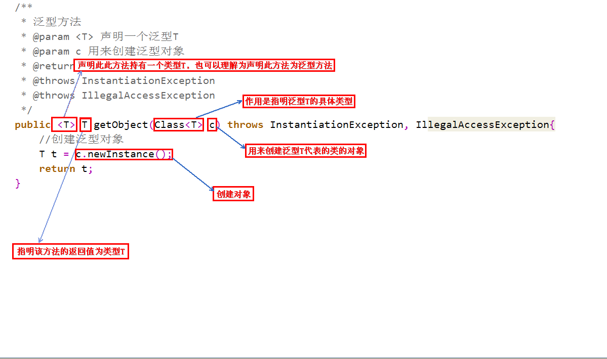

## Java泛型
Java泛型（generics）是JDK 5中引入的一个新特性，允许在定义类和接口的时候使用类型参数（type parameter）。**声明的类型参数在使用时用具体的类型来替换**。泛型最主要的应用是在**JDK 5中的新集合类框架**中。对于泛型概念的引入，开发社区的观点是褒贬不一。

从好的方面来说，泛型的引入可以解决之前的集合类框架在使用过程中通常会出现的运行时刻类型错误，因为**编译器可以在编译时刻就发现很多明显的错误**。而从不好的地方来说，为了保证与旧有版本的兼容性，Java泛型的实现上存在着一些不够优雅的地方。当然这也是任何有历史的编程语言所需要承担的历史包袱。

### 泛型方法
泛型方法，该方法在调用时可以接收不同类型的参数。根据传递给泛型方法的参数类型，编译器适当地处理每一个方法调用。

下面是定义泛型方法的规则：
 - 所有泛型方法声明都有一个类型参数声明部分（由尖括号分隔），该类型参数声明部分在方法返回类型之前。
 - 每一个类型参数声明部分包含一个或多个类型参数，参数间用逗号隔开。一个泛型参数，也被称为一个类型变量，是用于指定一个泛型类型名称的标识符。
 - 类型参数能被用来声明返回值类型，并且能作为泛型方法得到的实际参数类型的占位符。
 - 泛型方法体的声明和其他方法一样。注意类型参数只能代表引用型类型，不能是原始类型（像int,double,char的等）。

这里特地注明一下泛型方法声明时的含义



### 泛型类
泛型类的声明和非泛型类的声明类似，除了在类名后面添加了类型参数声明部分。
和泛型方法一样，泛型类的类型参数声明部分也包含一个或多个类型参数，参数间用逗号隔开。一个泛型参数，也被称为一个类型变量，是用于指定一个泛型类型名称的标识符。因为他们接受一个或多个参数，这些类被称为参数化的类或参数化的类型。

``` java
public class Box<T>{}
```

**zwlj：顺便一说，如若在使用类的时候不给类型参数，那么默认类型都会变成Object，这大概是由编译器实现决定的，泛型本身就是根据编译器自动帮你类型转换并附加桥接方法实现的\[后面类型擦除有提到\]，最后都是要类型擦除擦掉尖括号，所以默认不给参数的话，比如直接new List()，那么默认List里面的类型就是Object**

### Class\<T\>
这里要讲一讲Class\<T\>,他有他的特定用法。 随着Java的发展，类Class已经泛型化了

要区别一下T和Class\<T\>,T是指具体的某个类型，比如Apple类。那么Class\<T\>,就是Apple.class(Class类)。本质上，Apple.class的类型就是Class\<Apple\>(也可以只写成一个类型Class)

先看场景，之前的JDK版本中，Class.newInstance() 方法的定义返回 Object，您很可能要将该返回类型强制转换为另一种类型：
``` java
People people = (People) Class.forName("com.lyang.demo.fanxing.People").newInstance();
```

如果反射的类型不是People类，就会报
java.lang.ClassCastException错误。

使用Class\<T\>泛型后，不用强转了

``` java
public class Test {
    public static <T> T createInstance(Class<T> clazz) throws IllegalAccessException, InstantiationException {
        return clazz.newInstance();
    }

    public static void main(String[] args)  throws IllegalAccessException, InstantiationException  {
            Fruit fruit= createInstance(Fruit .class);
            People people= createInstance(People.class);
    }
}

```

zwlj:Class到Class\<T\>是一个泛型化的过程。

原本Class的定义大致是
``` java
class Class {
     Object newInstance();
 }
```

泛型化之后，定义被更改.
``` java
class Class<T> {
     T newInstance();
}
```

因此反射的时候可以拿到具体类型。


### 通配符与上下界
在使用泛型类的时候，既可以指定一个具体的类型，如List\<String\>就声明了具体的类型是String；也可以用通配符?来表示未知类型，**如List\<?\> 就声明了List中包含的元素类型是未知的**。

List\<?\>所声明的就是所有类型都是可以的。但是List<?>并不等同于List\<Object\>。List\<Object\>实际上确定了List中包含的是Object及其子类，在使用的时候都可以通过Object来进行引用。而List\<?\>则其中所包含的元素类型是不确定。其中可能包含的是String，也可能是 Integer。如果它包含了String的话，往里面添加Integer类型的元素就是错误的。

但是对于 List\<?\>中的元素确总是可以用Object来引用的，因为虽然类型未知，但肯定是Object及其子类。

因为对于List\<?\>中的元素只能用Object来引用，在有些情况下不是很方便。在这些情况下，**可以使用上下界来限制未知类型的范围**。

 - \<? extends T\>表示该通配符所代表的类型是T类型的子类。
 - \<? super T\>表示该通配符所代表的类型是T类型的父类。


当引入了上界之后，在使用类型的时候就可以使用上界类中定义的方法。比如访问 List\<? extends Number\>的时候，就可以使用Number类的intValue等方法。

### 类型系统(重)
虽然将集合看作是数组的抽象会有所帮助，但是数组还有一些集合不具备的特殊性质。Java 语言中的**数组是协变的-covariant**，也就是说(通俗的说)，如果 Integer扩展了 Number（事实也是如此），那么不仅 Integer是 Number，而且 Integer[]也是 Number[]，在要求 Number[]的地方完全可以传递或者赋予 Integer[]。（更正式地说，**如果 Number是 Integer的超类型，那么 Number[]也是 Integer[]的超类型**）。

**不幸的是，泛型不是协变的.** 也就是说，List\<Number\>不是 List\<Integer\>的超类型.

#### 协变的定义(临时插入)
记f(Object)是一种构造类型（可以类比下初中数学中函数的定义），那么我们可以这么来描述协变和逆变：

 - 当A ≦ B时,如果有f(A) ≦ f(B),那么f叫做协变；
 - 当A ≦ B时,如果有f(B) ≦ f(A),那么f叫做逆变；
 - 如果上面两种关系都不成立则叫做不可变。

比如上面的String ≦ Object 还有 String[] ≦ Object[]，这是协变。


不允许泛型协变这样做有一个很充分的理由：这样做将破坏要提供的类型安全泛型。
``` java
List<Integer> li = new ArrayList<Integer>();
List<Number> ln = li; // illegal
ln.add(new Float(3.1415));
```

如果能够将 List\<Integer\>赋给 List\<Number\>。那么上面的代码就允许将非 Integer的内容放入 List\<Integer\>,那么这就破坏了蕴含在 li定义中的类型安全承诺 —— 它是一个整数列表，这就是泛型类型不能协变的原因。

虽然上面代码换成数组，依旧是会抛出错误，然而因为数组时协变的，所以数组的情况下可以安全通过编译，只不过运行时才会报错。

引入泛型之后的类型系统增加了两个维度：一个是类型参数自身的继承体系结构，另外一个是泛型类或接口自身的继承体系结构。第一个指的是对于 List\<String\>和List\<Object\>这样的情况，类型参数String是继承自Object的。而第二种指的是 List接口继承自Collection接口。对于这个类型系统，有如下的一些规则：

 - 相同类型参数的泛型类的关系取决于泛型类自身的继承体系结构。即List\<String\>是Collection\<String\> 的子类型，List\<String\>可以替换Collection\<String\>。这种情况也适用于带有上下界的类型声明。

 - **当泛型类的类型声明中使用了通配符的时候**， 其子类型可以在两个维度上分别展开。如对Collection\<? extends Number\>来说，其子类型可以在Collection这个维度上展开，即List\<? extends Number\>和Set\<? extends Number\>等；也可以在Number这个层次上展开，即Collection\<Double\>和 Collection\<Integer\>等。如此循环下去，ArrayList\<Long\>和 HashSet\<Double\>等也都算是Collection<? extends Number>的子类型。

 - 如果泛型类中包含多个类型参数，则对于每个类型参数分别应用上面的规则。


### 类型擦除
正确理解泛型概念的首要前提是理解类型擦除（type erasure）。 **Java中的泛型基本上都是在编译器这个层次来实现的**。在生成的Java字节代码中是**不包含泛型中的类型信息**的。使用泛型的时候加上的类型参数，会被编译器在**编译的时候去掉**。这个过程就称为类型擦除。

如在代码中定义的List\<Object\>和List\<String\>等类型，在编译之后都会变成List。**JVM看到的只是List**，而由泛型附加的类型信息对JVM来说是不可见的。Java编译器会在编译时尽可能的发现可能出错的地方，但是仍然无法避免在运行时刻出现类型转换异常的情况。**类型擦除也是Java的泛型实现方式与C++模板机制实现方式之间的重要区别**。

很多泛型的奇怪特性都与这个类型擦除的存在有关，包括：
 - 泛型类并没有自己独有的Class类对象。比如并不存在List\<String\>.class或是List\<Integer\>.class，而只有List.class。
 - 静态变量是被泛型类的所有实例所共享的。对于声明为MyClass\<T\>的类，访问其中的静态变量的方法仍然是 MyClass.myStaticVar。不管是通过new MyClass\<String\>还是new MyClass\<Integer\>创建的对象，亦或直接new MyClass，都是共享一个静态变量。
 - 泛型的类型参数不能用在Java异常处理的catch语句中。因为异常处理是由JVM在运行时刻来进行的。由于类型信息被擦除，JVM是无法区分两个异常类型MyException\<String\>和MyException\<Integer\>的。对于JVM来说，它们都是 MyException类型的。也就无法执行与异常对应的catch语句。

需要注意的是，**在Java中不允许创建泛型数组**


而且对于泛型代码，Java编译器实际上还会偷偷帮我们实现一个Bridge method。
``` java
public class Node<T> {
    public T data;
    public Node(T data) { this.data = data; }
    public void setData(T data) {
        System.out.println("Node.setData");
        this.data = data;
    }
}
public class MyNode extends Node<Integer> {
    public MyNode(Integer data) { super(data); }
    public void setData(Integer data) {
        System.out.println("MyNode.setData");
        super.setData(data);
    }
}
```

上面的代码经过类型擦除后，按照预想会转换为下面代码
``` java
public class Node {
    public Object data;
    public Node(Object data) { this.data = data; }
    public void setData(Object data) {
        System.out.println("Node.setData");
        this.data = data;
    }
}
public class MyNode extends Node {
    public MyNode(Integer data) { super(data); }
    public void setData(Integer data) {
        System.out.println("MyNode.setData");
        super.setData(data);
    }
}
```

实际上这样转换，还是不够的，因为我extends Node\<integer\>,而不是简简单单的extends Node，要体现这个integer泛型参数。实际类型中还会产生一个bridge method。
``` java
class MyNode extends Node {
    // Bridge method generated by the compiler
    public void setData(Object data) {
        setData((Integer) data);
    }
    public void setData(Integer data) {
        System.out.println("MyNode.setData");
        super.setData(data);
    }
    // ...
}
```
setData方法进行了一个强制类型转换，这样就确保了参数只符合Integer，如果运行时不对，编译器就会报错。


编译器会尽可能的检查可能存在的类型安全问题。对于确定是违反相关原则的地方，会给出编译错误。当编译器无法判断类型的使用是否正确的时候，会给出警告信息。
