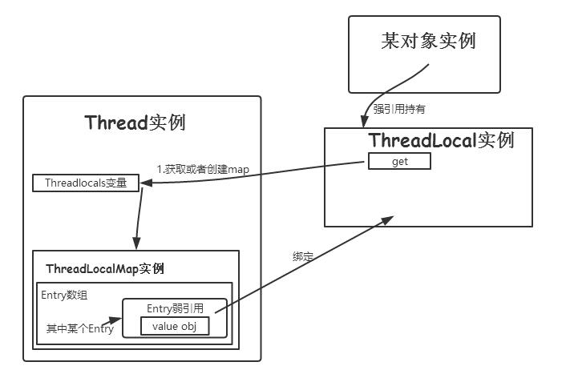

## ThreadLocal
ThreadLocal是一个关于创建线程局部变量的类。

通常情况下，我们创建的变量是可以被任何一个线程访问并修改的。而使用ThreadLocal创建的变量只能被当前线程访问，其他线程则无法访问和修改。

ThreadLocal的名称比较容易让人误解，会认为其是一个“本地线程”。其实，ThreadLocal并不是一个Thread，而是Thread的局部变量。

创建这个变量很简单，而且它支持泛型,并且有set和get方法。

``` java
ThreadLocal<String> mStringThreadLocal = new ThreadLocal<>();

mStringThreadLocal.set("droidyue.com");

mStringThreadLocal.get();

```

意思就是这个变量，在每个线程都有一个副本，互不干扰。

zwlj：好比说，线程之间是可以访问线程外的static静态变量的,也或者是可以通过过传递同一个引用进入线程的方式来共享变量，这当然是一种线程协作共享的场合。但是万一我希望每个线程都有一个自己的变量副本又如何呢？那这时就应该使用ThreadLocal了，所以ThreadLocal并不是解决线程之间协作的问题。

*ThreadLocal类用来提供线程内部的局部变量。这种变量在多线程环境下访问(通过get或set方法访问)时能保证各个线程里的变量相对独立于其他线程内的变量。ThreadLocal实例通常来说都是private static类型的，用于关联线程和线程的上下文。*、


来看一个比较长的例子
``` java
public class ThreadLocalDemo {
    public static void main(String []args){
        for(int i=0;i<5;i++){
            final Thread t = new Thread(){
                @Override
                public void run(){
                    System.out.println("当前线程:"+Thread.currentThread().getName()+",已分配ID:"+ThreadId.get());
                }
            };
            t.start();
        }
    }
    static   class ThreadId{
        //一个递增的序列，使用AtomicInger原子变量保证线程安全
        private static final AtomicInteger nextId = new AtomicInteger(0);
        //线程本地变量，为每个线程关联一个唯一的序号
        private static final ThreadLocal<Integer> threadId =
                new ThreadLocal<Integer>() {
                    @Override
                    protected Integer initialValue() {
                        return nextId.getAndIncrement();//相当于nextId++,由于nextId++这种操作是个复合操作而非原子操作，会有线程安全问题(可能在初始化时就获取到相同的ID，所以使用原子变量
                    }
                };

       //返回当前线程的唯一的序列，如果第一次get，会先调用initialValue，后面看源码就了解了
        public static int get() {
            return threadId.get();
        }
    }
}
```

以上案例使用了ThreadLocal，输出结果是每一个线程都获得了不同的id，说明了每个线程都存有一个变量副本。假若，这里不适用threadLocal变量定义这个threadId而只使用static。那么几个线程当然就会共享这个threadId变量，只获得一个初始值，而threadId也只会进行初始化一次。


### 原理
下面是ThreadLocal的set方法，大致意思为

``` java
public void set(T value) {
    Thread t = Thread.currentThread();
    ThreadLocalMap map = getMap(t);
    if (map != null)
        map.set(this, value);
    else
        createMap(t, value);
}

```

 - 首先获取当前线程
 - 利用当前线程作为句柄获取一个ThreadLocalMap的对象
 - 如果上述ThreadLocalMap对象不为空，则设置值，否则创建这个ThreadLocalMap对象并设置值。设置值的时候，这个this指的都是当前这个ThreadLocal对象

``` java
ThreadLocalMap getMap(Thread t) {
    return t.threadLocals;
}
```

上面的代码获取的实际上是Thread对象的threadLocals变量

threadLocals这个变量早就定义在了Thread这个类里。

``` java
class Thread implements Runnable {
    /* ThreadLocal values pertaining to this thread. This map is maintained
     * by the ThreadLocal class. */

    ThreadLocal.ThreadLocalMap threadLocals = null;
}
```
并且

``` java
void createMap(Thread t, T firstValue) {
    t.threadLocals = new ThreadLocalMap(this, firstValue);
}
```

**总结：实际上ThreadLocal的值是放入了当前线程的一个ThreadLocalMap实例中，所以只能在本线程中访问，其他线程无法访问。** 这里的this要注意放入的是ThreadLocal对象实例

#### 对象存放在哪里
每个Thread被创建后，其实都有它自己的作用域，换而言之就是产生一个线程的私有栈帧，栈帧当然是存放在栈内存当中。栈帧是线程私有。

#### 内存泄露
ThreadLocal并不会产生内存泄露，因为ThreadLocalMap在选择key的时候，并不是直接选择ThreadLocal实例，而是ThreadLocal实例的**弱引用**。

看以下ThreadLocalMap的源码

``` java
static class ThreadLocalMap {

/**
* The entries in this hash map extend WeakReference, using
* its main ref field as the key (which is always a
* ThreadLocal object).  Note that null keys (i.e. entry.get()
* == null) mean that the key is no longer referenced, so the
* entry can be expunged from table.  Such entries are referred to
* as "stale entries" in the code that follows.
*/
    static class Entry extends WeakReference<ThreadLocal<?>> {
        /** The value associated with this ThreadLocal. */
        Object value;

        Entry(ThreadLocal<?> k, Object v) {
            super(k);
            value = v;
        }
    }
}
```
所以实际上从ThreadLocal设计角度来说是**不会导致内存泄露的**。super(K)是在初始化weakReference的key值，这个key值之前看到了是ThreadLocal实例本身


#### zwlj总结



zwlj:总结一下原理便如上图所示，Threadlocal在get变量的时候，会根据currentThread，去这个thread实例里去找threadlocals变量，这个变量指向一个ThreadLocalMap实例，这个实例里有个Entry数组，每个Entry都以一个弱引用方式绑定一个ThreadLocal，并且自身里也自带一个value object。这个就是ThreadLocal的map实现方式，跟threadlocal实例绑定。

由此我们可知threadlocalmap里有很多entry可以绑定多个Threadlocal实例，同时一个threadlocal实例也可以被不同线程的threadlocalmap绑定。

那么为什么这么做可以解决内存泄漏的问题呢？那是因为，假如说，我们Entry是以强引用的方式绑定threadloca的，也就是我们不写成Entry，直接用一个map\<threadlocal,value\>来进行绑定，那么当图中的“某对象实例”死掉以后，ThreadLocal实例并不会被回收，而是跟每个绑定他的Thread的生命周期一致了，thread不死，那这个threadlocal也不死。实质上这是不对的，如果用弱引用，那么当持有这个threadlocal的类死掉，这个threadlocal自然就没用了，thread又是用弱引用绑定的它，所以这个threadlocal实例不会活过下一次gc，从而避免内存泄漏。

这里要注意的是，没错，ThreadLocal实例不会引起内存泄漏。但是Enrty里弱引用里的value却是不会被回收的，但是这个Entry slot会在之后被复用，这样也算是threadlocalmap自带了一定的清理机制。即便如此，**显示进行threadlocal的remove，是一个好习惯！**
