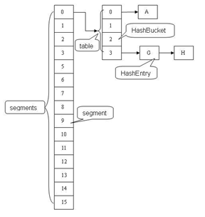
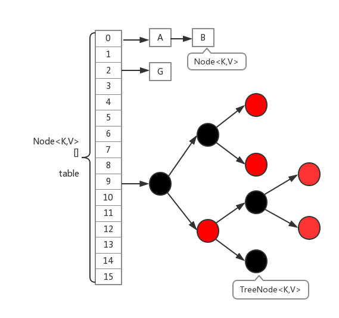

## java并发容器
Java 5.0 提供了多种并发容器来改进同步容器的性能。

 **同步容器**是将所有对容器的访问都串行化，以实现他们的线程安全性。代价是严重降低并发行，当多个线程竞争容器的锁时，吞吐量将严重降低。

 **并发容器**是针对多个线程并发访问设计的。

Java 5.0 还增加了两中心的容器类型：Queue 和 BlockingQueue。

早期版本的JDK提供的同步容器类为Vector和Hashtable，JDK1.2 提供了Collections.synchronizedXxx等工程方法，将普通的容器继续包装。对每个共有方法都进行同步。

同步容器都是线程安全的，但是对于复合操作，有些缺点：
1. 性能差
2. 存在偷偷使用迭代器的情况，比如hashCode和equals方法也会间接地调用迭代。类似地，contailAll、removeAll、retainAll方法，以及容器作为参数的构造函数，都会对容器进行迭代。而使用迭代器，就要加锁从而很影响性能
3. 复合操作不线程安全

上述的第三点，比如说
``` java
public static Object getLast(Vector list) {
int lastIndex = list.size() - 1;
return list.get(lastIndex);
}
public static void deleteLast(Vector list) {
int lastIndex = list.size() - 1;
list.remove(lastIndex);
}
```

一般我们都是if判断是否存在某个值，再去操作，如若两个函数分别在两个线程进行。执行时，deleteLast先拿到锁，把一个元素删了。这个时候排队的get函数获得锁时则会发生拿不到对应元素从而发生错误的情况。


正是由于同步容器类有以上问题，导致这些类成了鸡肋，于是Java 5推出了并发容器类，Map对应的有**ConcurrentHashMap**，List对应的有**CopyOnWriteArrayList**。与同步容器类相比，它有以下特性：

### ConcurrentHashMap
ConcurrentHashMap允许多个修改操作并发进行，其关键在于使用了**锁分离**技术。它使用了多个锁来控制对hash表的不同部分进行的修改。ConcurrentHashMap内部使用段(Segment)来表示这些不同的部分，每个段其实就是一个小的Hashtable，它们有自己的锁。只要多个修改操作发生在不同的段上，它们就可以并发进行。

有些方法需要跨段，比如size()和containsValue()，它们可能需要锁定整个表而而不仅仅是某个段，这需要按顺序锁定所有段，操作完毕后，又按顺序释放所有段的锁。这里“按顺序”是很重要的，否则极有可能出现死锁

现在稍微说下具体原理



从图中可以看到，ConcurrentHashMap内部分为很多个Segment，每一个Segment拥有一把锁(实质上自己就继承于ReentrantLock)，然后每个Segment都有一个hashtable一样的结构，从图中都可以清晰的看出。

CHM适用于做cache,在程序启动时初始化，之后可以被多个请求线程访问。正如Javadoc说明的那样，CHM是HashTable一个很好的替代，但要记住，CHM的比HashTable的同步性稍弱。

#### spread()重哈希
对于一个hash表来说，hash值分散的不够均匀的话会大大增加哈希冲突的概率，从而影响到hash表的性能。因此通过spread方法进行了一次重hash从而大大减小哈希冲突的可能性。

方法主要是将key的**hashCode的低16位于高16位进行异或运算**，这样不仅能够使得hash值能够分散能够均匀减小hash冲突的概率，另外只用到了异或运算，在性能开销上也能兼顾，做到平衡的trade-off。


#### 源码中的注意点
而JDK1.8中，HashMap已经采用数组+链表+红黑树实现，当链表长度超过阈值8时，将链表转换为红黑树，这样大大减少了查找时间。当桶中节点数小于6时，红黑树也会转为链表。

并且键值对的数量大于64才会发生转换。为了避免在哈希表建立初期，多个键值对恰好放在一块引起的不必要转化。


#### 1.8的改进
到了JDK 1.8的ConcurrentHashMap就有了很大的变化，光是代码量就足足增加了很多。1.8版本舍弃了segment，并且大量使用了synchronized，以及CAS无锁操作以保证ConcurrentHashMap操作的线程安全性。至于为什么不用ReentrantLock而是Synchronzied呢？实际上，synchronzied做了很多的优化，包括偏向锁，轻量级锁，重量级锁，可以依次向上升级锁状态，但不能降级

因此，使用synchronized相较于ReentrantLock的性能会持平甚至在某些情况更优

ConcurrentHashMap在1.8中的实现，相比于1.7的版本基本上全部都变掉了。首先，取消了Segment分段锁的数据结构，取而代之的是数组+链表（红黑树）的结构。而对于锁的粒度，调整为对每个数组元素加锁（Node）。然后是定位节点的hash算法被简化了，这样带来的弊端是Hash冲突会加剧。因此在链表节点数量大于8时，会将链表转化为红黑树进行存储。这样一来，查询的时间复杂度就会由原先的O(n)变为O(logN)。下面是其基本结构：



**zwlj：简而言之，就是在HashMap进行插入的时候，如果发现对应的哈希位置没有节点，那就用CAS添加。如果有节点(链表头结点或者是红黑树的根节点)，那就用synchronize加锁然后进行操作。**

#### 并发扩容机制
jdk8中，采用**多线程扩容**。整个扩容过程，通过**CAS设置sizeCtl**，transferIndex等变量协调多个线程进行并发扩容。

扩容期间，将table数组中的元素 迁移到 nextTable。

``` java
/**
 * The next table to use; non-null only while resizing.
   扩容时，将table中的元素迁移至nextTable . 扩容时非空
 */
private transient volatile Node<K,V>[] nextTable;

```

**多线程之间，以volatile的方式读取sizeCtl属性，来判断ConcurrentHashMap当前所处的状态。通过cas设置sizeCtl属性，告知其他线程ConcurrentHashMap的状态变更。**

``` java
private transient volatile int sizeCtl;
```

不同状态，sizeCtl所代表的含义也有所不同。

未初始化：
 - sizeCtl=0：表示没有指定初始容量。
 - sizeCtl>0：表示初始容量。

初始化中：
 - sizeCtl=-1,标记作用，告知其他线程，正在初始化

正常状态：
 - sizeCtl=0.75n ,扩容阈值

扩容中:
 - sizeCtl < 0 : 表示有其他线程正在执行扩容
 - sizeCtl = (resizeStamp(n) << RESIZE_STAMP_SHIFT) + 2 :表示此时只有一个线程在执行扩容

ConcurrentHashMap的状态图如下：


**扩容时机：**

 - 当前容量超过阈值(默认0.75n)
 - 当链表中元素个数超过默认设定（8个），当数组的大小还未超过64的时候，此时进行数组的扩容，如果超过则将链表转化成红黑树
 - 当发现其他线程扩容时，帮其扩容

zwlj：总而言之便是，concurrentHashMap达到扩容时机是，便会有扩容线程产生帮助其扩容，主要原理就是产生一个新的table数组，然后将原来数组的元素迁移过去。扩容过的节点会被标记成ForwardingNode，这样别的线程来put的时候就会知道此时有线程在扩容。


### CopyOnWrite容器
CopyOnWrite容器即写时复制的容器。通俗的理解是当我们往一个容器添加元素的时候，不直接往当前容器添加，而是**先将当前容器进行Copy，复制出一个新的容器，然后新的容器里添加元素，添加完元素之后，再将原容器的引用指向新的容器**。这样做的好处是我们可以对CopyOnWrite容器进行并发的读，而不需要加锁，因为当前容器不会添加任何元素。所以CopyOnWrite容器也是一种读写分离的思想，读和写不同的容器。

CopyOnWrite并发容器用于读多写少的并发场景。比如白名单，黑名单，商品类目的访问和更新场景，假如我们有一个搜索网站，用户在这个网站的搜索框中，输入关键字搜索内容，但是某些关键字不允许被搜索。这些不能被搜索的关键字会被放在一个黑名单当中，黑名单每天晚上更新一次。当用户搜索时，会检查当前关键字在不在黑名单当中，如果在，则提示不能搜索。

CopyOnWrite容器有很多优点，但是同时也存在两个问题，即内存占用问题和数据一致性问题。所以在开发的时候需要注意一下。

1. 内存占用问题。因为CopyOnWrite的写时复制机制，所以在进行写操作的时候，内存里会同时驻扎两个对象的内存，旧的对象和新写入的对象（注意:在复制的时候只是复制容器里的引用，只是在写的时候会创建新对象添加到新容器里，而旧容器的对象还在使用，所以有两份对象内存）。如果这些对象占用的内存比较大，比如说200M左右，那么再写入100M数据进去，内存就会占用300M，那么这个时候很有可能造成频繁的Yong GC和Full GC。之前我们系统中使用了一个服务由于每晚使用CopyOnWrite机制更新大对象，造成了每晚15秒的Full GC，应用响应时间也随之变长。

　　针对内存占用问题，可以通过压缩容器中的元素的方法来减少大对象的内存消耗，比如，如果元素全是10进制的数字，可以考虑把它压缩成36进制或64进制。或者不使用CopyOnWrite容器，而使用其他的并发容器，如ConcurrentHashMap。

2. 数据一致性问题。CopyOnWrite容器只能保证数据的最终一致性，不能保证数据的实时一致性。所以如果你希望写入的的数据，马上能读到，请不要使用CopyOnWrite容器。
