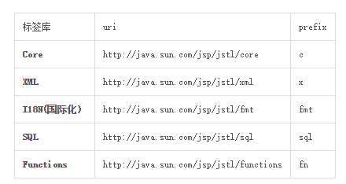

## JSP标准标签库
JSP标准标签库（JSTL）是一个JSP标签集合，它封装了JSP应用的通用核心功能。

jstl 标签库，按其功能划分，有以下五大类标签：核心标签库（core），xml标签库，国际化标签库（i18n），sql 标签库，函数标签库（fn），

 - 核心标签
 - 格式化标签
 - SQL 标签
 - XML 标签
 - JSTL 函数

其相关的 uri 和前缀如下




**在使用各种标签之前，要加上指令标签 taglib，<%@ taglib uri="..." prefix="..." %>**

### 标签使用
只拿核心标签的使用举例(其他标签使用方法查阅文档)

核心标签core是最常用的JSTL标签。引用核心标签库的语法如下：

``` xml
<%@ taglib prefix="c"
           uri="http://java.sun.com/jsp/jstl/core" %>
```

上面声明引用这个核心标签库。

核心标签库里包括比如<c:set>,<c:out>,这些标签。


核心标签有很多种，具体标签可以查阅文档，下面demo给出一个使用的例子

``` html
<%@ taglib uri="http://java.sun.com/jsp/jstl/core" prefix="c" %>
<html>
<head>
<title><c:set> Tag Example - www.yiibai.com</title>
</head>
<body>
<c:set var="salary" scope="session" value="${2000*2}"/>
<c:out value="${salary}"/>
</body>
</html>
```

上面网页会输出4000.
