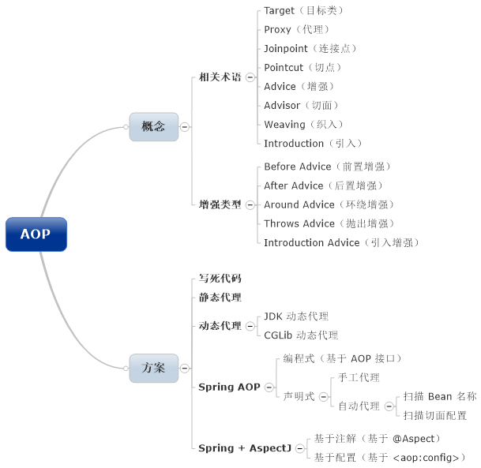
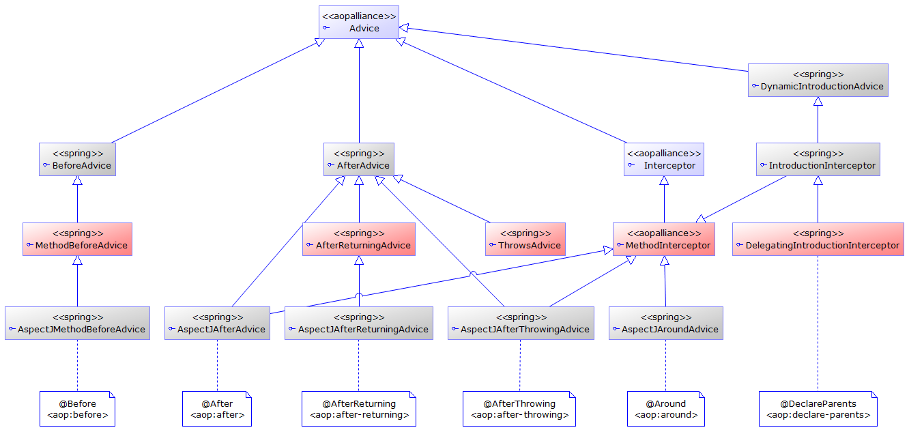

## Spring AOP

一张图总结。

<table  cellpadding="2" cellspacing="0" border="1" bordercolor="#000000">
 <tbody>
  <tr>
   <td> 增强类型 </td>
   <td> 基于 AOP 接口 </td>
   <td> 基于 @Aspect </td>
   <td> 基于&nbsp;&lt;aop:config&gt; </td>
  </tr>
  <tr>
   <td> Before Advice（前置增强）  </td>
   <td> MethodBeforeAdvice  </td>
   <td> @Before  </td>
   <td> &lt;aop:before&gt;  </td>
  </tr>
  <tr>
   <td> AfterAdvice（后置增强）  </td>
   <td> AfterReturningAdvice  </td>
   <td> @After  </td>
   <td> &lt;aop:after&gt;  </td>
  </tr>
  <tr>
   <td> AroundAdvice（环绕增强）  </td>
   <td> MethodInterceptor  </td>
   <td> @Around  </td>
   <td> &lt;aop:around&gt;  </td>
  </tr>
  <tr>
   <td> ThrowsAdvice（抛出增强  </td>
   <td> ThrowsAdvice  </td>
   <td> @AfterThrowing  </td>
   <td> &lt;aop:after-throwing&gt;  </td>
  </tr>
  <tr>
   <td> IntroductionAdvice（引入增强）  </td>
   <td> DelegatingIntroductionInterceptor  </td>
   <td> @DeclareParents  </td>
   <td> &lt;aop:declare-parents&gt;  </td>
  </tr>
 </tbody>
</table>

最后给一张 UML 类图描述一下 Spring AOP 的整体架构：

