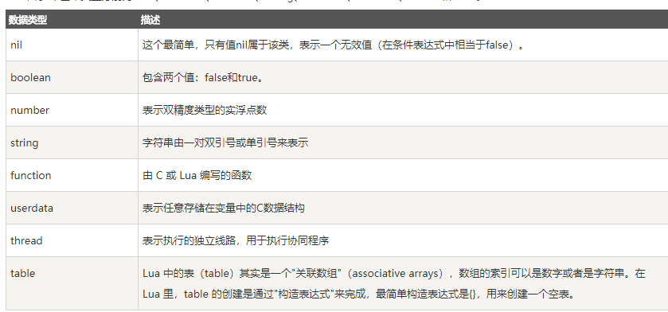

## Lua基础
Lua 是一种轻量小巧的脚本语言，用标准C语言编写并以源代码形式开放， **其设计目的是为了嵌入应用程序中，从而为应用程序提供灵活的扩展和定制功能**。

### 数据类型
Lua中有8个基本类型分别为：nil、boolean、number、string、userdata、function、thread和table。



#### nil
nil 类型表示一种没有任何有效值，它只有一个值 -- nil，例如打印一个没有赋值的变量，便会输出一个 nil 值

对于全局变量和 table，nil 还有一个"删除"作用，给全局变量或者 table 表里的变量赋一个 nil 值，等同于把它们删掉

```
tab1 = { key1 = "val1", key2 = "val2", "val3" }
for k, v in pairs(tab1) do
    print(k .. " - " .. v)
end
 
```

nil 作比较时应该加上双引号

```
> type(X)
nil
> type(X)==nil
false
> type(X)=="nil"
true
> 
```

Lua 把 false 和 nil 看作是"假"，其他的都为"真":

#### string
字符串用双引号表示，也可以用两个方括号表示。

#### table
在 Lua 里，table 的创建是通过"构造表达式"来完成，最简单构造表达式是{}，用来创建一个空表。也可以在表里添加一些数据，直接初始化表:

```
a3 = {}
for i = 1, 10 do
    a3[i] = i
end
a3["key"] = "val"
print(a3["key"])
print(a3["none"])
```

#### function

在 Lua 中，函数是被看作是"一等公民（First-Class Value）"，函数可以存在变量里:

```
function factorial1(n)
    if n == 0 then
        return 1
    else
        return n * factorial1(n - 1)
    end
end
print(factorial1(5))
factorial2 = factorial1
print(factorial2(5))
```

函数支持多返回值和可变参数

Lua 函数可以接受可变数目的参数，和 C 语言类似，在函数参数列表中**使用三点 ... 表示函数有可变的参数**。