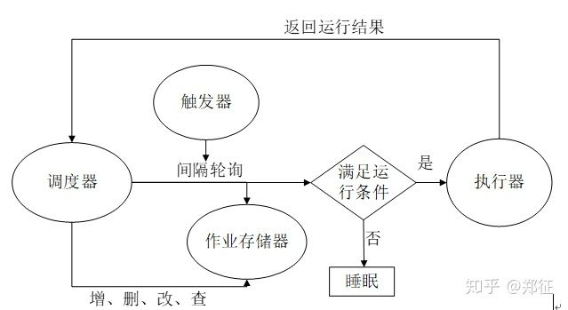

## 定时任务框架apscheduler
了解一下几个概念：

 - 触发器（triggers）：触发器包含调度逻辑，描述一个任务何时被触发，按日期或按时间间隔或按 cronjob 表达式三种方式触发。每个作业都有它自己的触发器，除了初始配置之外，触发器是完全无状态的。

 - 作业存储器（job stores）：作业存储器指定了作业被存放的位置，默认情况下作业保存在内存，也可将作业保存在各种数据库中，当作业被存放在数据库中时，它会被序列化，当被重新加载时会反序列化。作业存储器充当保存、加载、更新和查找作业的中间商。在调度器之间不能共享作业存储。

 - 执行器（executors）：执行器是将指定的作业（调用函数）提交到线程池或进程池中运行，当任务完成时，执行器通知调度器触发相应的事件。

 - 调度器（schedulers）：任务调度器，属于控制角色，通过它配置作业存储器、执行器和触发器，添加、修改和删除任务。调度器协调触发器、作业存储器、执行器的运行，通常只有一个调度程序运行在应用程序中，开发人员通常不需要直接处理作业存储器、执行器或触发器，配置作业存储器和执行器是通过调度器来完成的。



使用的时候遵循下面的模板即可：

### 间隔性任务

``` python
# -*- coding: utf-8 -*-
# Time: 2018/10/13 19:01:30
# File Name: ex_interval.py

from datetime import datetime
import os
from apscheduler.schedulers.blocking import BlockingScheduler

def tick():
    print('Tick! The time is: %s' % datetime.now())

if __name__ == '__main__':
    scheduler = BlockingScheduler()
    scheduler.add_job(tick, 'interval', seconds=3)
    print('Press Ctrl+{0} to exit'.format('Break' if os.name == 'nt' else 'C    '))

    try:
        scheduler.start()
    except (KeyboardInterrupt, SystemExit):
        pass
```

**导入调度器模块 BlockingScheduler，这是最简单的调度器，调用 start 方阻塞当前进程，如果你的程序只用于调度，除了调度进程外没有其他后台进程，那么请用 BlockingScheduler 非常有用，此时调度进程相当于守护进程。**

实例化一个 BlockingScheduler 类，不带参数表明使用默认的作业存储器-内存，默认的执行器是线程池执行器，最大并发线程数默认为 10 个（另一个是进程池执行器）。

第 11 行添加一个作业 tick，触发器为 interval，每隔 3 秒执行一次，另外的触发器为 date，cron。date 按特定时间点触发，cron 则按固定的时间间隔触发。 加入捕捉用户中断执行和解释器退出异常，pass 关键字，表示什么也不做。

### cron任务

``` python
# -*- coding: utf-8 -*-
# Time: 2018/10/13 19:21:09
# File Name: ex_cron.py


from datetime import datetime
import os
from apscheduler.schedulers.blocking import BlockingScheduler

def tick():
    print('Tick! The time is: %s' % datetime.now())

if __name__ == '__main__':
    scheduler = BlockingScheduler()
    scheduler.add_job(tick, 'cron', hour=19,minute=23)
    print('Press Ctrl+{0} to exit'.format('Break' if os.name == 'nt' else 'C    '))

    try:
        scheduler.start()
    except (KeyboardInterrupt, SystemExit):
        pass
```

hour =19 ,minute =23 这里表示每天的19：23 分执行任务。这里可以填写数字，也可以填写字符串

