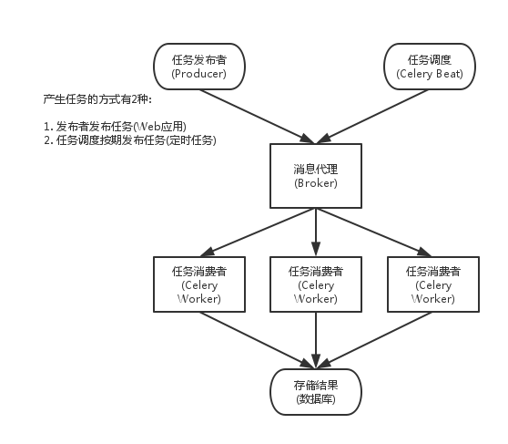

## celery异步任务
Celery是一个专注于**实时处理和任务调度的分布式任务队列**。所谓任务就是消息，消息中的有效载荷中包含要执行任务需要的全部数据。

使用Celery的常见场景如下：

 - Web应用。当用户触发的一个操作需要较长时间才能执行完成时，可以把它作为任务交给Celery去异步执行，执行完再返回给用户。这段时间用户不需要等待，提高了网站的整体吞吐量和响应时间。
 - 定时任务。生产环境经常会跑一些定时任务。假如你有上千台的服务器、上千种任务，**定时任务的管理很困难，Celery可以帮助我们快速在不同的机器设定不同种任务**。
 -  同步完成的附加工作都可以异步完成。比如发送短信/邮件、推送消息、清理/设置缓存等。

Celery还提供了如下的特性：

1. 方便地查看定时任务的执行情况，比如执行是否成功、当前状态、执行任务花费的时间等。
2. 可以使用功能齐备的管理后台或者命令行添加、更新、删除任务。
3. 方便把任务和配置管理相关联。
4. 可选多进程、Eventlet和Gevent三种模式并发执行。
5. 提供错误处理机制。

celery架构图：

如上图，其实不难理解，有几种组件：

 - Celery Beat：任务调度器，Beat进程会读取配置文件的内容，周期性地将配置中到期需要执行的任务发送给任务队列(也就是一种生产者)。
 -  Producer：调用了Celery提供的API、函数或者装饰器而产生任务并交给任务队列处理的都是任务生产者。
 -  Broker：消息代理，或者叫作消息中间件，接受任务生产者发送过来的任务消息，存进队列再按序分发给任务消费方（通常是消息队列或者数据库）。zwlj：本质上就是一个消息队列嘛
 -  Celery Worker：执行任务的消费者，通常会在多台服务器运行多个消费者来提高执行效率。
 -   Result Backend：任务处理完后保存状态信息和结果，以供查询。Celery默认已支持Redis、RabbitMQ、MongoDB、Django ORM、SQLAlchemy等方式。

