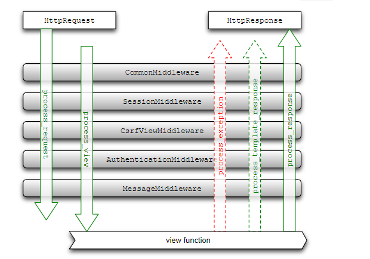

## django基础
安装django `pip install django`,然后可以直接在命令行执行django-admin创建一个样例python工程。`django-admin startproject HelloWorld`

django项目标准结构：

```
$ tree
.
|-- HelloWorld
|   |-- __init__.py
|   |-- settings.py
|   |-- urls.py
|   `-- wsgi.py
`-- manage.py
```


 - HelloWorld: 项目的容器。
 - manage.py: 一个实用的命令行工具，可让你以各种方式与该 Django 项目进行交互。
 - HelloWorld/__init__.py: 一个空文件，告诉 Python 该目录是一个 Python 包。
 - HelloWorld/settings.py: 该 Django 项目的设置/配置。
 - HelloWorld/urls.py: 该 Django 项目的 URL 声明; 一份由 Django 驱动的网站"目录"。
 - HelloWorld/wsgi.py: 一个 WSGI 兼容的 Web 服务器的入口，以便运行你的项目。

接下来我们进入 HelloWorld 目录输入以下命令，启动服务器：

```
python3 manage.py runserver 0.0.0.0:8000
```

### template
 目录底下创建 templates 目录并建立 hello.html文件

 ```
 -- templates
    -- hello.html
 ```

 settings.py文件里指定了末班文件的路径。

 Django拥有强大的模板功能，使用该模板能设计出强大的Web页面。

 ``` html
 # /template/year_archive.html
Books for {{ year }}

{}
<h1>Articles for {{years}}</h1>


    <p>{{ book.name }}</p>
    <p>Published {{ book.pub_date|date:"F j, Y" }}</P>



 ```

 year_archive.html 是 html 模板。 使用带基本逻辑声明的模板语言，如，它试图将函数返回的结果显示在网页上。
Django的这种结构我们称之为MTV模式：M代表模型(Model)，T代表模板(Template)，V代表视图(View)。这三个分别代表了三种不同功能的Web应用，各司其职，又彼此合作。 大家一定听说过MVC模式(Mode-View-Controller)，MTV模式本质上与MVC相同，都是让各组件保持低耦合的关系。

### 项目配置文件settings.py
创建的Django项目中，会在根模块中包含一个settings.py配置文件，这个配置文件中用于配置和管理Django项目的管理运维信息

这个配置文件有一些特性：

 - 配置项settings.py配置文件中的所有配置项都是大写的
 - 默认值 settings.py在项目创建时，就初始化了一些默认配置，这些默认配置承载着最基础的项目信息
 - 配置规则 可以从global_settings.py中导入全局配置，常规情况下，这是不必要的
 - 安全性  对于settings文件包含的信息，涉密的情况很多，需要严格控制settings.py文件的访问权限，在共享主机的情况下，这一点格外重要。


有一些变量的设置需要注意：

 -  INSTALLED_APPS：默认值: () (空的 tuple) 一个字符串tuple ,内容是本 Django 安装中的所有应用. 每个字符串应该是一个包含Django应用程序的Python包的路径全称, django-admin.py startapp 会自动往其中添加内容.

#### 中间件
我们从浏览器发出一个请求 Request，得到一个响应后的内容 HttpResponse ，这个请求传递到 Django的过程如下：



也就是说，每一个请求都是先通过中间件中的 process_request 函数，这个函数返回 None 或者 HttpResponse 对象，如果返回前者，继续处理其它中间件，如果返回一个 HttpResponse，就处理中止，返回到网页上。

中间件不用继承自任何类（可以继承 object ），下面一个中间件大概的样子：

```
class CommonMiddleware(object):
    def process_request(self, request):
        return None
 
    def process_response(self, request, response):
        return response
```

Django 1.10 接口发生变化，变得更加简洁

```
class SimpleMiddleware(object):
    def __init__(self, get_response):
        self.get_response = get_response
        # One-time configuration and initialization.
 
    def __call__(self, request):
        # Code to be executed for each request before
        # the view (and later middleware) are called.
        # 调用 view 之前的代码
 
        response = self.get_response(request)
 
        # Code to be executed for each request/response after
        # the view is called.
        # 调用 view 之后的代码
 
        return response
```