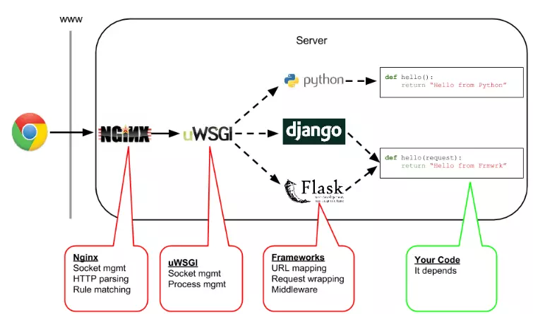

## Nginx搭建python web环境
在讨论Python web的环境之前，有几个概念还是要搞清楚。

在网络的cgi笔记里，我们知道了cgi程序其实就是web服务器开启的一个进程，用来处理http请求。那么我们看到的WSGI，uwsgi，uWSGI这些又是啥玩意呢？

看一个流程图

client发送请求以后，请求给到nginx，nginx是一个web服务器，然后nginx会把这个请求传给uwsgi，注意，这个uwsgi**也是一个web服务器**，uwsgi这个web服务器会把这个请求交给flask app进行处理，处理好以后返回结果。

因此我们知道：

 - ngnix，一种高性能web服务器，用来接收请求、处理请求、返回响应
 - flask，python的web框架，处理python请求，我们的代码就写在这里面
 - uWSGI, 实现了uwsgi协议和WSGI的web服务器。在上面的流程中，协助nginx和flask通信。

zwlj：这里注意一下WSGI，uWSGI,uwsgi：

 - **WSGI（Web Server Gateway Interface）**，是为Python语言定义的Web服务器和Web应用程序或框架之间的一种简单而通用的接口协议，只要web服务器和 web应用都遵守WSGI协议，那么两者之间就可以任意组合。
 - **uwsgi**，是基于二进制的线路协议，与WSGI协议作用相同，但属于uWSGI服务器自有协议。也就是说是一种服务器协议。
 - **uWSGI是Web服务器**，它实现了WSGI协议、uwsgi、http等协议

## 参考
[Linux搭建Python web环境（nginx + flask + uwsgi)](https://www.jianshu.com/p/85692a94e99b)