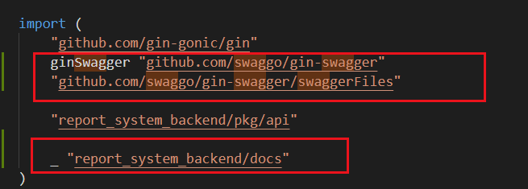
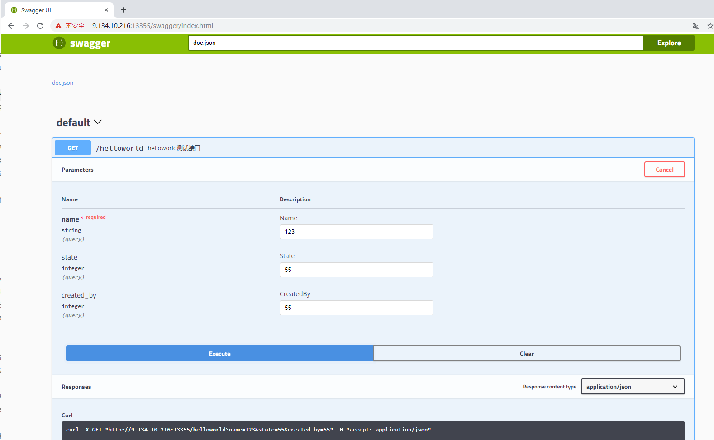

## gin配合go-swagger

首先安装go swag这个包。

```
go get -u github.com/swaggo/swag/cmd/swag
```

然后移动这个可执行文件到PATH下

```
mv $GOPATH/bin/swag /usr/local/go/bin
```

一般unix系统默认的GOPATH就在家目录。

然后就可以验证这个包是否有安装成功了

```
swag -v
```


接下来要安装gin-swagger

```
go get -u github.com/swaggo/gin-swagger
go get -u github.com/swaggo/gin-swagger/swaggerFiles
```


### 代码中要有注释

sawg可执行程序移动到PATH目录以后，我们就可以在main.go的文件夹执行init命令生成文档文件了。

```
swag init
```

上面这条命令，它生成了一个docs文件夹，然后，里面有个docs.go文件。

接下来我们就可以去代码里写注释了

比如在gin的处理函数中，如下

```go
// @Summary 测试SayHello
// @Description 向你说Hello
// @Tags 测试
// @Accept mpfd
// @Produce json
// @Param who query string true "人名"
// @Success 200 {string} json "{"msg": "hello Razeen"}"
// @Failure 400 {string} json "{"msg": "who are you"}"
// @Router /hello [get]
func HandleHello(c *gin.Context) {
	who := c.Query("who")

	if who == "" {
		c.JSON(http.StatusBadRequest, gin.H{"msg": "who are u?"})
		return
	}

	c.JSON(http.StatusOK, gin.H{"msg": "hello " + who})
}
```


最后，在我们的gin 路由中，加上swag前端页面的导入




```go
import (
	ginSwagger "github.com/swaggo/gin-swagger"
	"github.com/swaggo/gin-swagger/swaggerFiles"
	_ "report_system_backend/docs"
)
```


在路由添加哪里导入这三个包，gin-swagger，swaggerFiles和docs

然后路由里加入：

```go
r.GET("/swagger/*any", ginSwagger.WrapHandler(swaggerFiles.Handler))
```


这样我们就可以在浏览器页面访问看到swagger页面了：




以后假如要修改文档，只要修改一下代码里的注释，然后重新`swag init`一下。就可以更新这个api文档了。

里面甚至可以自动发包curl进行测试，强无敌。