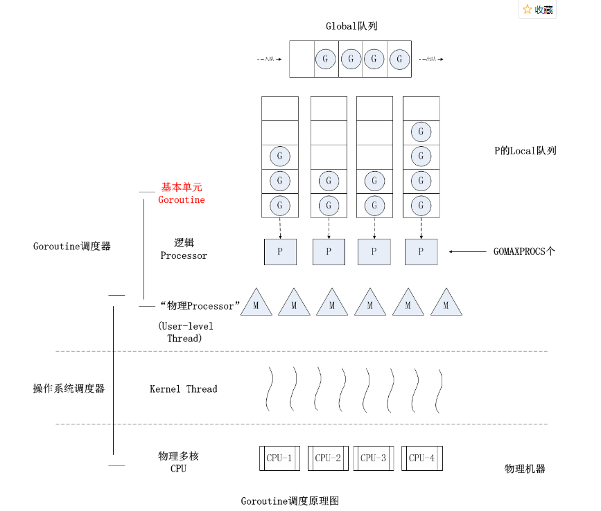

## 异步&协程与调度

同步(Synchronous)和异步(Asynchronous)，阻塞(Blocking)和非阻塞(Non-Blocking)是两种完全不同的概念。前者指的是一种事件通知、处理机制阻塞

我们以A调用B为例来说明两者之间的区别：

只有当B任务完成后，程序控制权才会返回给A, A得以继续执行。

- 非阻塞 B马上返回，此时B并没有完成，但A可以继续执行，B任务并不影响A的执行。
- 同步 A需要通过某种方式主动查询B是否完成。在blocking模式中，它表现为等待B返回；在non-blocking模式中表现为通过Future对象询问B是否完成，如果完成则取出结果，未完成则等待(阻塞)。
- 异步 A在启动B任务时就不管了，继续执行自己的任务，当B完成时，由操作系统主动通知A，告知B已经完成。A可以在适宜的时候取出B的执行结果。在这种模式下，A完全不会因为B的执行而影响自己。

**Go中只有协程，而协程本质上就是异步。**

协程(routine)跟线程是多对一的关系，routine本身不会被调度执行，它只能依靠操作系统的线程来运行。一个线程可以执行多个routine, Go运行时调度器负责进行调度处理。**routine只有三种情况需要让出执行权，分别是system call, 锁竞争和主动让出执行权力**。

- system call 当发生系统调用时，执行当前routine的线程会block这是没得商量的，但go运行时会从它维护的线程池中取出一条空闲线程继续执行其它routine, 这样就做到了即使你block了routine，也不会影响其它routine的执行。这里可以类比于Netty中的I/O线程，如果你代码block了，则会卡住其他任务的执行，否则你必须在自己的线程池中执行会产生block的代码。
- **网络I/O**， 调用`net`包下的网络I/O操作是不会阻塞线程的(**比如http**)。当发起网络I/O请求时，go运行时会通过操作系统提供的epoll机制注册I/O事件，不会挂起实际干活的线程，只会切换goroutine而已。
- 无论是锁竞争还是读写channel而导致routine被挂起，**其背后的线程都是不会有任何block的**，在OS看来线程一直在正常运行，从而大大降低了线程上下文切换的开销。
- 主动让出执行权，同上面的竞争，主动让出执行权时背后的线程同样不会block。

简而言之，就是go的调度器，会一开始就分配好几个工作线程，这些工作线程是不会block阻塞的。代码会天生就根据协程机制分为一段一段routine，这些routine会被分配到几个工作线程里执行，当routine进行到“阻塞”环节，就会被go的调度器调度出去。但线程是在一直工作的，而go的net包天生就是如此异步，根据epoll已经实现了这一点。因此异步大大提升了执行效率

### goroutine的抢占

在可用核心一定的条件下，协程该如何有效地利用 CPU 资源呢？Golang搬出了GPM模型

#### GPM模型

下面先是几个概念

GPM模型使用一种M:N的调度器来调度任意数量的协程运行于任意数量的系统线程中，从而保证了上下文切换的速度并且利用多核，但是增加了调度器的复杂度。

P 是一个“逻辑 Proccessor”，每个 G 要想真正运行起来，首先需要被分配一个 P（进入到 P 的 local runq 中，这里暂忽略 global runq 那个环节）。对于 G 来说，P 就是运行它的 “CPU”，可以说：G 的眼里只有 P。但从 Go scheduler 视角来看，真正的 “CPU” 是 M，只有将 P 和 M 绑定才能让 P 的 runq 中 G 得以真实运行起来。这样的 P 与 M 的关系，就好比 Linux 操作系统调度层面用户线程 (user thread) 与核心线程 (kernel thread) 的对应关系那样，都是 （n × m） 模型。具体地：

- G: 表示 goroutine，存储了 goroutine 的执行 stack 信息、goroutine 状态以及 goroutine 的任务函数等；另外 G 对象是可以重用的。
- P: 表示逻辑 processor，P的数量决定了系统内最大可并行的 G 的数量（前提是系统的物理 CPU 核数>=P 的数量，可以 runtime.GOMAXPROCS(20)增加 P 数量大于 CPU 核数）；P 的最大作用还是其拥有的各种 G 对象队列、链表、一些 cache 和状态。
- M: M代表着真正的执行计算资源。在绑定有效的 P 后，进入 schedule 循环；而 schedule 循环的机制大致是从各种队列、P 的本地队列中获取 G，切换到 G 的执行栈上并执行G的函数，调用 goexit 做清理工作并回到 M，如此反复。M并不保留 G 状态，这是 G 可以跨 M 调度的基础。

goroutine 遇到下面的情况下可能会产生重新调度

- 阻塞 I/O
- select操作
- 阻塞在channel
- 等待锁
- 主动调用 runtime.Gosched()