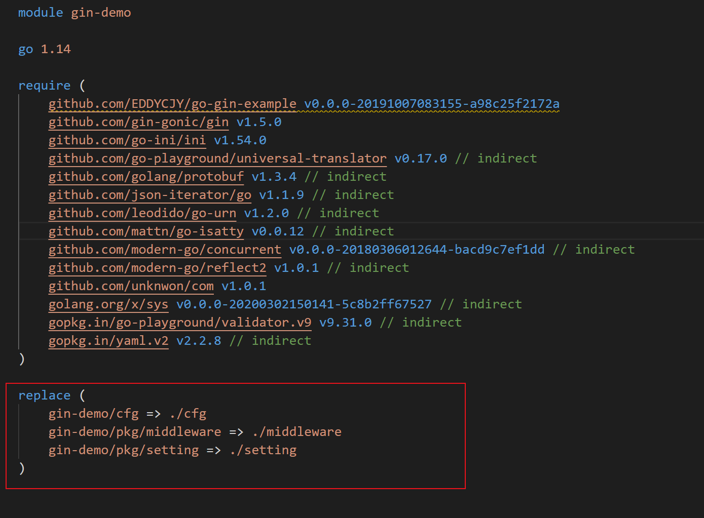

## go语言基础

### 特性
go语言的特性可以很好的概括：

 - 开放源码
 - 静态类型和编译型(声明时指定类型，而且要编译成可执行文件方可执行)
 - 跨平台(跨计算架构和操作系统)
 - 自动垃圾回收
 - 原生并发编程
 - 多编程范式
 - **代码风格强制统一**

### 工程结构
go 是一个推崇软件工程理念的编程语言，所以有几个概念需要理清。

#### 工作区
go项目源码的目录，就是工作区。

一般来说，可以构建三个子目录，src，pkg和bin

 - src目录，源码目录，而且相关模块的代码要在相关命名的目录下。
 - pkg目录，通过go install安装后的代码包的归档文件。
 - bin目录，通过go install完成安装后，代码源码生成的可执行文件。

只看上面的划分可能还不明确，实质上，go项目喜欢这样分，所有的Go项目统一放到一个Go Project文件夹

```
C:\Go    <<--- GOROOT 指向的位置 //linux 下一般为/usr/local/go
    --src                 <<--- Go 语言自带的源代码
    --pkg                 <<--- 编译的中间文件放在此文件夹
    --bin                 <<--- 编译的目标文件放在此文件夹
D:\MyWorks  <<--- GOPATH 指向的位置
    --src                 <<--- 项目源代码放置在此文件夹。!!!警告：一个常犯的错误是把 GOPATH 指向此处!!!
        --HelloWorld      <<--- 我们项目源代码所在的文件夹。!!!警告：一个常犯的错误是把 GOPATH 指向此处!!!
        --vendor          <<--- 第三方开源代码文件夹
            --github.com
                --...
    --pkg                 <<--- 编译的中间文件放在此文件夹，Go编译器自动生成此文件夹
    --bin                 <<--- 编译的目标文件放在此文件夹，Go编译器自动生成此文件夹
```

**代码文件开头第一行要声明package**,一般同一个目录下的源码文件要属于同一个package才行。

#### GOPATH
go项目所在的目录，也就是刚才提到的src目录的上一层。

#### 命令源码文件
我们想要执行go文件，那么这个go文件就必须是 **命令源码文件**。命令源码文件需要有一个main函数，而且这个文件必须属于package main，否则会不能执行

``` go
package main
func main(){
  ...
}

```

由于刚才提到的同一目录下要同属同一个package的原则，所以命令源码文件要单独开一个目录(代码包)。

zwlj：也就是命令源码文件必须属于main包

#### 安装依赖
在下载一个第三方的go项目的时候，我们直接go build还不一定可以，要安装它的依赖。通过直接在项目下：

```
go get
```


#### go install&build
执行go build会在当前目录生成一个和包名一致的可执行文件，go install则会在bin目录下产生。


### Go modules

在go 1.11 版本后 **配置GOPATH已经不是必须的玩意了**、

开启go modules，我们可以把go工程放任何地方，不过前提好还是GOROOT要配好

接下来我们将正式的进入使用，首先你需要有一个你喜欢的目录，例如：`$ mkdir ~/go-application && cd ~/go-application`，然后执行如下命令：


```shell
$ mkdir go-gin-example && cd go-gin-example

$ go env -w GO111MODULE=on

$ go env -w GOPROXY=https://goproxy.cn,direct

$ go mod init github.com/EDDYCJY/go-gin-example
go: creating new go.mod: module github.com/EDDYCJY/go-gin-example

$ ls
go.mod
```

- `mkdir xxx && cd xxx`：创建并切换到项目目录里去。
- `go env -w GO111MODULE=on`：打开 Go modules 开关（目前在 Go1.13 中默认值为 `auto`）。
- `go env -w GOPROXY=...`：设置 GOPROXY 代理，这里主要涉及到两个值，第一个是 `https://goproxy.cn`，它是由七牛云背书的一个强大稳定的 Go 模块代理，可以有效地解决你的外网问题；第二个是 `direct`，它是一个特殊的 fallback 选项，它的作用是用于指示 Go 在拉取模块时遇到错误会回源到模块版本的源地址去抓取（比如 GitHub 等）。
- `go mod init [MODULE_PATH]`：初始化 Go modules，它将会生成 go.mod 文件，需要注意的是 `MODULE_PATH` 填写的是模块引入路径，你可以根据自己的情况修改路径。


**我们只需要敲下 go mod init name， 就可以初始化一个go项目了**

每次我们更新依赖，就会有**go.sum**文件来记住我们的依赖版本

下面一些常用的go mod命令要记住


- `go get -u` 更新现有的依赖
- `go mod download` 下载 go.mod 文件中指明的所有依赖
- 用 `go mod tidy` 整理现有的依赖

- 用 `go mod graph` 查看现有的依赖结构


#### replace

我们使用go mod写自己的项目的时候，有时肯定是会引用到自己的包的。

这时我们也需要在mod文件里记下来才行



要用replace注册一下最好