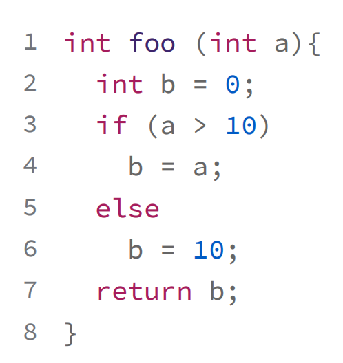
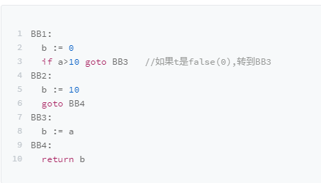
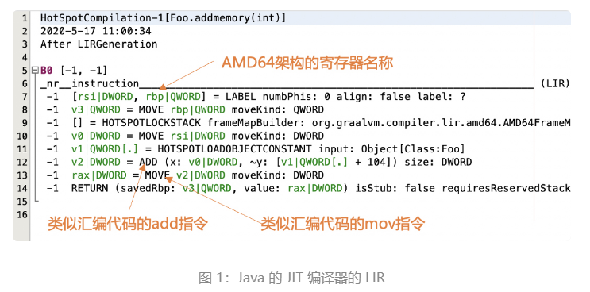
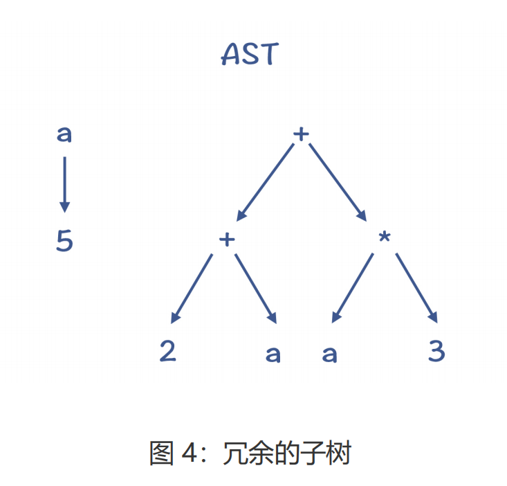
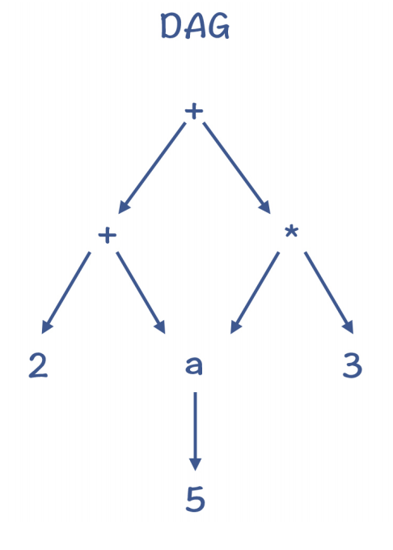
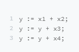
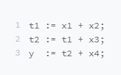
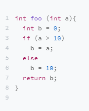
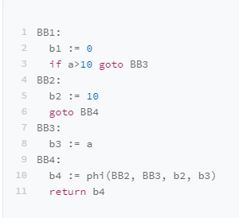

## 中间代码

IR，也就是中间代码（Intermediate Representation，有时也称 Intermediate Code，IC），它是编译器中很重要的一种数据结构。编译器在做完前端工作以后，首先就是生成IR，并在此基础上执行各种优化算法，最后再生成目标代码。

设计 IR 的目的，是要满足编译器中的各种需求。需求的不同，就会导致 IR 的设计不同。通常情况下，IR 有两种用途:

- 一种是用来做分析和变换的
- 一种是直接用于解释执行的。

编译器中，基于 IR 的分析和处理工作，一开始可以基于一些抽象层次比较高的语义，这时所需要的 IR 更接近源代码。而在后面，则会使用低层次的、更加接近目标代码的语义。

### HIR：基于源语言做一些分析和变换

假设你要开发一款 IDE，那最主要的功能包括：发现语法错误、分析符号之间的依赖关系（以便进行跳转、判断方法的重载等）、根据需要自动生成或修改一些代码（提供重构能力）。

这个时候，你对 IR 的需求，是能够准确表达源语言的语义就行了。**这种类型的 IR，可以叫做 High IR，简称 HIR**。

其实，AST 和符号表就可以满足这个需求。也就是说，AST 也可以算作一种 IR。如果你要开发 IDE、代码翻译工具（从一门语言翻译到另一门语言）、代码生成工具、代码统计工具等，使用 AST（加上符号表）就够了。

当然，有些 HIR 并不是树状结构（比如可以采用线性结构），但一般会保留诸如条件判断、循环、数组等抽象层次比较高的语法结构。

### MIR**独立于源语言和** **CPU** 架构做分析和优化

大量的优化算法是可以通用的，没有必要依赖源语言的语法和语义，也没有必要依赖具体的CPU 架构。

这些优化包括部分算术优化、常量和变量传播、死代码删除等，实现这类分析和优化功能的 IR 可以叫做 Middle IR，简称 MIR。

因为 MIR 跟源代码和目标代码都无关，**所以在讲解优化算法时，通常是基于 MIR，比如三地址代码（Three Address Code，TAC）**。

TAC 的特点是，最多有三个地址（也就是变量），其中赋值符号的左边是用来写入的，而右边最多可以有两个地址和一个操作符，用于读取数据并计算。

比如上面代码，转成TAC以后：

可以看到，TAC 用 goto 语句取代了 if 语句、循环语句这种比较高级的语句，当然也不会有类、继承这些高层的语言结构。但是，它又没有涉及数据如何在内存读写等细节，书写格式也不像汇编代码，与具体的目标代码也是独立的。

所以，它的抽象程度算是不高不低。

### LIR：依赖于 **CPU** 架构做优化和代码生成

最后一类 IR 就是 Low IR，简称 LIR。

这类 IR 的特点，是它的指令通常可以与机器指令一一对应，比较容易翻译成机器指令（或汇编代码）。因为 LIR 体现了 CPU 架构的底层特征，因此可以做一些与具体 CPU 架构相关的优化。

比如，下面是 Java 的 JIT 编译器输出的 LIR 信息，里面的指令名称已经跟汇编代码很像了，并且会直接使用 AMD64 架构的寄存器名称。

### P-code：用于解释执行的 IR

前 3 类 IR 是从抽象层次来划分的，它们都是用来做分析和变换的。我们继续看看第二种直接用于解释执行的 IR。这类 IR 还有一个名称，叫做 P-code，也就是 Portable Code 的意思。由于它与具体机器无关，因此可以很容易地运行在多种电脑上。这类 IR 对编译器来说，就是做编译的目标代码。

Java 的字节码就是这种 IR。除此之外，Python、Erlang 也有自己的字节码，.NET 平台、Visual Basic 程序也不例外。

对于专门用来解释执行 IR，通常会有一些特别的设计，跟虚拟机配合来尽量提升运行速度。

### IR在内存里的数据结构

在实际的实现中，有线性结构、树结构、有向无环图（DAG）、程序依赖图（PDG）等多种格式。编译器会根据需要，选择合适的数据结构。在运行某些算法的时候，采用某个数据结构可能会更顺畅，而采用另一些结构可能会带来内在的阻滞。所以，**我们一定要根据具体要处理的工作的特点，来选择合适的数据结构**

#### TAC线性结构

你可以把代码表示成一行行的指令或语句，用数组或者列表保存就行了。其中的符号，需要引用符号表，来提供类型等信息。

这种线性结构有时候也被称作 goto 格式。因为高级语言里的条件语句、循环语句，要变成用 goto 语句跳转的方式

#### 树结构

树结构当然可以用作 IR，AST 就是一种树结构。

树结构的缺点是，可能有冗余的子树。比如，语句“a=5; b=(2+a)+a*3; ”形成的 AST就有冗余。如果基于这个树结构生成代码，可能会做两次从内存中读取 a 的值的操作，并存到两个临时变量中。

#### 有向无环图

DAG 结构，是在树结构的基础上，消除了冗余的子树。比如，上面的例子转化成 DAG 以后，对 a 的内存访问只做一次就行了。

#### 程序依赖图

程序依赖图，是显式地把程序中的数据依赖和控制依赖表示出来，形成一个图状的数据结构。基于这个数据结构，我们再做一些优化算法的时候，会更容易实现。

这种数据结构里，因为会有很多图节点，又被形象地称为“**节点之海（Sea ofNodes）**”。

### IR的SSA格式

SSA 是 Static Single Assignment 的缩写，也就是静态单赋值。这是 IR 的一种设计范式，它要求一个变量只能被赋值一次。

y = x1 + x2 + x3 + x4的普通 TAC 如下：

y 被赋值了三次，如果我们写成 SSA 的形式，就只能写成下面的样子：

原因是，使用 SSA 的形式，体现了精确的“**使用 - 定义（Use-def）**”关系。并且由于变量的值定义出来以后就不再变化，使得基于 SSA 更容易运行一些优化算法。

在 SSA 格式的 IR 中，还会涉及一个你经常会碰到的，但有些特别的指令，叫做 **phi 指令**。它

其中，变量 b 有 4 个版本：b1 是初始值，b2 是 else 块（BB2）的取值，b3 是 if 块（BB3）的取值，最后一个基本块（BB4）要把 b 的最后取值作为函数返回值。很明显，b的取值有可能是 b2，也有可能是 b3。这时候，就需要 phi 指令了。

phi 指令，会根据控制流的实际情况确定 b4 的值。如果 BB4 的前序节点是 BB2，那么 b4的取值是 b2；而如果 BB4 的前序节点是 BB3，那么 b4 的取值就是 b3。所以你会看到，如果要满足 SSA 的要求，也就是一个变量只能赋值一次，那么在遇到有程序分支的情况下，就必须引入 phi 指令。

**由于 SSA 格式的优点，现代语言用于优化的 IR，很多都是基于 SSA的了，包括 Java 的 JIT 编译器、JavaScript 的 V8 编译器、Go 语言的gc 编译器、Julia 编译器，以及 LLVM 工具等。**所以，要高度重视 SSA。

