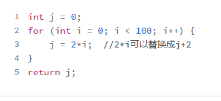

## 代码优化

对代码做优化的方法有很多。如果要把它们分一下类的话，可以按照下面两个维度：

- **第一个分类维度，是机器无关的优化与机器相关的优化。**。机器无关的优化与硬件特征无关，比如把常数值在编译期计算出来（常数折叠）。而机器相关的优化则需要利用某硬件特有的特征，比如 SIMD 指令可以在一条指令里完成多个数据的计算。
- **第二个分类维度，是优化的范围。**本地优化是针对一个基本块中的代码，全局优化是针对整个函数（或过程），过程间优化则能够跨越多个函数（或过程）做优化。

### 思路1 常数折叠

程序里的有些表达式，肯定能计算出一个常数值，那就不要等到运行时再去计算，干脆在编译期就计算出来。比如 “x=2*3”可以优化成“x=6”。这种优化方法，叫做**常数折叠（Constant Folding）**。

而如果你一旦知道 x 的值其实是一个常量，那你就可以把所有用到 x 的地方，替换成这个常量，这叫做**常数传播（Constant Propagation）**。如果有“y=x*2”这样一个语句，那么就能计算出来“y=12”。所以说，常数传播会导致更多的常数折叠。

就算不能引起新的常数折叠，比如说“z=a+x”，替换成“z=a+6”以后，计算速度也会更快。因为对于很多 CPU 来说，“a+x”和“a+6”对应的指令是不一样的。前者可能要生成两条指令（比如先把 a 放到寄存器上，再把 x 加上去），而后者用一条指令就行了，因为常数可以作为操作数。

### 思路2 代数简化

完成相同的计算，可以用代价更低的方法。比如“x=x+0”这行代码，操作前后 x 没有任何变化，所以这样的代码可以删掉；又比如“x=x*0” 可以简化成“x=0”。**这类利用代数运算的规则所做的简化，叫做代数简化（Algebra Simplification）**。

对于很多 CPU 来说，乘法运算改成移位运算，速度会更快。比如，`x*2`等价`x<<1`. 这种采用代价更低的运算的方法，也叫做**强度折减（Strength Reduction）**。

### 思路3 消除重复计算

```
x := a + b
y := x
z := 2 * y
```

第三行可以被替换成“z:=2*x”， 因为 y 的值就等于 x。这种优化叫做**拷贝传播（Copy Propagation）**。

### 思路4 化整为零，向量计算

很多 CPU 支持向量运算，也就是 SIMD（Single Instruction Multiple Data）指令。这就可以在一条指令里计算多个数据。比如 AVX-512 指令集，可以使用 512 位的寄存器做运算，这个指令集的一条 add 指令相当于一次能把 16 个整数加到另 16 个整数上，以 1 当16 呀。

比如，把 16 万个整数相加，应该怎样写程序呢？普通方法，是循环 16 万次，每次读 1 个数据，并做累加。向量化的方法，是每次读取 16 个，用 AVX-512 指令做加法计算，一共循环计算 1 万次，最后再把得到的 16 个数字相加就行了。

向量优化的一个例子是超字级并行（Superword-Level Parallelism，SLP)。它是把基本块中的多个变量组成一个向量，用一个指令完成多个变量的计算。

### 思路5 化整为零，各个优化

很多语言都有结构和对象这样的复合数据类型，内部包含了多个成员变量，这种数据类型叫做聚合体（aggregates）。通常，为这些对象申请内存的时候，是一次就申请一整块，能放下里面的所有成员。但这样做，非常不利于做优化。

通常的优化算法都是针对标量（Scalar）的。如果经过分析，发现可以把聚合体打散，像使用单个本地变量（也就是标量）一样使用聚合体的成员变量，那就有可能带来其他优化的机会。比如，可以把聚合体的成员变量放在寄存器中进行计算，根本不需要访问内存。这种优化叫做聚合体的标量替换（Scalar Replacement of Aggregates，SROA）。在研究 Java 的 JIT 编译器时，我们会见到一个这类优化的例子。

### 思路6 循环优化

在编译器中，对循环的优化从来都是重点，因为程序中最多的计算量都是被各种循环消耗掉的。所以，对循环做优化，会起到事半功倍的效果。如果一个循环执行了 10000 次，那么你的优化效果就会被扩大 10000 倍。



比如上面循环里的变量j就可以做强度折减

除此之外，还可以做一些循环不变代码外提等操作。

### 思路7 减少过程开销

你知道，当程序调用一个函数的时候，开销是很大的，比如保存原来的栈指针、保存某些寄存器的值、保存返回地址、设置参数，等等。其中很多都是内存读写操作，速度比较慢。

如果能做一些优化，减少这些开销，那么带来的优化效果会是很显著的

第一种：尾调用优化（Tail-call Optimization）和尾递归优化（Tail-recursion Elimination）。

尾调用就是一个函数的最后一句，是对另一个函数的调用。比如，下面这段示例代码：

```
f(){
...
return g(a,b);
}
```

而如果 g() 本身就是 f() 的最后一行代码，那么 f() 的栈帧已经没有什么用了，可以撤销掉了（修改栈顶指针的值），然后直接跳转到 g() 的代码去执行，就像 f() 和 g() 是同一个函数一样。这样可以让 g() 复用 f() 的栈空间，减少内存消耗，也减少一些内存读写操作（比如，保护寄存器、写入返回地址等）。

如果 f() 和 g() 是同一个函数，这就叫做尾递归。很多同学都应该知道，尾递归是可以转化为一个循环的。

除此之外，还有内联，内联扩展等方法。

### 思路8 控制流优化

通过对程序的控制流分析，我们可以发现很多优化的机会。这就好比在做公司管理，优化业务流程，就会提升经营效率。

比如有：

- 不可达代码消除

- 死代码删除

- if简化

- 循环反转

  .....

  