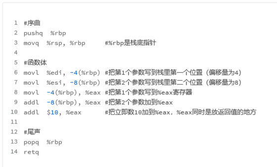
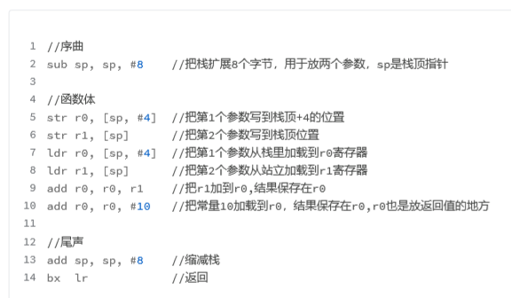
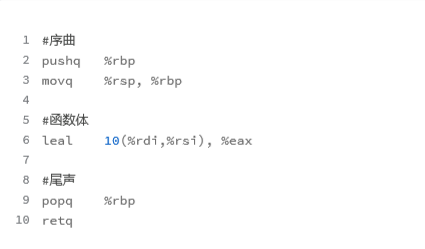
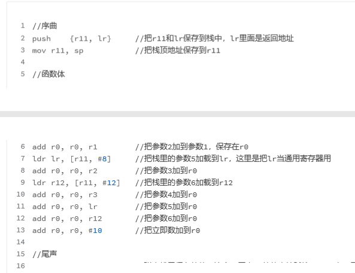
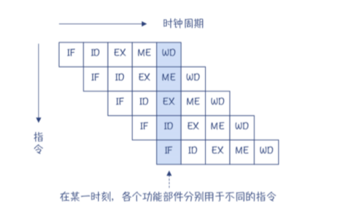
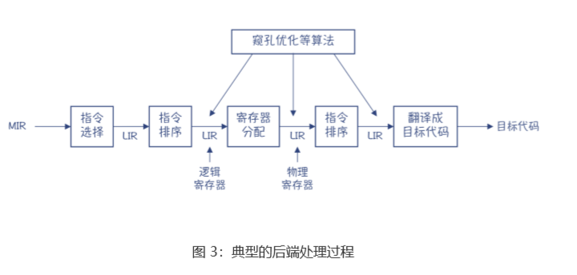

## 代码生成

在编译过程的前几个阶段之后，编译器生成了 AST，完成了语义检查，并基于 IR 运行了各 种优化算法。这些工作，基本上都是机器无关的。但编译的后一步，也就是生成目标代 码，则必须是跟特定 CPU 架构相关的。

这就是编译器的后端。不过，后端不只是简单地生成目标代码，它还要完成与机器相关的一 些优化工作，确保生成的目标代码的性能高。

### 不同CPU目标代码

我们已经知道，编译器的后端要把 IR 翻译成目标代码，那么要生成的目标代码是什么样子的呢？

```c
int foo(int a, int b){    return a + b + 10; }
```

执行“clang -S foo.c -o foo.x86.s”命令，你可以得到对应的 x86 架构下的汇编代码 



上述汇编代码采用的是 GNU 汇编器的代码格式，源操作数在前面，目的操作数在 后面。

要翻译成目标代码，编译器必须要先懂得目标代码，就像做汉译英 一样，我们必须要懂得英语。可是，通常情况下，我们会对汇编代码比较畏惧，觉得汇编语言似乎很难学。其实不然。

（有些编译器，是先编译成汇编代码，再通过汇编器把汇编代码转变成机器码。而 另一些编译器，是直接生成机器码，并写成目标文件，这样编译速度会更快一些。但这样的 编译器一般就要带一个反汇编器，在调试等场合把机器码转化成汇编代码，这样我们看起来 比较方便）

使用“clang -S -target armv7a-none-eabi foo.c -o foo.armv7a.s”命令，生成一段针对 ARM 芯片的汇编代码：



与前面生成的针对 x86 架构的汇编代码比较一下，你马上就会发现一些不 同。这两种 CPU，完成相同功能所使用的汇编指令和寄存器都不同。

x86 的汇编，mov 指令的功能很强大，可以从内存加载到寄存器，也可以从寄存器保存回 内存，还可以从内存的一个地方拷贝到另一个地方、从一个寄存器拷贝到另一个寄存器。 add 指令的操作数也可以使用内存地址。

而在 ARM 的汇编中，从寄存器到内存要使用 str（也就是 Store）指令，而从内存到寄存 器要使用 ldr（也就是 Load）指令。对于加法指令 add 而言，两个操作数及计算结果都必 须使用寄存器。

对于 foo.c 示例代码，在编译时加上“-O2”指令，就会得到如下的优化代 码



它使用了 lea 指令，可以一次完成三个数的相加，并把结果保存到 %eax。这样一个 lea 指 令，代替了三条指令（一条 mov，两条 add），显然更优化。

这揭示了我们生成代码时面临的一种情况：对于相同的源代码和 IR，编译器可以生成不同 的指令，而我们要选择代价最低的那个。

### 寄存器分配

们再看一下刚刚优化后的代码，发现了，优化后的算法对寄存器的使用也更 加优化了。没错，接下来我们就分析下寄存器分配。

优化后的代码，去掉了内存操作，直接基于寄存器做加法运算。

同样的，ARM 的汇编代码也可以使用“-O2”指令优化。优化完毕以后，后剩下的代码 只有三行。而且因为不需要访问内存，所以连栈顶指针都不需要挪动，进一步减少了代码 量。

对于编译器来说，肯定要尽量利用寄存器，不去读写内存。因为内存读写对于 CPU 来说就 是 IO，性能很低。特别是像函数中用到的本地变量和参数，它们在退出作用域以后就没用 了，所以能放到寄存器里，就放寄存器里吧。

在 IR 中，通常我们会假设寄存器是无限的（就像 LLVM 的 IR），但实际 CPU 中的寄存器 是有限的。所以，我们就要用一定的算法，把寄存器分配给使用频繁的变量，比如循环中 的变量。而对于超出物理寄存器数量的变量，则“溢出”到栈里，通过内存来保存。

寄存器分配的算法有很多种。一个使用比较广泛的算法是寄存器染色算法，它的特点是计算 结果比较优化，但缺点是计算量比较大。

另一个常见的算法是线性扫描算法，它的优点是计算速度快，但缺点是有可能不够优化，适合需要编译速度比较快的场景，比如即时编译。在解析 Graal 编译器的时候，你会看到这种算法的实现。

### 指令排序

下面示例程序中的 params 函数，有 6 个参数：

```c
int params(int x1,int x2,int x3,int x4,int x5,int x6）
{    
	return x1 + x2 + x3 + x4 + x5 + x6 + 10; 
} 
```

把它编译成 ARM 汇编代码，如下：



根据编译时使用的调用约定，其中有 4 个参数是通过寄存器传递的（r0~r3），还有两个参 数是在栈里传递的。

值得注意的是，在把参数 5 和参数 6 用于加法操作之前，它们就被提前执行加载（ldr）命 令了。那，为什么会这样呢？这就涉及到 CPU 执行指令的一种内部机制：流水线 （Pipeline）。

，CPU 内部是分成多个功能单元的。对于一条指令，每个功能单元处理完毕以后，交 给下一个功能单元，然后它就可以接着再处理下一条指令。所以，在同一时刻，不同的功能 单元实际上是在处理不同的指令。这样的话，多条指令实质上是并行执行的，从而减少了总 的执行时间，**这种并行叫做指令级并行**。

在下面的示意图中，每个指令的执行被划分成了 5 个阶段，每个阶段占用一个时钟周期



因为每个时钟周期都可以开始执行一条新指令，所以虽然一条指令需要 5 个时钟周期才能 执行完，但在同一个时刻，却可以有 5 条指令并行执行。

但是有的时候，指令之间会存在依赖关系，后一条指令必须等到前一条指令执行完毕才能运 行（在上一讲，我们曾经提到过依赖分析，指令排序就会用到依赖分析的结果）。比如，前 面的示例程序中，在使用参数 5 的值做加法之前，必须要等它加载到内存。这样的话，指 令就不能并行了，执行时间就会大大延长。

要把 ldr 指令提前执行，目的就是为了更好 地利用流水线技术，实现指令级并行。

很多实际的 CPU 架构，划分了更 多的阶段。比如，某类型的奔腾芯片支持 21 段，那理论上也就意味着可以有 21 条指令并 行执行，但它的前提是必须做好指令排序的优化。

现代一些 CISC 的 CPU 在硬件层面支持乱序执行（Out-of-Order）。一批指令给到 CPU 后，它也会在内部打乱顺序去优化执行。而 RISC 芯片一般不支持乱序执行，所以像 ARM 这样的芯片，做指令排序就更加重要。

另外，在上一讲，我提到过对循环做优化的一种技术，叫做**循环展开（Loop Unroll）**，它 会把循环体中的代码重复多次，与之对应的是减少循环次数。。这样一个基本块中就会有更多条指令，增加了通过指令排序做优化的机会

指令排序的算法也有很多种，比如基于数据依赖图的 List Scheduling 算法。

### 窥孔优化（Peephole Optimization）

基于 LIR 或目标代码，代码还有被进一步优化的可能性。这就是代码优化的特点。比如， 你在前面做了常数折叠以后，后面的处理步骤修改了代码或生成新的代码以后，可能还会产生出新的常数折叠的机会。另外，有些优化也只有在目标代码的基础上才方便做。

假设相邻两条指令，一条指令从寄存器保存数据到栈里，下一条指令又从 栈里原封不动地把数据加载到原来的寄存器，那么这条加载指令就是冗余的，可以去掉。

```
str r0, [sp, #4]  //把r0的值保存到栈顶+4的位置 
ldr r0, [sp, #4]  //把栈顶+4位置的值加载到r0寄存器
```

基于目标代码的优化，常用的方法是窥孔优化（Peephole Optimization）。窥孔优化 的思路，是提供一个固定大小的窗口，比如能够容纳 20 条指令，并检查窗口内的指令，看 看是否可以优化。然后再往下滑动窗口，再次检查优化机会。

### 后端处理

好了，到这里，我已经介绍完了生成目标代码过程中所做的各种优化处理。那么，我们怎么 把它们串成一个整体呢？



在实际实现时，我们通常是先做指令选择，然后做一次指令排序。在分配完寄存器以后，还 要再做一次指令排序，因为寄存器分配算法会产生新的指令排序优化的机会。比如，一些变 量会溢出到栈里，从而增加了一些内存访问指令。

这个处理过程，其实也是 IR 不断 lower 的过程。一开始是 MIR，在做了指令选择以后，就 变成了具体架构相关的 LIR 了。在没做寄存器分配之前，我们在 LIR 中用到寄存器还是虚 拟的，数量是无限的，做完分配以后，就变成具体的物理寄存器的名称了。

