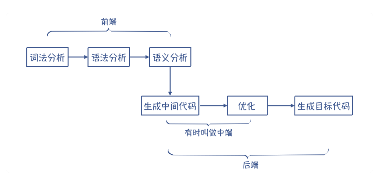
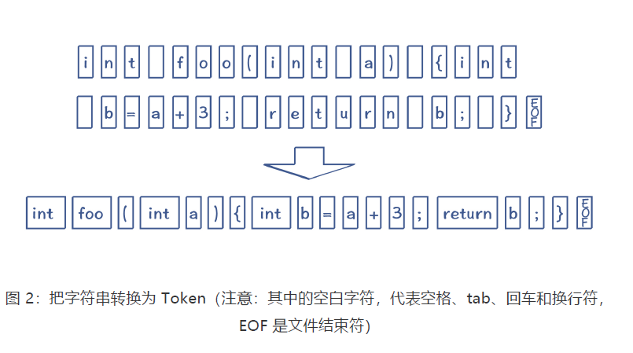
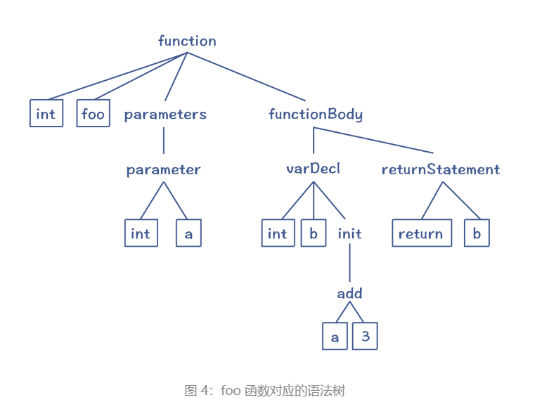
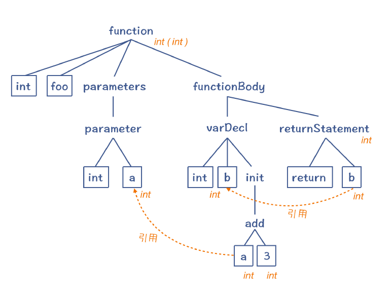
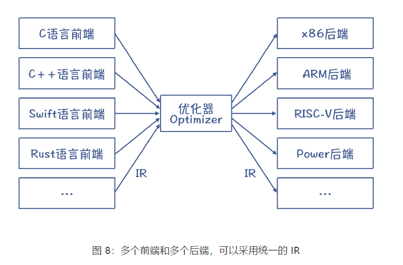

## 编译过程

编译器翻译源代码，也需要经过多个处理步骤

在操作系统的一些笔记里也有记载，大致就是：



### 词法分析

在编译之前，源代码只是一长串字符而已，这显然不利于编译器理解程序的含义。所以，编译的第一步，就是要像读文章一样，先把里面的单词和标点符号识别出来。程序里面的单词叫做 Token，它可以分成关键字、标识符、字面量、操作符号等多个种类。把字符串转换为 Token 的这个过程，就叫做词法分析。



### 语法分析

识别出 Token 以后，离编译器明白源代码的含义仍然有很长一段距离。下一步，我们需要让编译器像理解自然语言一样，理解它的语法结构。这就是第二步，语法分析。

在编译器里，语法分析阶段也会把 Token 串，转换成一个体现语法规则的、树状的数据结构，这个数据结构叫做抽象语法树（**AST，Abstract Syntax Tree**）。我们前面的示例程序转换为 AST 以后，大概是下面这个样子：

```c
int foo(int a){
	int b = a + 3;
	return b;
}
```




这样的一棵 AST 反映了示例程序的语法结构。比如说，我们知道一个函数的定义包括了返回值类型、函数名称、0 到多个参数和函数体等。这棵抽象语法树的顶部就是一个函数节点，它包含了四个子节点，刚好反映了函数的语法。

再进一步，函数体里面还可以包含多个语句，如变量声明语句、返回语句，它们构成了函数体的子节点。然后，每个语句又可以进一步分解，直到叶子节点，就不可再分解了。而叶子节点，就是词法分析阶段生成的 Token（图中带边框的节点）。对这棵 AST 做深度优先的遍历，你就能依次得到原来的 Token。

### 语义分析

生成 AST 以后，程序的语法结构就很清晰了，编译工作往前迈进了一大步。但这棵树到底代表了什么意思，我们目前仍然不能完全确定。

语言的设计者在定义类似“a+3”中加号这个操作符的时候，是给它规定了一些语义的，就是要把加号两边的数字相加。你在阅读某门语言的标准时，也会看到其中有很多篇幅是在做语义规定。

所以，我们可以在每个 AST 节点上附加一些语义规则，让它能反映语言设计者的本意。

- add 节点：把两个子节点的值相加，作为自己的值；
- 变量节点（在等号右边的话）：取出变量的值；
- 数字字面量节点：返回这个字面量代表的值。

语义分析例子：

```c
int a = 10; //全局变量
int foo(int a){ //参数里有另一个变量a
	int b = a + 3; //这里的a指的是哪一个？
	return b;
}
```

编译程序要根据 C 语言在作用域方面的语义规则，识别出“a+3”中的 a，所以这里指的其实是函数参数中的 a，而不是全局变量的 a。这样的话，我们在计算“a+3”的时候才能取到正确的值。

而把“a+3”中的 a，跟正确的变量定义关联的过程，就叫做**引用消解（Resolve）**。这个时候，变量 a 的语义才算是清晰了。

**语义分析的重要特点，就是做上下文相关的分析**。

语义分析获得的一些信息（引用消解信息、类型信息等），会附加到 AST 上。这样的 AST叫做带有标注信息的 AST（Annotated AST/Decorated AST），用于更全面地反映代码的含义



总结起来，在语义分析阶段，编译器会做语义理解和语义检查这两方面的工作。词法分析、语法分析和语义分析，统称**编译器的前端**，它完成的是对源代码的理解工作

**生成目标代码的工作，叫做后端工作**

### 中间代码

中间代码（IR），是处于源代码和目标代码之间的一种表示形式。

我们倾向于使用 IR 有两个原因。第一个原因，是很多解释型的语言，可以直接执行 IR，比如 Python 和 Java。这样的话，编译器生成 IR 以后就完成任务了，没有必要生成最终的汇编代码。

第二个原因更加重要。我们生成代码的时候，需要做大量的优化工作。而很多优化工作没有必要基于汇编代码来做，而是可以基于 IR，用统一的算法来完成。

### 优化

那为什么需要做优化工作呢？这里又有两大类的原因。

第一个原因，是源语言和目标语言有差异。源语言的设计目的是方便人类表达和理解，而目标语言是为了让机器理解。在源语言里很复杂的一件事情，到了目标语言里，有可能很简单地就表达出来了。

以 Java 为例，我们经常为某个类定义属性，然后再定义获取或修改这些属性的方法：

```java
Class Person{
private String name;
public String getName(){
return name;
}
public void setName(String newName){
this.name = newName
}
}
```

如果你在程序里用“person.getName()”来获取 Person 的 name 字段，会是一个开销很大的操作，因为它涉及函数调用。在汇编代码里，实现一次函数调用会做下面这一大堆事情

这个逻辑其实是可以简化的,怎样简化呢？就是跳过方法的调用。我们直接根据对象的地址计算出 name 属性的地址，
然后直接从内存取值就行。这样优化之后，性能会提高好多倍。

这种优化方法就叫做**内联（inlining）**，也就是把原来程序中的函数调用去掉，把函数内的逻辑直接嵌入函数调用者的代码中。在 Java 语言里，这种属性读写的代码非常多。所以，Java 的 JIT 编译器（把字节码编译成本地代码）很重要的工作就是实现**内联优化**，这会让整体系统的性能提高很大的一个百分比！

**第二个需要优化工作的原因，是程序员写的代码不是最优的，而编译器会帮你做纠正**

在生成目标代码之前，需要做的优化工作可以有很多，这通常也是编译器在运行时，花费时间最长的一个部分



而采用中间代码来编写优化算法的好处，是可以把大部分的优化算法，写成与具体 CPU 架构无关的形式，从而大大降低编译器适配不同 CPU 的工作量。并且，如果采用像 LLVM 这样的工具，我们还可以让多种语言的前端生成相同的中间代码，这样就可以复用中端和后端的程序了。

### 生成目标代码

编译器最后一个阶段的工作，是生成高效率的目标代码，也就是汇编代码。这个阶段，编译器也有几个重要的工作。

第一，是要选择合适的指令，生成性能最高的代码。

第二，是要优化寄存器的分配，让频繁访问的变量（比如循环变量）放到寄存器里，因为访
问寄存器要比访问内存快 100 倍左右。

第三，是在不改变运行结果的情况下，对指令做重新排序，从而充分运用 CPU 内部的多个功能部件的并行计算能力。

目标代码生成以后，整个编译过程就完成了。