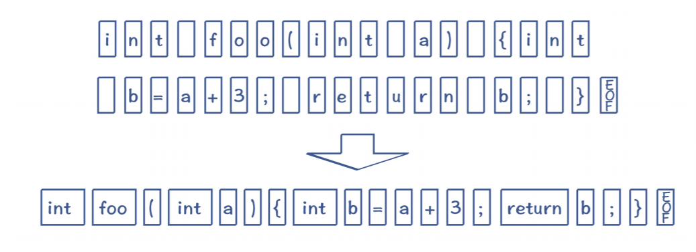
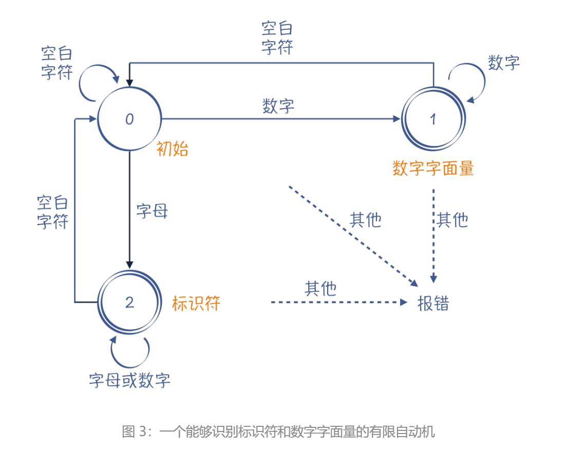
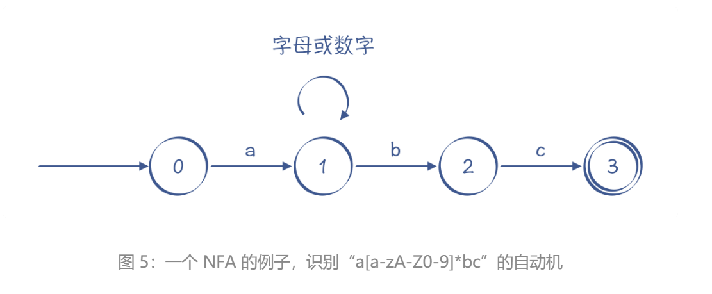
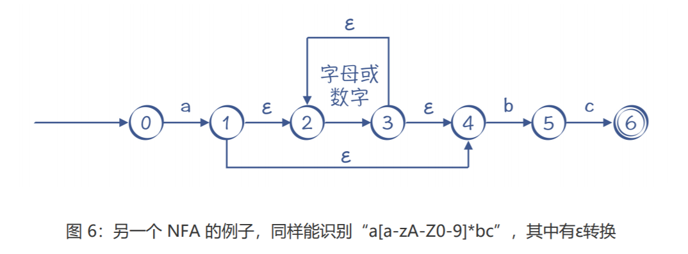
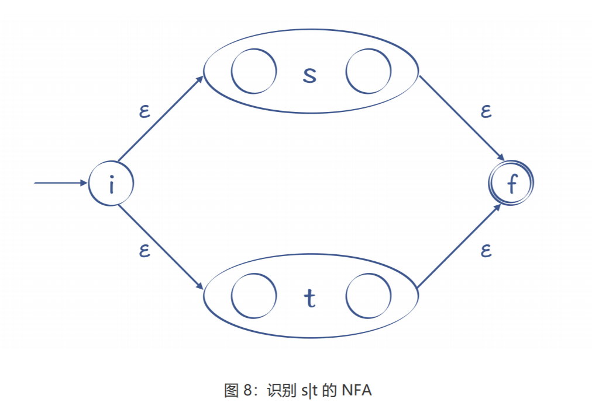
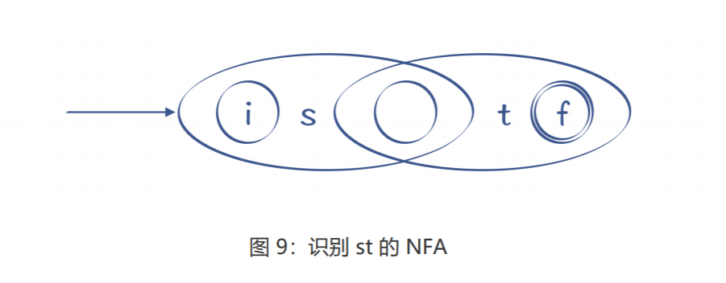
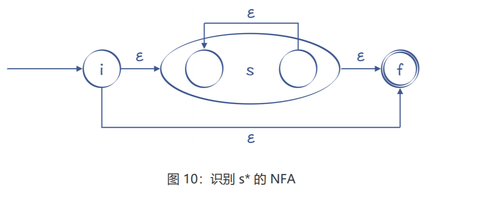
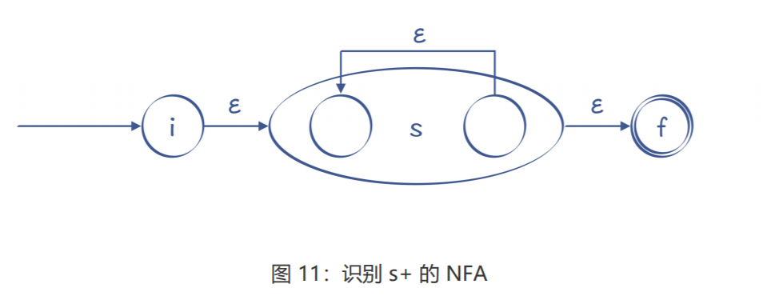

## 词法分析

词法分析的任务：输入字符串，输出 Token 串。所 以，词法分析器在英文中一般叫做 Tokenizer

这里要有一个计算模型，叫做有限自动机（Finite-state Automaton，FSA），或者叫做有限状态自动机（Finite-state Machine，FSM）。有限自动机这个名字，听上去可能比较陌生。但大多数程序员，肯定都接触过另一个词：状 态机。假设你要做一个电商系统，那么订单状态的迁移，就是一个状态机。

有限自动机就是这样的状态机，它的状态数量是有限的。当它收到一个新字符的时候，会导致状态的迁移。比如说，下面的这个状态机能够区分标识符和数字字面量

我用单线圆圈表示临时状态，双线圆圈表示接受状态。接受状态就是 一个合格的 Token，比如图 3 中的状态 1（数字字面量）和状态 2（标识符）。**当这两个 状态遇到空白字符的时候，就可以记下一个 Token，并回到初始态（状态 0）**，开始识别 其他 Token

zwlj：从0状态开始，遇到一个数字转到1，再接受一个数字仍然在状态1，收到空白符以后，记下一个token回到0状态。

#### 自动生成有限自动机

然而，手写词法分析器还是太繁琐了，**我们能否只写出词法规则，就自动生成相对应的有限自动机呢？**

当然是可以的，实际上，正则表达式工具就是这么做的。此外，词法分析器生成工具 lex（及 GNU 版本的 flex）也能够基于规则自动生成词法分析器。它的具体实现思路是这样的：把一个正则表达式翻译成 NFA，然后把 NFA 转换成 DFA。 

-  **DFA**，它是“Deterministic Finite Automaton”的缩写，即**确定的有限自动机**。 它的特点是：该状态机在任何一个状态，基于输入的字符，都能做一个确定的状态转换。前面例子中的有限自动机，都属于 DFA。
- **NFA**，它是“Nondeterministic Finite Automaton”的缩写，即**不确定的有限自动机**。它的特点是：该状态机中存在某些状态，针对某些输入，不能做一个确定的转换。

对于NFA，这又细分成两种情况：

1. 对于一个输入，它有两个状态可以转换。
2.  存在ε转换的情况，也就是没有任何字符输入的情况下，NFA 也可以从一个状态迁移到另 一个状态。

比如，“a[a-zA-Z0-9]*bc”这个正则表达式，对字符串的要求是以 a 开头，以 bc 结尾， a 和 bc 之间可以有任意多个字母或数字。

可以看到，在图 5 中，状态 1 的节点输入 b 时，这个状态是有两条路径可以选择的：一条是迁移到状态 2，另一条是仍然保持在状态 1。所以，这个有限自动机是一个 NFA。

这个 NFA 还有引入ε转换的画法，如图 6 所示，它跟图 5 的画法是等价的。实际上，图 6 表示的 NFA 可以用我们下面马上要讲到的算法，通过正则表达式自动生成出来。

无论是 NFA 还是 DFA，都等价于正则表达式。也就是说，所有的正则表达 式都能转换成 NFA 或 DFA；而所有的 NFA 或 DFA，也都能转换成正则表达式。

#### 正则算法

一个正则表达式可以机械地翻译成一个 NFA。它的翻译方法如下：

**1.识别字符 i 的 NFA。**

当接受字符 i 的时候，引发一个转换，状态图的边上标注 i。其中，第一个状态（i， initial）是初始状态，第二个状态 (f，final) 是接受状态。

**2.转换“s|t”这样的正则表达式。**

它的意思是，或者 s，或者 t，二者选一。s 和 t 本身是两个子表达式，我们可以增加两个 新的状态：开始状态和接受状态。然后，用ε转换分别连接代表 s 和 t 的子图。它的含义也 比较直观，要么走上面这条路径，那就是 s，要么走下面这条路径，那就是 t：

s 之后接着出现 t，转换规则是把 s 的开始状态变成 st 整体的开始状态，把 t 的结束状态变 成 st 整体的结束状态，并且把 s 的结束状态和 t 的开始状态合二为一。这样就把两个子图 衔接了起来，走完 s 接着走 t。

对于`?`和`+`这样的符号，它们的意思是可以重复 0 次、0 到多次、1 到多 次，转换时要增加额外的状态和边。以“s*”为例，我们可以做下面的转换：

如果是“s+”，那就没有办法跳过 s，s 至少要经过一次：

通过这样的转换，所有的正则表达式，都可以转换为一个 NFA。

基于 NFA，你仍然可以实现一个词法分析器，只不过算法会跟基于 DFA 的不同：当某个状 态存在一条以上的转换路径的时候，你要先尝试其中的一条；如果匹配不上，再退回来，尝 试其他路径。**这种试探不成功再退回来的过程，叫做回溯（Backtracking）**。