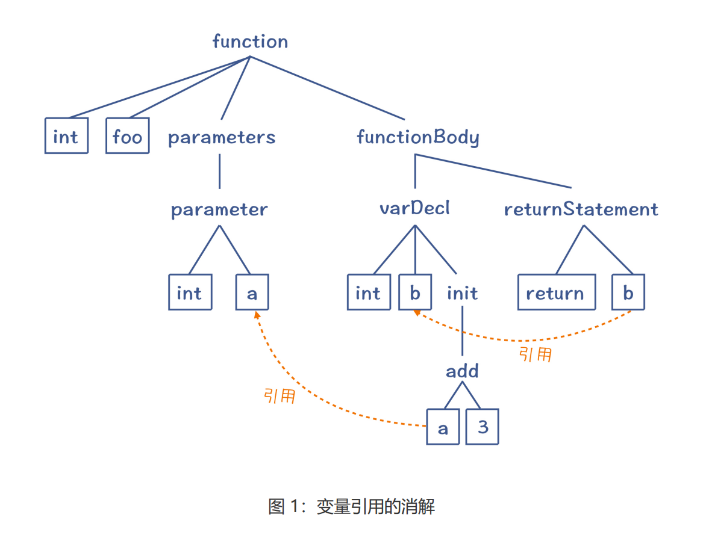
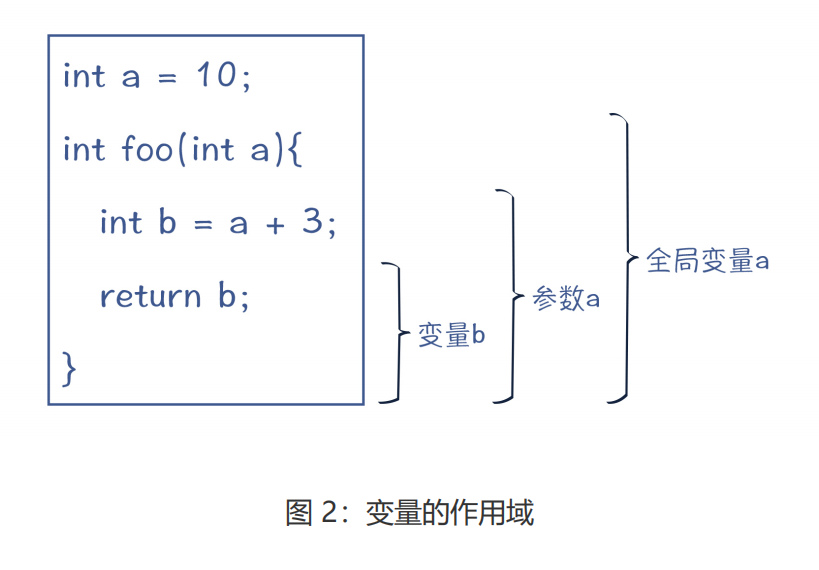
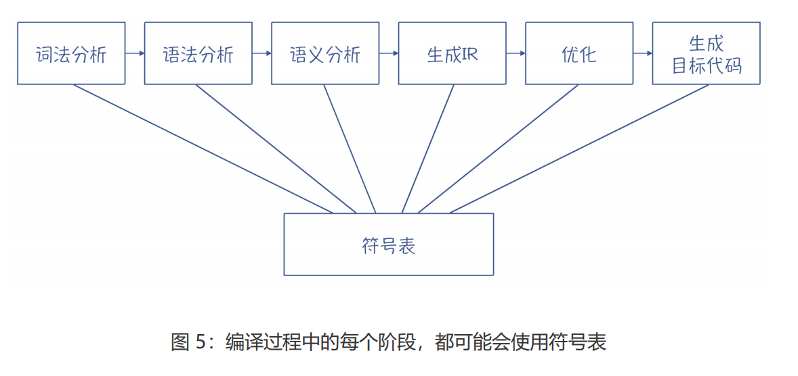
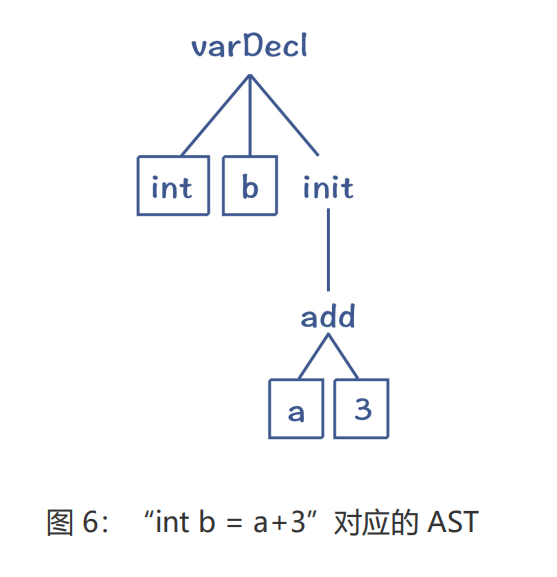
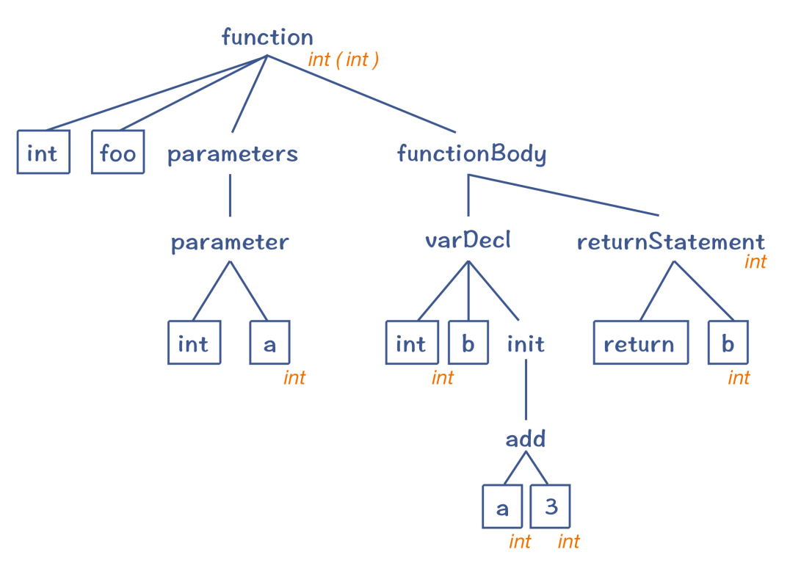

## 语义分析

**语义，就是程序要表达的意思**。

语法分析只能处理与上下文无关的工作。而与上下文有关的工作呢，自然就放到了语义分析阶段。

在语义分析过程中，会使用**两个数据结构**。**一个还是 AST**，但我们会把语义分析时获得的一些信息标注在 AST 上，形成带有标注的 AST。另一个是符号表，用来记录程序中声明的各种标识符，并用于后续各个编译阶段。

### 上下文相关分析

什么是与上下文有关的工作呢？在解析一个程序时，会有非常多的分析工作要结合上下文来进行。接下来，我就以控制流检查、闭包分析和引用消解这三个场景和你具体分析下。

#### 控制流检查

像 return、break 和 continue 等语句，都与程序的控制流有关，它们必须符合控制流方面的规则。在 Java 这样的语言中，语义规则会规定：如果返回值不是 void，那么在退出函数体之前，一定要执行一个 return 语句，那么就要检查所有的控制流分支，是否都以 return语句结尾。

#### 闭包分析

很多语言都支持闭包。而要正确地使用闭包，就必须在编译期知道哪些变量是自由变量。这里的自由变量是指在本函数外面定义的变量，但被这个函数中的代码所使用。这样，在运行期，编译器就会用特殊的内存管理机制来管理这些变量。所以，对闭包的分析，也是上下文敏感的

#### 引用消解

引用消解（Reference Resolution），有时也被称作名称消解（Name Resolution）或者标签消解（Label Resolution）。对变量名称、常量名称、函数名称、类型名称、包名称等的消解，都属于引用消解。因此，引用消解是一种非常重要的上下文相关的语义规则

对于变量来说，为了找到正确的引用，就需要用到**作用域**（Scope）这个概念。在编译技术里面，作用域这个词，有两个稍微有所差异的使用场景。

作用域的第一个使用场景，指的是变量、函数等标识符可以起作用的范围。下图列出了三个变量的作用域，每个变量声明完毕以后，它的下一句就可以引用它

作用域的第二个使用场景，是词法作用域（Lexical Scope），也就是程序中的不同文本区域。比如，一个语句块、参数列表、类定义的主体、函数（方法）的主体、模块主体、整个程序等。

**标识符和词法的作用域的差异**在于：一个本地变量（标识符）的作用域，虽然属于某个词法作用域（如某个函数体），但其作用范围只是在变量声明之后的语句。而类的成员变量（标识符）的作用域，跟词法作用域是一致的，也就是整个类的范围，跟声明的位置无关。如果这个成员变量不是私有的，它的作用域还会覆盖到子类

在做引用消解的时候，为了更好地查找变量、类型等定义信息，编译器会使用一个辅助的数据结构：**符号表**。

### 符号表

在写程序的时候，我们会定义很多标识符，比如常量名称、变量名称、函数名称、类名称，等等。在编译器里，我们又把这些标识符叫做符号（Symbol）。用来保存这些符号的数据结构，就叫做符号表。

### 类型分析和处理

**在计算机语言里，类型是数据的一个属性，它的作用是来告诉编译器或解释器，程序可以如何使用这些数据。**比如说，对于整型数据，它可能占 32 或者 64 位存储，我们可以对它做加减乘除操作。而对于字符串，它可能占很多个字节，并且通过一定的编码规则来表示字符。字符串可以做连接、查找、获取子字符串等操作，但不能像整数一样做算术运算。

关于类型检查，编译器一般会采用**属性计算**的方法，来计算出每个 AST 节点的类型属性，然后检查它们是否匹配。

以“int b = a+3”为例，它的 AST 如下图所示。编译器会计算出 b 节点所需的类型和 init节点的实际类型，比较它们是否一致（或者可以自动转换）

同样是计算 AST 节点的类型，等号右边和左边的计算方法是不一样的。有些属性是通过子节点计算出来的，这叫做 S 属性（Synthesized Attribute，综合出来的属性），比如等号右边的类型。而另一些属性，则要根据父节点或者兄弟节点计算而来，这种属性叫做 I 属性（InheritedAttribute，继承到的属性），比如等号左边的 b 变量的类型。

计算出来的属性，我们可以标注在 AST 上，这就形成曾经提过的带有标注信息的 AST，（Annotated Tree），也有人称之为 Decorated Tree，或者 Attributed Tree。虽然叫法有很多，但都是一个意思，都是向 AST 中添加了语义信息。

属性计算的方法，就是基于语法规则，来定义一些属性计算的规则，在遍历 AST 的时候执行这些规则，我们就可以计算出属性值。**这种基于语法规则定义的计算规则，被叫做属性文法（Attribute Grammar）**