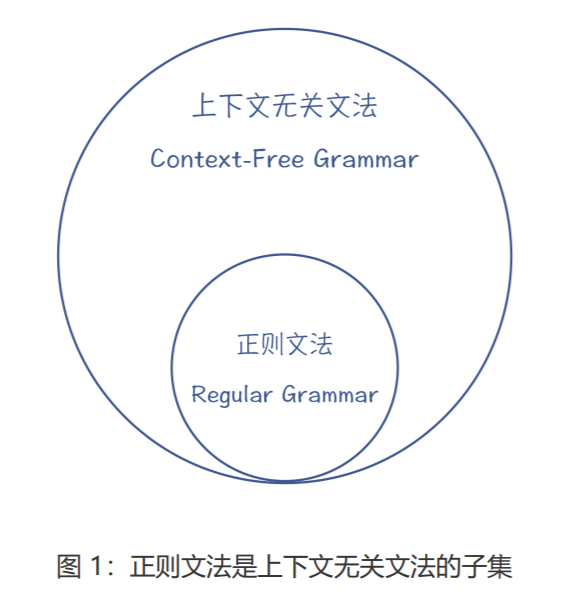
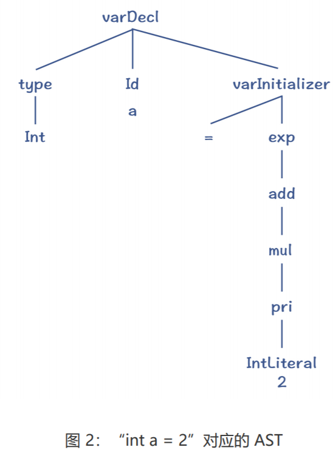
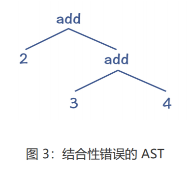
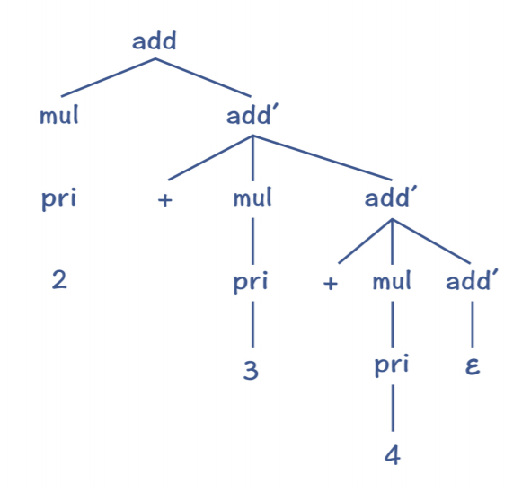
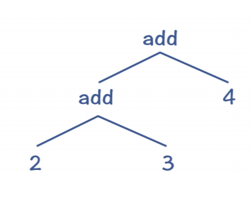
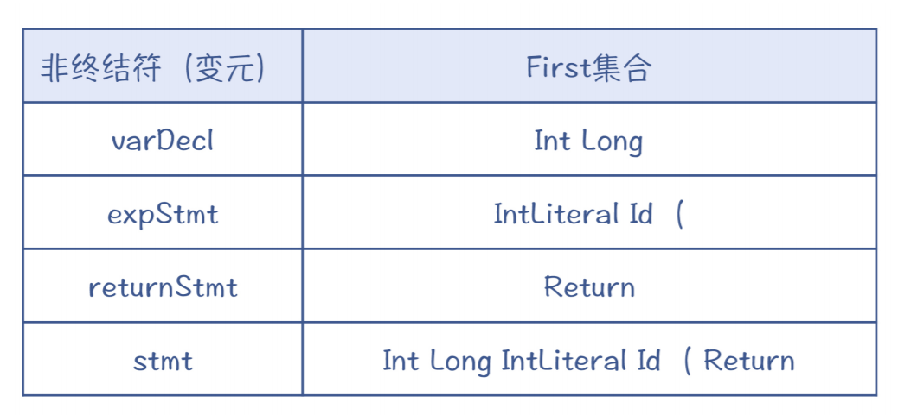
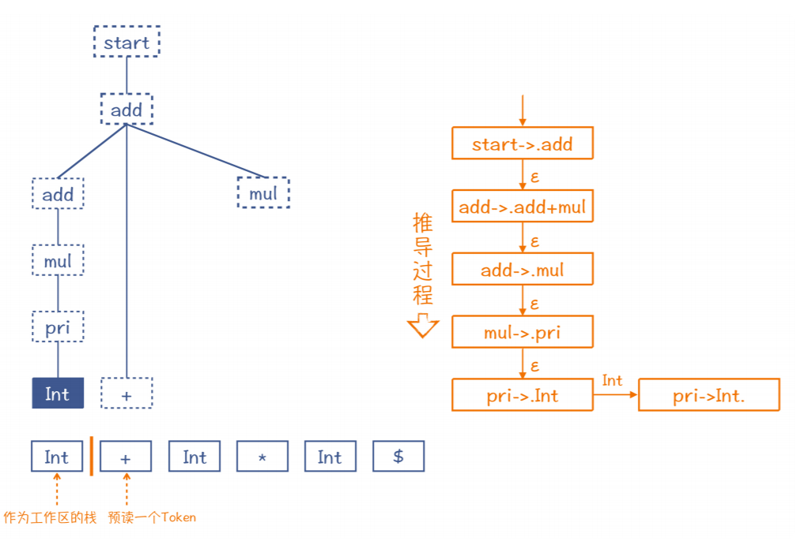

## 语法分析

两个基本功：第一，必须能够阅读和书写语法规则，也就是掌握上下文无关文法；第 二，必须要掌握递归下降算法。

两种算法思路：一种是自顶向下的语法分析，另一种则是自底向上的语法分析。

语法分析阶段的任务：依据语法规则，把 Token 串转化成 AST。

### 上下文无关文法（Context-Free Grammar）

在开始语法分析之前，我们要解决的第一个问题，就是**如何表达语法规则**

语法规则第一种写法可以这样写：

```
start：blockStmts ; //起始
block : '{' blockStmts '}' ; //语句块
blockStmts : stmt* ; //语句块中的语句
stmt = varDecl | expStmt | returnStmt | block; //语句
varDecl : type Id varInitializer？ ';' ; //变量声明
type : Int | Long ; //类型
varInitializer : '=' exp ; //变量初始化
expStmt : exp ';' ; //表达式语句
returnStmt : Return exp ';' ; //return语句
exp : add ; //表达式
add : add '+' mul | mul; //加法表达式
mul : mul '*' pri | pri; //乘法表达式
pri : IntLiteral | Id | '(' exp ')' ; //基础表达式
```

都是左边是规则名称， 右边是正则表达式

在语法规则里，我们把冒号左边的叫做**非终结符（Non-terminal）**，又叫**变元 （Variable）**。非终结符可以按照右边的正则表达式来逐步展开，直到最后都变成标识符、 字面量、运算符这些不可再展开的符号，也就是**终结符（Terminal）**。终结符其实也是词 法分析过程中形成的 Token。

像这样左边是非终结符，右边是正则表达式的书写语法规则的方式，就叫做**扩展巴科斯范式 （EBNF）**。你在 ANTLR 这样的语法分析器生成工具中，经常会看到这种格式的语法规则。

在教科书中，我们还经常采用另一种写法，就是产生式（Production Rule），又叫做替换 规则（Substitution Rule）。产生式的左边是非终结符（变元），它可以用右边的部分替 代，中间通常会用箭头连接。

```
add -> add + mul
add -> mul
mul -> mul * pri
mul -> pri
```

产生式不用“ * ”和“+”来表示重复，而是用迭代，并引入“ε”（空字符串）。所 以“blockStmts : stmt*”可以写成下面这个样子

```
blockStmts -> stmt blockStmts | ε
```

总结起来，语法规则是由 4 个部分组成的

+ 一个有穷的非终结符（或变元）的集合； 
+ 一个有穷的终结符的集合；
+  一个有穷的产生式集合； 
+ 一个起始非终结符（变元）。

那么符合这四个特点的文法规则，就叫做**上下文无关文法（Context-Free Grammar， CFG）**。

**正则文法是上下文无关文法的一个子集**。其实，正则文法也可以写成产生式的格式。 比如，数字字面量（正则表达式为“[0-9]+”）可以写成：

```
IntLiteral -> Digit IntLiteral1
IntLiteral1 -> Digit IntLiteral1
IntLiteral1 -> ε
Digit -> [0-9]
```

在上下文无关文法里，产生式的右边可以放置任意的终结符和非终结符，而正则文法 只是其中的一个子集，叫做线性文法（Linear Grammar）。它的特点是产生式的右边部分 最多只有一个非终结符，比如 X->aYb，其中 a 和 b 是终结符。



把上一讲用到的正则表达式“a[a-zA-Z0-9]*bc”写成产生式的格式，它就 符合线性文法的特点

```
S0 -> aS1bc
S1 -> [a-zA-Z0-9]S1
S1 -> ε
```

**学习编译原理，阅读和书写语法规则是一项基本功。针对高级语言中的各种语句，要都能够手写出它们的语法 规则来才可以**

### 递归下降算法（Recursive Descent Parsing）

接下来，我们就要依据语法规则，编写语法分析程序，把 Token 串转化成 AST。语法分析 的算法有很多，但有一个算法也是你必须掌握的一项基本功，这就是递归下降算法。

递归下降算法其实很简单，它的基本思路就是按照语法规则去匹配 Token 串。比如说，变量声明语句的规则如下：

```
varDecl : types Id varInitializer？ ';' ; //变量声明
varInitializer : '=' exp ; //变量初始化
exp : add ; //表达式
add : add '+' mul | mul; //加法表达式
mul : mul '*' pri | pri; //乘法表达式
pri : IntLiteral | Id | '(' exp ')' ; //基础表达式
```

zwlj:表达式优先级，通过定义的展开就实现了。

如果写成产生式格式，是下面这样：

```
varDecl -> types Id varInitializer ';'
varInitializer -> '=' exp
varInitializer -> ε
exp -> add
add -> add + mul
add -> mul
mul -> mul * pri
mul -> pri
pri -> IntLiteral
pri -> Id
pri -> ( exp )
```

而基于这个规则做解析的算法如下：

```
匹配一个数据类型(types)
匹配一个标识符(Id)，作为变量名称
匹配初始化部分(varInitializer)，而这会导致下降一层，使用一个新的语法规则：
匹配一个等号
匹配一个表达式(在这个步骤会导致多层下降：exp->add->mul->pri->IntLiteral)
创建一个varInitializer对应的AST节点并返回
如果没有成功地匹配初始化部分，则回溯，匹配ε，也就是没有初始化部分。
匹配一个分号
创建一个varDecl对应的AST节点并返回
```

用上述算法解析“int a = 2”，就会生成下面的 AST：



总结起来，递归下降算法的特点是：

- 对于一个非终结符，要从左到右依次匹配其产生式中的每个项，包括非终结符和终结 符。 
- 在匹配产生式右边的非终结符时，要下降一层，继续匹配该非终结符的产生式。
-  如果一个语法规则有多个可选的产生式，那么只要有一个产生式匹配成功就行。如果一 个产生式匹配不成功，那就回退回来，尝试另一个产生式。这种回退过程，叫做回溯 （Backtracking）。

递归下降算法是非常容易理解的。它能非常有效地处理很多语法规则，但是它也有两个缺点。

**第一个缺点，就是著名的左递归（Left Recursion）问题**。比如，在匹配算术表达式时， 产生式的第一项就是一个非终结符 add，那么按照算法，要下降一层，继续匹配 add。这 个过程会一直持续下去，无限递归下去。

```
add -> add + mul
```

你可能会说，把产生式改成右递归不就可以了吗？也就是 add 这个递归项在右边,这样确实可以避免左递归问题，**但它同时也会导致结合性的问题**。

举个例子来说，我们按照上面的语法规则来解析“2+3+4”这个表达式，会形成如下所示 的 AST。



它会先计算“3+4”，而不是先计算“2+3”。这破坏了加法的结合性规则，加法运算本来 应该是左结合的。 其实有一个标准的方法，能避免左递归问题。我们可以改写原来的语法规则，也就是引入 add'，把左递归变成右递归：

```
add -> mul add'
add' -> + mul add' | ε
```



你能看出，这种改写方法虽然能够避免左递归问题，但由于add'的规则是右递归的，采用 标准的递归下降算法，仍然会出现运算符结合性的错误。那么针对这点，我们有没有解决办法呢？

有的，方法就是把递归调用转化成循环。这里利用了很多同学都知道的一个原理，即递归调用可以转化为循环。

其实我把上面的规则换成用 EBNF 方式来表达就很清楚了。在 EBNF 格式里，允许 用“*”号和“+”号表示重复：

```
add ： mul ('+' mul)* ；
```

所以说，对于('+'mul)*这部分，我们其实可以写成一个循环。而在循环里，我们可以根据结合性的要求，手工生成正确的 AST。它的伪代码如下：

```
左子节点 = 匹配一个mul
while(下一个Token是+){
消化掉+
右子节点 = 匹配一个mul
用左、右子节点创建一个add节点
左子节点 = 该add节点
}
```

采用上面的算法，就可以创建正确的 AST，如下图所示：



**递归下降算法的第二个缺点，就是当产生式匹配失败的时候，必须要“回溯”**，这就可能导 致浪费。 这个时候，我们有个针对性的解决办法，就是预读后续的一个 Token，判断该选择哪个产 生式。

这个时候，我们有个针对性的解决办法，就是预读后续的一个 Token，判断该选择哪个产 生式。

以 stmt 变元为例，考虑它的三个产生式，分别是变量声明语句、表达式语句和 return 语 句。那么在递归下降算法中，我们可以在这里预读一个 Token，看看能否根据这个 Token 来选择某个产生式。

经过仔细观察，你发现如果预读的 Token 是 Int 或 Long，就选择变量声明语句；如果是 IntLiteral、Id 或左括号，就选择表达式语句；而如果是 Return，则肯定是选择 return 语 句。因为这三个语句开头的 Token 是不重叠的，所以你可以很明确地做出选择。

如果我们手写递归下降算法，可以用肉眼识别出每次应该基于哪个 Token，选择用哪个产 生式。但是，对于一些比较复杂的语法规则，我们要去看好几层规则，这样比较辛苦。那么能否有一个算法，来自动计算出选择不同产生式的依据呢？当然是有的，这就是 LL 算 法家族

### LL算法

**LL 算法的要点，就是计算 First 和 Follow 集合。**

First 集合是每个产生式开头可能会出现的 Token 的集合。就像 stmt 有三个产生式，它的 First 集合如下表所示。



而 stmt 的 First 集合，**就是三个产生式的 First 集合的并集**，也是 Int Long IntLiteral Id ( Return。

总体来说，针对非终结符 x，它的 First 集合的计算规则是这样的：

- 如果产生式以终结符开头，那么把这个终结符加入 First(x)； 
- 如果产生式以非终结符 y 开头，那么把 First(y) 加入 First(x); 
- 如果 First(y) 包含ε，那要把下一个项的 First 集合也加入进来，以此类推；
-  如果 x 有多个产生式，那么 First(x) 是每个产生式的并集。

其实还有一种特殊情况我们需要考虑，那就是对于某个非终结符，它自身会产生ε的情况。 比如说，示例文法中的 blockStmts，它是可能产生ε的，也就是块中一个语句都没有。

```
block : '{' blockStmts '}' ; //语句块
blockStmts : stmt* ; //语句块中的语句
stmt = varDecl | expStmt | returnStmt; //语句
```

对于某个非终结符后面可能跟着的 Token 的集合，我们叫做 Follow 集合。如果预读到的 Token 在 Follow 中，那么我们就可以判断当前正在匹配的这个非终结符，产生了ε。

Follow 的算法也比较简单，以非终结符 x 为例：

- 扫描语法规则，看看 x 后面都可能跟着哪些符号；
-  对于后面跟着的终结符，都加到 Follow(x) 集合中去； 
- 如果后面是非终结符 y，就把 First(y) 加 Follow(x) 集合中去； 最后，如果 First(y) 中包含ε，就继续往后找； 
- 如果 x 可能出现在程序结尾，那么要把程序的终结符 $ 加入到 Follow(x) 中去。

这样在计算了 First 和 Follow 集合之后，**你就可以通过预读一个 Token，来完全确定采用 哪个产生式。这种算法，就叫做 LL(1) 算法**。

LL(1) 中的第一个 L，是 Left-to-right 的缩写，代表从左向右处理 Token 串。第二个 L， 是 Leftmost 的缩写，意思是最左推导。最左推导是什么呢？就是它总是先把产生式中最左 侧的非终结符展开完毕以后，再去展开下一个。这也就相当于对 AST 从左子节点开始的深 度优先遍历。LL(1) 中的 1，指的是预读一个 Token。

### LR 算法：移进和规约

前面讲的递归下降和 LL 算法，都是自顶向下的算法。还有一类算法，是自底向上的，其中 的代表就是 LR 算法。

自顶向下的算法，是从根节点逐层往下分解，形成最后的 AST；而 LR 算法的原理呢，则是 从底下先拼凑出 AST 的一些局部拼图，并逐步组装成一棵完整的 AST。所以，其中的关键 之处在于如何“拼凑”。

```
start->add
add->add+mul
add->mul
mul->mul*pri
mul->pri
pri->Int
pri->(add)
```

如果用于解析“2+3*5”

LR 算法和 LL 算法一样，也是从左到右地消化掉 Token。在第 1 步，它会取出“2”这个 Token，放到一个栈里，这个栈是用来组装 AST 的工作区。同时，它还会预读下一个 Token，也就是“+”号，用来帮助算法做判断。

在下面的示意图里，我画了一条橙色竖线，竖线的左边是栈，右边是预读到的一个 Token。在做语法解析的过程中，竖线会不断地往右移动，把 Token 放到栈里，这个过程 叫做“移进”（Shift）。



zwlj: 上图的工作过程，我们先读了第一个token2，这时候根据之前说到的递归下降算法，我们从add开始找(生成式一层层往下)，然后预读一个+符号，走到add我们发现对不上，继续走add+mul，这时发现能能对上了，继续走下一个add分支来匹配2这个token，去到add->.mul，最后一路推导出2是个Int。上图右边就是推导过程

注意，我在图 7 中还用虚线框推测了 AST 的其他部分。也就是说，如果第一个 Token 遇 到的是整型字面量，而后面跟着一个 + 号，那么这两个 Token 就决定了它们必然是这棵推 测出来的 AST 的一部分。而图中右边就是它的推导过程，其中的每个步骤，都使用了一个 产生式加了一个点（如“.add”）。这个点，就相当于图中左边的橙色竖线。 所以你就可以根据这棵假想的 AST，也就是依据假想的推导过程，给它反推回去。把 Int 还原为 pri。这个还原过程，就叫做**“规约”（Reduce）**。工作区里的元素也随之更新成 pri。


**对于规约的一些细节过程，这里等以后有空再补充**

相对于 LL 算法，LR 算法的优点是能够处理左递归文 法。但它也有缺点，比如不利于输出全面的编译错误信息。因为在没有解析完毕之前，算法 并不知道最后的 AST 是什么样子，所以也不清楚当前的语法错误在整体 AST 中的位置。