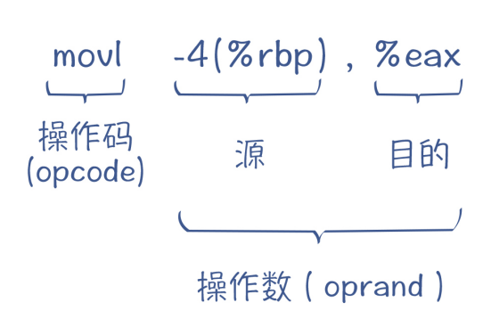

## 运行时机制

在语义分析之后，编译过程就开始进入中后端了。

经过前端阶段的处理分析，编译器已经充分理解了源代码的含义，准备好把前端处理的结果（带有标注信息的 AST、符号表）翻译成目标代码了。

通常情况下，程序有两种执行模式。

**第一种执行模式是在物理机上运行**。针对的是 C、C++、Go 这样的语言，编译器直接将源代码编译成汇编代码（或直接生成机器码），然后生成能够在操作系统上运行的可执行程序。为了实现它们的后端，编译器需要理解程序在底层的运行环境，包括 CPU、内存、操作系统跟程序的互动关系，并要能理解汇编代码。

**第二种执行模式是在虚拟机上运行**。针对的是 Java、Python、Erlang 和 Lua 等语言，它们能够在虚拟机上解释执行。这时候，编译器要理解该语言的虚拟机的运行机制，并生成能够被执行的 IR。

### 物理机执行模式

在计算机发展的早期，科学家们确立了计算机的结构，并一直延续至今，这种结构就是**冯·诺依曼结构**。它的主要特点是：数据和指令不加区别，混合存储在同一个存储器中（即主存，或叫做内存）；用一个指令指针指向内存中指令的位置，CPU 就能自动加载这个位置的指令并执行。

在 x86 架构下，这个指针是 **eip 寄存器（32 位模式）或 rip 寄存器（64 位模式）**。一条指令执行完毕，指令指针自动增加，并执行下一条指令。如果遇到跳转指令，则跳转到另一个地址去执行


**计算机指令的执行基本上只跟两个硬件相关：一个是 CPU，一个是内存**

#### cpu相关

CPU 上面有寄存器，并且可以直接由指令访问。寄存器的读写速度非常快，大约是内存的 100 倍。所以我们**编译后的代码，要尽量充分利用寄存器**，而不是频繁地去访问内存。

CPU 有高速缓存，并且可能是多级的。高速缓存也比内存快。CPU 在读取指令和数据的时候，不是一次读取一条，而是读取相邻的一批数据，放到高速缓存里。接下来要读取的数据，很可能已经在高速缓存里了，通过这种机制来提高运行性能。编译器要尽量提高缓存的命中率

**CPU 有多种不同的架构，比如 x86 架构、ARM 架构等**。不同架构的 CPU，它的指令是不一样的。不过它们的共性之处在于，指令都是 01 这样的机器码。为了便于理解，我们通常会用汇编代码来表示机器指令。比如，b=a+2 指令对应的汇编码可能是这样的

```
movl -4(%rbp), %eax #把%rbp-4内存地址的值拷贝到%eax寄存器
addl $2, %eax #把2加到%eax寄存器
movl %eax, -8(%rbp) #把%eax寄存器的值保存回内存，地址是%rbp-8
```

上面的汇编代码采用的是 GNU 汇编器规定的格式。每条指令都包含了两部分：**操作码（opcode）和操作数（oprand）**。



#### 内存相关

内存中的每个位置都有一个地址，地址的长度决定了能够表示多大空间，这叫做**寻址空间**。我们目前使用的都是 64 位的机器，理论上，你可以用一个 64 位的长整型来表示内存地址。

由于我们根本用不了这么大的内存，所以 AMD64 架构的寻址空间只使用了 48 位。但这也有 256TB，远远超出了一般情况下的需求。所以，像 Windows 这样的操作系统还会给予进一步的限制，缩小程序的寻址空间

一个编译器的作者，可以决定在哪儿放代码，在哪儿放数据。当然了，别的作者也可能采用其他的策略。比如，C 语言和Java 虚拟机对内存的管理和使用策略就是不同的。大多数语言还是会采用一些通用的内存管理模式。以 C 语言为例，会把内存划分为代码区、静态数据区、栈和堆，如下所示。


其中，代码区（也叫做文本段），主要存放编译完成后的机器码，也就是 CPU 指令；静态数据区会保存程序中的全局变量和常量。这些内存是静态的、固定大小的，在编译完毕以后就能确定清楚所占用空间的大小、代码区每个函数的地址，以及静态数据区每个变量和常量的地址。这些内存在程序运行期间会一直被占用。

使用栈的一个好处是，操作系统会根据程序使用内存的需求，自动地增加或减少栈的空间。通常来说，操作系统会用一个寄存器保存栈顶的地址，程序可以修改这个寄存器的值，来获取或者释放空间。有的 CPU，还有专门的指令来管理栈，比如x86 架构，会使用 push 和 pop 指令，把数据写入栈或弹出栈，并自动修改栈顶指针。**每次调用函数的过程中，都需要一些空间来保存一些信息，比如参数、需要保护的寄存器的值、返回地址、本地变量等，这些信息叫做这个过程的活动记录（Activation Record）**。

**活动记录是个逻辑概念。**在物理实现上，一些信息可以保存在寄存器里，使得性能更高。比如说依据一些约定，返回值和少于 6 个的参数，是通过寄存器传递的。这里所说的“依据约定”，是指在调用一个函数时，如何传递参数、如何设定返回地址、如何获取返回值的这种约定，我们把它称之为 ABI（Application Binary Interface，应用程序二进制接口）。利用 ABI，使得我们可以用一种语言写的程序，去调用另外的语言写的程序。


### 虚拟机运行

虚拟机是计算机语言的一种运行时系统。虚拟机上运行的是**中间代码**，而不是 CPU 可以直接认识的指令。

虚拟机有两种模型：一种叫做**栈机**（Stack Machine），一种叫做**寄存器机**（Register Machine）。它们的区别，主要在于如何获取指令的操作数

栈机是从栈里获取，而寄存器机是从寄存器里获取。这两种虚拟机各有优缺点。

#### 基于栈的虚拟机

首先说说栈机。JVM 和 Python 中的解释器，都采用了栈机的模型。在本讲中，我主要介绍 Java 的虚拟机的运行机制。

JVM 中，每一个线程都有一个 JVM 栈，每次调用一个方法都会生成一个栈帧，来支持这个方法的运行。这跟 C 语言很相似。但 JVM 的栈帧比 C 语言的复杂，它包含了一个本地变量数组（包括方法的参数和本地变量）、操作数栈、到运行时常量池的引用等信息。


对于每个指令，解释器先要把它的操作数压到栈里。在执行指令时，从栈里弹出操作数，计算完毕以后，再把结果压回栈里。

#### 基于寄存器的虚拟机

除了栈机之外，另一种虚拟机是寄存器机。寄存器机使用寄存器名称来表示操作数，所以它的指令也跟汇编代码相似，像 add 这样的操作码后面要跟操作数。

在实践中，早期版本的安卓系统中，用于解释执行代码的 Dalvik 虚拟机，就采用了寄存器模式，而 Erlang 和 Lua 语言的虚拟机也是寄存器机。JavaScript 引擎 V8 的比较新的版本中，也引入了一个解释器 Ignition，它也是个寄存器机。

**与栈机相比**，利用寄存器机编译所生成的代码更少，因为省去了很多 push 指令。

不过，寄存器机所指的寄存器，不一定是真正的物理寄存器，有可能只是栈帧中的一个位置。当然，有的寄存器机在实现的时候，确实会用到物理寄存器，从而提高计算性能。