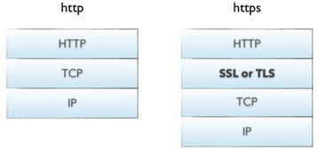
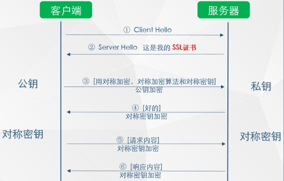

## https详解
HTTPS 协议（HyperText Transfer Protocol over Secure Socket Layer）：可以理解为HTTP+SSL/TLS， **即 HTTP 下加入 SSL 层，HTTPS 的安全基础是 SSL，因此加密的详细内容就需要 SSL，用于安全的 HTTP 数据传输**。

HTTP请求过程中，客户端与服务器之间没有任何身份确认的过程，数据全部明文传输，“裸奔”在互联网上，所以很容易遭到黑客的攻击

### 一些推论

如果单单使用对称秘钥加密，那么不同的客户端、服务器数量庞大，所以双方都需要维护大量的密钥，维护成本很高，且密钥极易泄露。

如果单单使用非对称秘钥，公钥是公开的（也就是黑客也会有公钥），所以私钥加密的信息如果被黑客截获，其可以使用公钥进行解密，获取其中的内容。

非对称加密既然也有缺陷，那我们就**将对称加密，非对称加密两者结合起来**，取其精华、去其糟粕，发挥两者的各自的优势

### https流程

客户端先想服务器发个hello包，服务器返回SSL证书里面有服务端的公钥。**客户端协定好对称秘钥加密的算法和密钥**，然后用服务端公钥加密，之后就全部都走对称密钥加密。

如上图所示，在第2步时服务器发送了一个SSL证书给客户端，SSL 证书中包含的具体内容有()：

1. 证书的发布机构CA
2. 证书的有效期
3. 公钥
4. 证书所有者
5. 签名
6. ...

客户端在接受到服务端发来的SSL证书时，**会对证书的真伪进行校验，以浏览器为例说明如下**：

1. 首先浏览器读取证书中的证书所有者、有效期等信息进行一一校验

2. 浏览器开始查找操作系统中已内置的受信任的证书发布机构CA，与服务器发来的证书中的颁发者CA比对，用于校验证书是否为合法机构颁发(**一般是需要浏览器访问CA站点去验证证书的有效性的**)

3. 如果找不到，浏览器就会报错，说明服务器发来的证书是不可信任的。

4. 如果找到，那么浏览器就会从操作系统中取出  颁发者CA  的公钥，然后对服务器发来的证书里面的签名进行解密

5. 浏览器使用相同的hash算法计算出服务器发来的证书的hash值，将这个计算的hash值与证书中签名做对比(zwlj:也就是说对报文做一次hash，然后和上一步中解密出的哈希做对比，看看一不一致)

6. **对比结果一致，则证明服务器发来的证书合法**，没有被冒充

7. 此时浏览器就可以读取证书中的公钥，用于后续加密了

### https局限性
HTTPS比HTTP耗费更多服务器资源（https其实就是建构在SSL/TLS之上的 http协议，所以要比较https比http多用多少服务器资源，主要看SSL/TLS本身消耗多少服务器资源。

耗费的资源多，过程也复杂，想当然访问不如HTTP高效。**大流量网站非必要也不会采用，流量成本太高**。

HTTPS并不能防止站点被网络蜘蛛抓取。在某些情形中，被加密资源的URL可仅通过截获请求和响应的大小推得，这就可使攻击者同时知道明文（公开的静态内容）和密文（被加密过的明文），从而使选择密文攻击成为可能。
