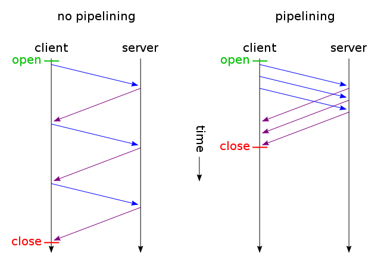

## HTTP1.1的流水线技术(HTTP Pipelining)
 使用了HTTP长连接（HTTP persistent connection ）之后的好处，包括可以使用HTTP 流水线技术（HTTP pipelining，也有翻译为**管道化连接**）

 它是指，**在一个TCP连接内，多个HTTP请求可以并行**，下一个HTTP请求**在上一个HTTP请求的应答完成之前就发起**。从wiki上了解到这个技术目前并没有广泛使用，使用这个技术必须要求客户端和服务器端都能支持，目前有部分浏览器完全支持，而服务端的支持仅需要：**按HTTP请求顺序正确返回Response**（也就是请求&响应采用FIFO模式），wiki里也特地指出，只要服务器能够正确处理使用HTTP pipelinning的客户端请求，那么服务器就算是支持了HTTP pipelining。

HTTP管线化将多个HTTP要求（request）整批提交，而在传送过程中不需先等待服务端的回应。管线化机制须通过永久连接（persistent connection）完成，**仅HTTP/1.1支持此技术**（HTTP/1.0不支持），并且只有GET和HEAD要求可以进行管线化，而POST则有所限制。此外，初次创建连接时也不应启动管线机制，因为对方（服务器）不一定支持HTTP/1.1版本的协议。

此技术之关键在于多个HTTP的要求消息可以同时塞入一个TCP分组中，所以只**提交一个分组即可同时发出多个要求**，借此可减少网络上多余的分组并**降低线路负载**。

由于要求服务端返回响应数据的顺序**必须跟客户端请求时的顺序一致**，这样也就是**要求FIFO**，这容易导致**Head-of-line blocking**：第一个请求的响应发送影响到了后边的请求，可以参见线头阻塞的笔记

因为这个原因导致HTTP流水线技术对性能的**提升并不明显**（wiki提到，这个问题会在HTTP2.0中解决）。另外，使用这个技术的还必须是幂等的HTTP方法，因为客户端无法得知当前已经处理到什么地步，重试后可能发生不可预测的结果。POST方法不是幂等的：同样的报文，第一次POST跟第二次POST在服务端的表现可能会不一样。

目前**浏览器并不太重视这个技术**，毕竟性能提升有限。
