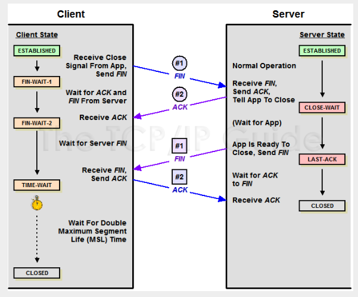

## Close Wait详解

主动关闭的一方发出 FIN 包，被动关闭的一方响应 ACK 包，此时，被动关闭的一方就进入了 CLOSE_WAIT 状态。如果一切正常，稍后被动关闭的一方也会发出 FIN 包，然后迁移到 LAST_ACK 状态。

通常，CLOSE_WAIT 状态在服务器停留时间很短，如果你发现大量的 CLOSE_WAIT 状态，那么就意味着被动关闭的一方没有及时发出 FIN 包，一般有如下几种可能：

- 程序问题：如果代码层面忘记了 close 相应的 socket 连接，那么自然不会发出 FIN 包，从而导致 CLOSE_WAIT 累积；或者代码不严谨，出现死循环之类的问题，导致即便后面写了 close 也永远执行不到。
- 响应太慢或者超时设置过小：如果连接双方不和谐，一方不耐烦直接 timeout，另一方却还在忙于耗时逻辑，就会导致 close 被延后。响应太慢是首要问题，不过换个角度看，也可能是 timeout 设置过小。
- BACKLOG 太大：此处的 backlog 不是 syn backlog，而是 accept 的 backlog，如果 backlog 太大的话，**设想突然遭遇大访问量的话，即便响应速度不慢，也可能出现来不及消费的情况，导致多余的请求还在队列里就被对方关闭了**。

如果你通过「netstat -ant」或者「ss -ant」命令发现了很多 CLOSE_WAIT 连接，请注意结果中的「Recv-Q」和「Local Address」字段，通常「Recv-Q」会不为空，它表示应用还没来得及接收数据