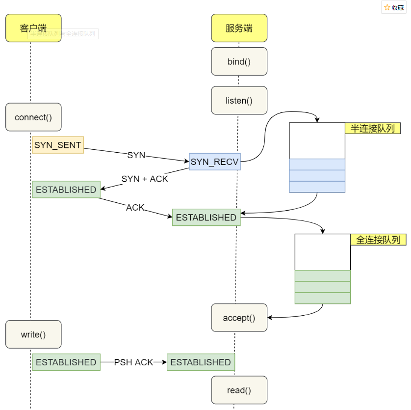
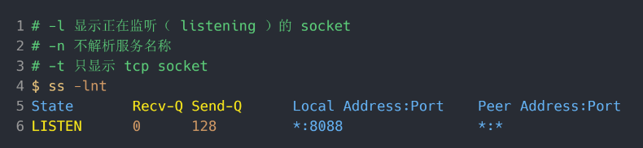
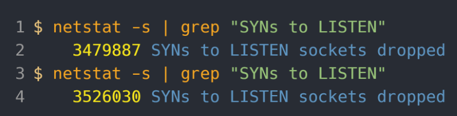

## TCP SYN队列与Accept队列详解

tcp之间的网络调用，时而可能会出现Connection Reset By peer的问题，这个最有可能是什么问题呢，其实跟tcp连接中的两个队列有关，一个是SYN队列，一个是Accept队列。

- 半连接队列，也称 SYN 队列；
- 全连接队列，也称 accepet 队列；


简单来说，tcp三次握手的时候，服务端收到SYN包，就会把这个连接放到SYN队列当中，然后收到对端的三次握手ACK之后，就把这个连接从SYN队列取出放到accept队列里



**不管是半连接队列还是全连接队列，都有最大长度限制，超过限制时，内核会直接丢弃，或返回 RST 包。(重)**

### 观察全连接队列

在服务端可以使用 `ss` 命令，来查看 TCP 全连接队列的情况

`ss` 命令获取的 `Recv-Q/Send-Q` 在「LISTEN 状态」和「非 LISTEN 状态」所表达的含义是不同的

在socket是「LISTEN 状态」时，`Recv-Q/Send-Q` 表示的含义如下：

- Recv-Q：当前全连接队列的大小，也就是当前已完成三次握手并等待服务端 `accept()` 的 TCP 连接；
- Send-Q：当前全连接最大队列长度，上面的输出结果说明监听 8088 端口的 TCP 服务，最大全连接长度为 128；



假如像上面那样显示，那说明这个listen状态的socket，全连接队列的最大长度是128，recv-q也就是目前等待取出的连接是0

在「非 LISTEN 状态」时，`Recv-Q/Send-Q` 表示的含义如下：

- Recv-Q：已收到但未被应用进程读取的字节数；
- Send-Q：已发送但未收到确认的字节数；

，**当服务端并发处理大量请求时，如果 TCP 全连接队列过小，就容易溢出。发生 TCP 全连接队溢出的时候，后续的请求就会被丢弃，这样就会出现服务端请求数量上不去的现象。**

#### tcp_abort_on_overflow参数(重)

丢弃连接只是 Linux 的默认行为，我们还可以选择向客户端发送 RST 复位报文，告诉客户端连接已经建立失败。

tcp_abort_on_overflow 共有两个值分别是 0 和 1，其分别表示：

- 0 ：如果全连接队列满了，那么 server 扔掉 client 发过来的 ack ；
- 1 ：如果全连接队列满了，server 发送一个 `reset` 包给 client，表示废掉这个握手过程和这个连接；

#### somaxconn

**TCP 全连接队列的最大值取决于 somaxconn 和 backlog 之间的最小值，也就是 min(somaxconn, backlog)**

- `somaxconn` 是 Linux 内核的参数，默认值是 128，可以通过 `/proc/sys/net/core/somaxconn` 来设置其值；
- `backlog` 是 `listen(int sockfd, int backlog)` 函数中的 backlog 大小，Nginx 默认值是 511，可以通过修改配置文件设置其长度；

**如果持续不断地有连接因为 TCP 全连接队列溢出被丢弃，就应该调大 backlog 以及 somaxconn 参数。**

### 观察半连接队列

很遗憾，TCP 半连接队列长度的长度，没有像全连接队列那样可以用 ss 命令查看。

但是我们可以抓住 TCP 半连接的特点，就是服务端处于 `SYN_RECV` 状态的 TCP 连接，就是 TCP 半连接队列。

于是我们可以使用命令：

```
netstat -nat | grep SYN_RECV | wc -l
```

还可以通过 netstat -s 观察半连接队列溢出的情况：



### 参考

https://www.cnblogs.com/xiaolincoding/p/12995358.html