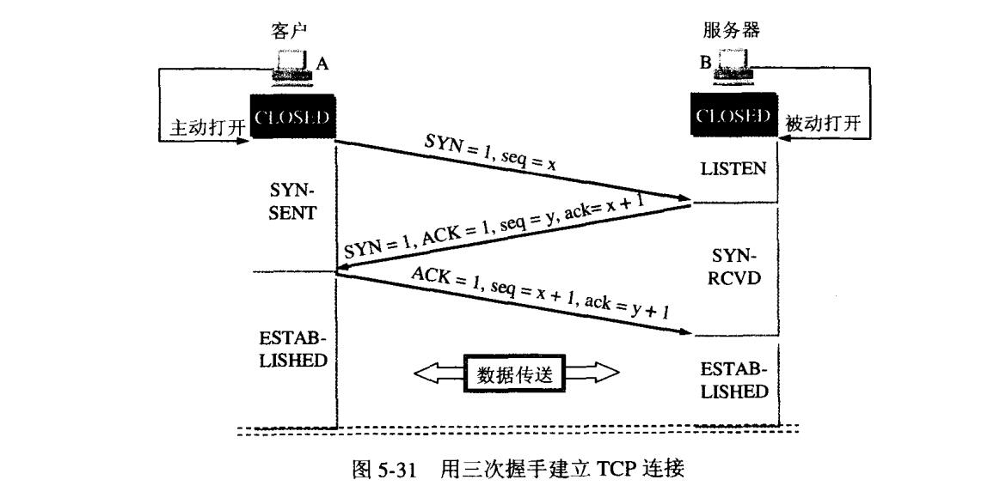
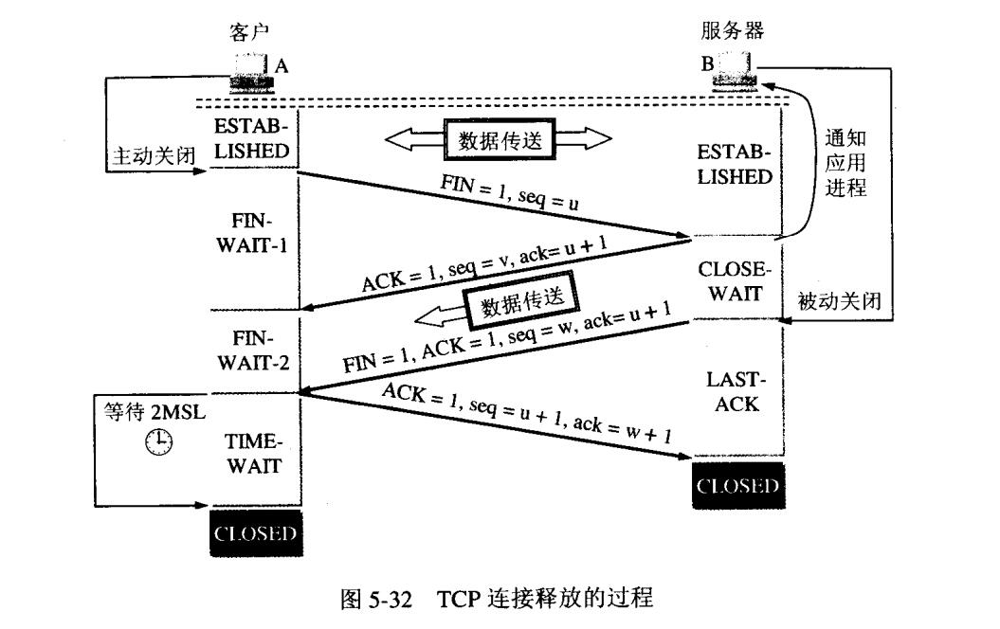

## TCP连接管理

### 三次握手

TCP用三次握手（three-way handshake）过程创建一个连接。在连接创建过程中，很多参数要被初始化，例如序号被初始化以保证按序传输和连接的强壮性。

如上图，注意客户端主动打开，服务端被动打开。

#### 三次握手的必要性
这主要是为了**防止已失效的连接请求报文段突然又传送到了服务器**，因而发生错误。

考虑一种情况，客户发出连接请求后，但因连接请求报文丢失而未收到确认。于是客户再重传一次连接请求。后来收到了确认，建立了连接。数据传输完毕后，就释放了连接。

现假定一种异常情况。即客户发出的第一个连接请求报文段**并没有丢失**，而是在某些网络结点长时间滞留了，以致延误到连接释放以后的某个时间才到达服务器。本来这是一个早已失效的报文段，但服务器收到此失效的连接请求后，就误认为是客户又一次发出一次新的连接请求。于是就向客户发出确认报文段，同意建立连接。假定不采用三次握手而采用**2次握手**，那么**只要服务器发出确认**，新的连接就建立了(server发出状态后变为连接状态)。

zwlj:还可以**换个角度**理解三次握手的必要性。那就是TCP连接，必须保证收发双发都**确认自己**有具有正确的发送信息能力和收到信息能力。A向B发一个syn报文，B收到后就知道了A有正确发送信息的能力且B自己有收到信息的能力，然后就回了一个带ACK的syn报文。A收到后就确认了自己有正确地发送信息和收到信息的能力且B有**收发信息**的能力，但是此时B还不确定B自己有成功发送信息的能力，A此时就需要再回复一个ACK过去，告诉B他发成功了，从而建立连接。

#### SYN泛洪攻击
SYN攻击是黑客攻击的手段。SYN洪泛攻击的基础是依靠TCP建立连接时三次握手的设计。

SYN攻击属于DOS攻击的一种，它利用TCP协议缺陷，通过发送大量的半连接请求，耗费CPU和内存资源。SYN攻击除了能影响主机外，还可以危害路由器、防火墙等网络系统，事实上SYN攻击并不管目标是什么系统，只要这些系统打开TCP服务就可以实施。

大量的SYN请求导致未连接队列被塞满，使正常的TCP连接无法顺利完成三次握手

##### 防御
对SYN包进行监视，如果发现某个IP发起了较多的攻击报文，直接将这个IP列入黑名单即可。对于源地址不停变化的攻击使用上述方法则不行

#### 四次挥手
数据传输结束后，通信的双方可以释放连接。

数据传输结束后的客户A和服务器B都处于ESTABLISHED状态，然后进入释放连接的过程。

由于TCP连接是全双工的，因此每个方向都必须单独进行关闭。这个原则是**当一方完成它的数据发送任务后就能发送一个FIN来终止这个方向的连接**。收到一个 FIN只意味着这一方向上**没有数据流动**，一个TCP连接在**收到一个FIN后仍能发送数据**。首先进行关闭的一方将执行**主动关闭**，而另一方执行**被动关闭**。

1. 客户端A已无数据流传输，发送一个FIN，用来关闭客户A到服务器B的数据传送。A进入FIN-WAIT-1

2. 服务器B收到这个FIN，它发回一个ACK，确认序号为收到的序号加1。和SYN一样，一个FIN将消耗一个序号。此时B进入CLOSE-WAIT状态等待自己传输完数据。**注意此时TCP变成了只向一个方向传输数据的半关闭(half-close)状态**

3. A收到B的确认，知道B收到FIN了，自己变成FIN-WAIT2状态，专注接受B的数据。

4. 数据传输完成后，服务器B将关闭与客户端A的连接，也发送一个FIN给客户端A说明自己已经没有数据流了。B此时进入LAST-ACK状态，等待最后一个确认。

5. 客户端A收到B的FIN，发回ACK报文确认，并将确认序号设置为收到序号加1。此时A进入TIME-WAIT，等待2MSL后关闭。MSL(Maximum Segment Lifetime)即**最长报文段寿命**

#### 有关MSL
 MSL是Maximum Segment Lifetime,译为“报文最大生存时间”，他是任何报文在网络上存在的最长时间，超过这个时间报文将被丢弃。

 RFC 793中规定MSL为2分钟，实际应用中常用的是30秒，1分钟和2分钟等

2MSL即两倍的MSL，TCP的TIME_WAIT状态也称为2MSL等待状态，当TCP的一端发起主动关闭，在发出最后一个ACK包后，即第3次握手完成后发送了第四次握手的ACK包后就进入了TIME_WAIT状态，必须在此状态上停留两倍的MSL时间。

**等待2MSL时间主要目的是怕最后一个ACK包对方没收到**，那么对方在超时后将**重发第三次握手的FIN包**，主动关闭端接到重发的FIN包后可以再发一个ACK应答包。

**在TIME_WAIT状态时两端的端口不能使用，要等到2MSL时间结束才可继续使用**。

当连接处于2MSL等待阶段时任何迟到的报文段都将被丢弃。不过在实际应用中可以通过设置SO_REUSEADDR选项达到不必等待2MSL时间结束再使用此端口。

**等2MSL还有一个好处：** 客户A在发送完最后一个ACK报文段后，再经过时间2MSL，就可以使本连接持续的时间内所产生的所有报文段都会网络中消失。这样就可以使下一个新的连接中不会出现这种旧的连接请求报文段。

#### 为什么挥手是4次
关闭连接时，当Server端收到FIN报文时，很可能并不会立即关闭SOCKET，所以只能先回复一个ACK报文，告诉Client端，"你发的FIN报文我收到了"。只有等到我Server端所有的报文都发送完了，我才能发送FIN报文，因此不能Fin和ACK一起发送(连接时ACK和SYN可以一起发送，所以3步)。故需要四步握手。
