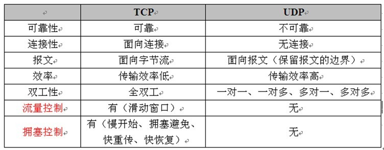

## tcp和udp
OSI 和 TCP/IP 模型在传输层定义两种传输协议：TCP（或传输控制协议）和 UDP（或用户数据报协议）。

 UDP 与 TCP 的主要区别在于 **UDP 不一定提供可靠的数据传输**。事实上，该协议不能保证数据准确无误地到达目的地。UDP 在许多方面非常有效。当某个程序的目标是尽快地传输尽可能多的信息时（其中任意给定数据的重要性相对较低），可使用 UDP。

  **TCP的目的是提供可靠的数据传输**，并在相互进行通信的设备或服务之间保持一个虚拟连接。TCP在数据包接收无序、丢失或在交付期间被破坏时，负责数据恢复。它通过为其发送的每个数据包提供一个序号来完成此恢复。记住，**较低的网络层会将每个数据包视为一个独立的单元，因此，数据包可以沿完全不同的路径发送**，即使它们都是同一消息的组成部分。这种路由与网络层处理分段和重新组装数据包的方式非常相似，只是级别更高而已。

  为确保正确地接收数据，TCP要求在目标计算机成功收到数据时发回一个确认（即 ACK）。如果在某个时限内未收到相应的 ACK，将重新传送数据包。如果网络拥塞，这种重新传送将导致发送的数据包重复。但是，接收计算机可使用数据包的序号来确定它是否为重复数据包，并在必要时丢弃它。

  如果比较UDP包和TCP包的结构，很明显UDP包不具备TCP包复杂的可靠性与控制机制。与TCP协议相同，UDP的源端口数和目的端口数也都支持一台主机上的多个应用。一个16位的UDP包包含了一个字节长的头部和数据的长度，校验码域使其可以进行整体校验。

  **当数据传输的性能必须让位于数据传输的完整性、可控制性和可靠性时，TCP协议是当然的选择**。当强调**传输性能**而不是传输的完整性时，如：**音频和多媒体应用**，UDP是最好的选择。在数据传输时间很短，以至于此前的连接过程成为整个流量主体的情况下，UDP也是一个好的选择，如：**DNS交换**。把SNMP建立在UDP上的部分原因是设计者认为当发生网络阻塞时，UDP较低的开销使其有更好的机会去传送管理数据。TCP丰富的功能有时会导致不可预料的性能低下，但是我们相信在不远的将来，TCP可靠的点对点连接将会用于绝大多数的网络应用。

  

  如图，实时性高的电话视频会议，音频多媒体等时间敏感应用，用udp比较好。文件传输，邮件，web文档，这些不能容忍数据丢失的，用tcp。

### 多路复用和多路分解
**多路复用multiplexing，多路分解demultiplexing.**

本质上就是个分门牌号和合并门牌号的过程。

多路复用就是将各个进程(不同套接字)交付来的网络包**封装传输层首部信息**(比如来源于哪个套接字)，封装成报文，交付给网络层。这个过程就是多路复用。

相反，将从网络层交付来的报文，按照传输层头部信息分派给不同的进程(套接字)，这个过程就是多路分解。

### 应用层的支持协议

### TCP和UDP的深入对比

#### 面向连接
TCP面向连接，UDP面向无连接（在默认的阻塞模式下）

在TCP协议中，当客户端退出程序或断开连接时，TCP协议的recv函数会立即返回不再阻塞，因为服务端自己知道客户端已经退出或断开连接，证明它是面向连接的；

而在UDP协议中，recvfrom这个接收函数将会始终保持阻塞，因为服务端自己不知道客户端已经退出或断开连接，证明它是面向无连接的）。

#### 面向字节流、面向报文
面向字节流：虽然应用程序和TCP的交互是一次一个数据块（大小不等），但TCP把应用程序看成是一连串的无结构的字节流。TCP有一个缓冲，当应用程序传送的数据块太长，TCP就可以把它划分短一些再传送。如果应用程序一次只发送一个字节，TCP也可以等待积累有足够多的字节后再构成报文段发送出去。

 面向报文：面向报文的传输方式是**应用层交给UDP多长的报文，UDP就照样发送**，即**一次发送一个报文**。因此，应用程序必须选择合适大小的报文。若报文太长，则IP层需要分片，降低效率。（谢希仁，第五版。UDP对应用层交下来的报文，既不合并，也不拆分，而是**保留这些报文的边界**。这也就是说，应用层交给UDP多长的报文，UDP就照样发送），即一次发送一个报文）。

#### 在默认的阻塞模式下，为什么说TCP无边界，UDP有边界

对于TCP协议，客户端连续发送数据，只要服务端的这个函数的缓冲区足够大，会一次性接收过来，即客户端是分好几次发过来，是有边界的，而服务端却一次性接收过来，所以证明是无边界的；

而对于UDP协议，客户端连续发送数据，即使服务端的这个函数的缓冲区足够大，也只会一次一次的接收，发送多少次接收多少次，即客户端分几次发送过来，服务端就必须按几次接收，从而证明，这种UDP的通讯模式是有边界的。
