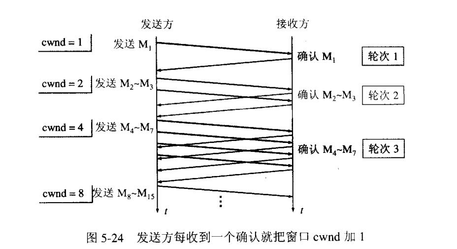
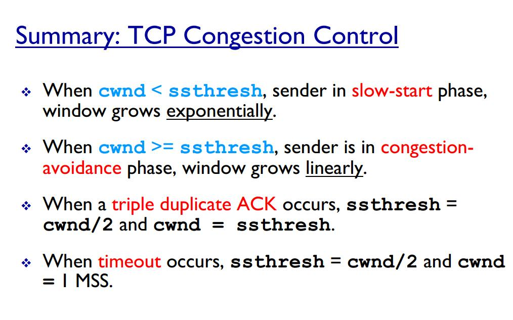

## TCP拥塞控制
tcp采用一些机制面对网络拥塞问题。拥塞控制是一个**全局性过程**。

为了**防止网络的拥塞现象**，TCP提出了一系列的拥塞控制机制。

最初由V. Jacobson在1988年的论文中提出的TCP的拥塞控制由 **“慢启动(Slow start)”和“拥塞避免(Congestion avoidance)”组成**。

后来TCP Reno版本中又针对性的加入了**“快速重传(Fast retransmit)”、“快速恢复(Fast Recovery)”算法**.

再后来在TCP NewReno中又对 **“快速恢复”算法进行了改进**

近些年又出现了**选择性应答( selective acknowledgement,SACK)算法**，还有其他方面的大大小小的改进，成为网络研究的一个热点。

zwlj:总结之后就是有：
 - 慢启动(Slow start)和拥塞避免(Congestion avoidance)
 - 快速重传(Fast retransmit)、快速恢复(Fast Recovery)算法
 - 快速恢复再改进
 - 最新的选择性应答( selective acknowledgement,SACK)算法

### 慢开始和拥塞避免
发送方**维持一个拥塞窗口 cwnd ( congestion window )的状态变量**。拥塞窗口的大小**取决于网络的拥塞程度**，并且动态地在变化。发送方让自己的**发送窗口等于拥塞窗口**。

**zwlj：实质上是让发送窗口=min(拥塞窗口,对方的接受窗口)**

发送方控制拥塞窗口的原则是：只要网络没有出现拥塞，拥塞窗口就再增大一些，以便把更多的分组发送出去。但只要网络出现拥塞，拥塞窗口就减小一些，以减少注入到网络中的分组数

#### 慢开始算法
现在并不清楚网络的负荷情况。较好的方法是先探测一下，即由小到大逐渐增大发送窗口。通常在刚刚开始发送报文段时，**先把拥塞窗口 cwnd 设置为一个最大报文段MSS的数值--也就是1**。而在每收到一个对新的报文段的确认后，把拥塞窗口增加**至多一个MSS的数值**。用这样的方法**逐步增大发送方的拥塞窗口 cwnd** ，可以使分组注入到网络的速率更加合理。

zwlj:这里有一点要注意，虽然拥塞窗口也就是发送窗口在增大，但是报文仍是以MSS为单位发送。所以发送窗口导致的是每次可以发送的报文段增多了。而定义上是，每收到一个**报文段**的确认，让阻塞窗口增加1个MSS。那么导致的结果则是每一轮**会使阻塞窗口倍增**,例:第一轮发了一个包，收回了一个ACK，阻塞窗口加1变成了2.第二轮发了2个包，收到了**2个ACK**，导致阻塞窗口+2也就是每轮都倍增。

如图，既能理解为什么阻塞窗口是每轮倍增了。

慢开始的“慢”并不是指cwnd的增长速率慢，而是指在TCP开始发送报文段时先设置cwnd=1，使得发送方在开始时只发送一个报文段（目的是试探一下网络的拥塞情况），然后再逐渐增大cwnd
为了防止拥塞窗口cwnd增长过大引起网络拥塞

##### 慢开始到达门限
还需要设置一个**慢开始门限ssthresh状态变量**。慢开始门限ssthresh的用法如下：
 - 当 cwnd < ssthresh 时，使用上述的慢开始算法
 - 当 cwnd > ssthresh 时，停止使用慢开始算法而改用拥塞避免算法
 - 当 cwnd = ssthresh 时，既可使用慢开始算法，也可使用拥塞控制避免算法

#### 拥塞避免算法
让拥塞窗口cwnd缓慢地增大，即每经过一个往返时间RTT就把发送方的拥塞窗口**cwnd加1**，而不是加倍。这样拥塞窗口cwnd按线性规律缓慢增长，比慢开始算法的拥塞窗口增长速率缓慢得多。

#### 拥塞处理
**无论在慢开始阶段还是在拥塞避免阶段**，只要发送方判断网络**出现拥塞**（其根据就是没有收到确认），就要**把慢开始门限ssthresh设置为出现拥塞时的发送方窗口值的一半**（但不能小于2）。然后把**拥塞窗口cwnd重新设置为1，执行慢开始算法**。这样做的目的就是要迅速减少主机发送到网络中的分组数，使得发生拥塞的路由器有足够时间把队列中积压的分组处理完毕

如下图，用具体数值说明了上述拥塞控制的过程。现在发送窗口的大小和拥塞窗口一样大

“拥塞避免”并非指完全能够避免了拥塞。利用以上的措施要完全避免网络拥塞还是不可能的。“拥塞避免”是说在拥塞避免阶段将拥塞窗口控制为按线性规律增长，使网络比较不容易出现拥塞

### 快重传和快恢复
如果发送方设置的超时计时器时限已到但还没有收到确认，那么很可能是网络出现了拥塞，致使报文段在网络中的某处被丢弃。这时，TCP马上把拥塞窗口 cwnd 减小到1，并执行慢开始算法，同时把慢开始门限值ssthresh减半。**这是不使用快重传的情况**

#### 快重传算法
快重传算法**首先要求接收方每收到一个失序的报文段后就立即发出重复确认**（为的是使发送方及早知道有报文段没有到达对方）而不要等到自己发送数据时才进行捎带确认。

zwlj:首先关闭流量控制中的捎带确认功能，要求立即发出确认。

接收方收到了M1和M2后都分别发出了确认。现在假定接收方没有收到M3但接着收到了M4。显然，接收方不能确认M4，因为M4是收到的失序报文段。根据可靠传输原理，接收方**可以什么都不做，也可以在适当时机发送一次对M2的确认**。但按照**快重传算法的规定，接收方应及时发送对M2的重复确认**，这样做可以让发送方及早知道报文段M3没有到达接收方。

快重传算法还规定，发送方只要**一连收到三个重复确认**就应当**立即重传对方尚未收到的报文段M3**，而不必继续等待M3设置的重传计时器到期。由于发送方尽早重传未被确认的报文段，因此采用快重传后可以使整个网络吞吐量提高约20%

#### 快恢复算法
快恢复算法，其过程有以下两个要点：

1. 当发送方连续收到三个重复确认，就执行“乘法减小”算法，把慢开始门限ssthresh减半。这是为了预防网络发生拥塞。请注意：**接下去不执行慢开始算法**。

2. 由于发送方现在认为网络**很可能没有发生拥塞**，因此与慢开始不同之处是现在不执行慢开始算法（即拥塞窗口cwnd现在不设置为1），而是**把cwnd值设置为慢开始门限ssthresh减半后的数值**，然后开始执行**拥塞避免算法-加法增大**，使拥塞窗口缓慢地线性增大。 下图给出了快重传和快恢复的示意图，并标明了“TCP Reno版本”。 区别：新的 TCP Reno 版本在快重传之后采用快恢复算法而不是采用慢开始算法。

在采用快恢复算法时，慢开始算法只是在TCP连接建立时和网络出现超时时才使用
采用这样的拥塞控制方法使得TCP的性能有明显的改进

#### 流程总结(zwlj)
也就是启用了快重传和快速恢复算法之后，流程相比于慢开始有了更新一步的改进。

在TCP连接建立和包超时的时候仍是使用慢开始算法，超过门限之后仍然是使用拥塞避免算法线性增加阻塞窗口。区别在于，**启用快重传并受到了连续3个确认的前提下**，出现拥塞之后，并不是重新执行慢开始，而是把cwnd重新设置成新门限ssthresh并再执行拥塞避免，这个过程也就是**快恢复**。

**由上图就知道流程被优化成了:慢开始->拥塞避免(到达门限)->门限减半处执行拥塞避免(收到3个重复确认被认为是拥堵，快恢复) || 超时则继续执行慢开始**

**超时和新连接建立时仍是使用慢开始，而收到3个重复确认而导致的拥堵，过程被优化为快恢复。**

### 快恢复改进和SACK算法(了解)
可以看出Reno的快速重传算法是针对一个包的重传情况的，然而在实际中，一个重传超时可能导致许多的数据包的重传，因此当多个数据包从一个数据窗口中丢失时并且触发快速重传和快速恢复算法时，问题就产生了。因此NewReno出现了，它在Reno快速恢复的基础上稍加了修改，可以恢复一个窗口内多个包丢失的情况。具体来讲就是：**Reno在收到一个新的数据的ACK时就退出了快速恢复状态了，而NewReno需要收到该窗口内所有数据包的确认后才会退出快速恢复状态，从而更一步提高吞吐量。**

SACK就是**改变TCP的确认机制**，最初的TCP只确认当前已连续收到的数据，**SACK则把乱序等信息会全部告诉对方，从而减少数据发送方重传的盲目性**。比如说序号1，2，3，5，7的数据收到了，那么普通的ACK只会确认序列号4，而SACK会把当前的5，7已经收到的信息在SACK选项里面告知对端，从而提高性能，**当使用SACK的时候，NewReno算法可以不使用**，因为SACK本身携带的信息就可以使得发送方有足够的信息来知道需要重传哪些包，而不需要重传哪些包。
