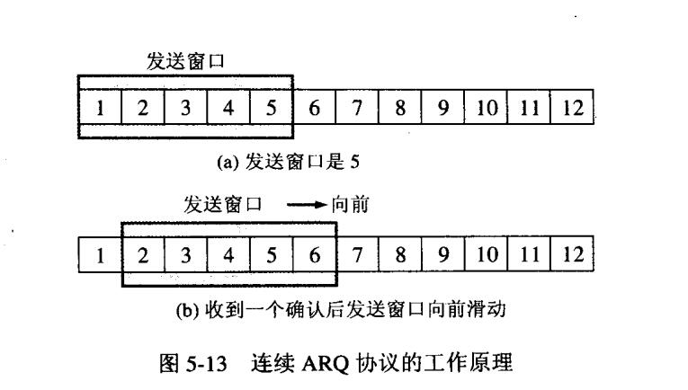
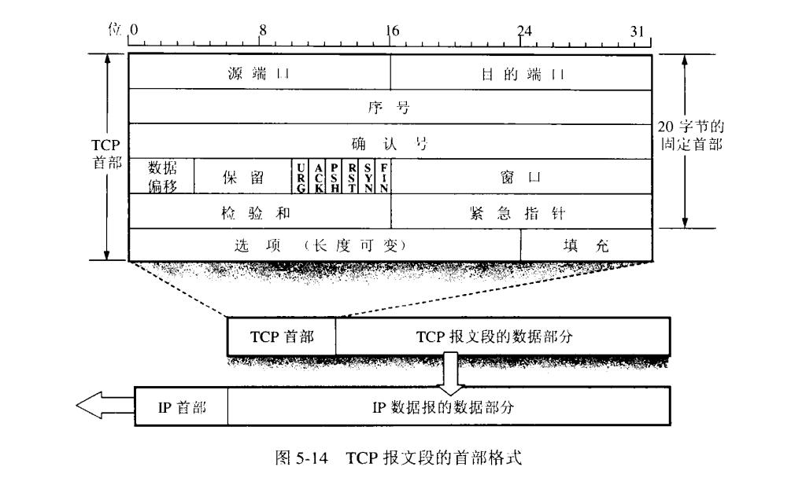

## tcp协议详解
根据tcp和udp协议的笔记，我们知道了tcp和udp的关键区别就是，tcp是个可靠的传输协议。那么什么是可靠的传输协议呢？

### 什么是可靠的传输协议
最理想的传输有**两个特点**：
 - 传输信道不产生差错(**内容和顺序都正确**)；
 - 不管发送方是否降低发送数据的速度，不需要采取任何措施就能够实现可靠传输。

也就是要保证两点，**传输不出差错，还有就是解决传输过程中的丢包问题**。

然而实际中的网络并不能够达到这种理想的状态，但我们可以通过使用一些可靠传输的协议去处理这些问题，比如规定如果发现发送的数据发生错误时让发送方重新发送，这样的协议有停止等待协议、连续ARQ协议等。

### 保证可靠性的机制

#### 停止等待协议(不使用)

最开始设计的简单协议就是**停止等待协议stop-and-wait protocol**，也就是发送方发送一个分组，在收到对方确认之前我停止发送下一个分组，进行等待。如果没收到确认则**超时重传**

显然这种一次只发一个分组，然后等待的方法效率太低了。在现代网络产生拥阻的情况下非常难受。性能非常糟糕。所以**现在传输层，不会使用这种协议**。

#### 连续ARQ协议

##### 流水线改进停止等待协议

前面我们提到了停止等待协议的缺点，一次只发送一个分组效率太低。

所以我们就需要使用**流水线pipelining**的方式，一次传输多个分组。所以我们需要解决的问题就是，怎样有序的保证对面正确有序的接受了你连续发过去的东西。这也是个管理ACK(确认)的问题。

使用流水线机制，那么解决流水线差错恢复则有两种机制可以解决。一个是**选择重传，一个是回退N**，当然，使用流水线机制的话，收发双发都会采用滑动窗口的收发机制。

###### ARQ协议
在讲连续ARQ之前，我们还先要知道ARQ协议是什么。

**ARQ协议，即Automatic Repeat reQuest自动重传请求协议**，核心其实就是围绕重传这个操作。一旦对方没有发来确认(可能中途丢包，也可能出差错被对方丢弃)，则超时重传。还有，**接收方收到重复的包(可能确认丢失)，也重传确认**。

##### 滑动窗口机制
在提到上面所说的回退N和选择重传之前。先看下连续ARQ采用滑动窗口机制，收发双发在缓存中都是维护一个窗口，用来接收和发送字节流。

如图所示，收到确认以后，就按照相应的机制向前滑动。

##### 回退N
**回退N，即Go-Back-N,也叫GBN**。

结合刚才的滑动窗口，在这种机制下：

首先，接收方，只对**按序到达的最后一个分组发出确认**，**累计确认**，累计一定按序在合适的时候发回确认。

其次，发送方**只对这个按序收到的确认**向前滑动，则是回退窗口。

比如，我发送了12345，对面重传了1245,没有3的确认。那我就只把窗口滑到3，**重传3以后的所有字节，也就是345**.这相当于我先滑了5，然后回退2格。这就是回退N机制。

**优点是实现简单**，不需要缓存失序的分组，但是**缺点**也是显而易见的，就那是**浪费**。发送方无法完整的知道接收方的接受情况，比如根本不知道对方是否接受了4和5，只知道对面3没收到。相当于要**退回去重传丢失数据后面所有的字节**。在通信质量不好的时候，很影响性能。

##### 选择重传
由于回退N不缓存失序分组，每次一个分组的丢失可能导致其后大量分组的重传，在网络质量不好的情况下，流水线很容易被这些大量重传的分组填满。

那么**选择重传SR select repeat**，就是只让发送方发送它怀疑对面丢失的分组。对于未按序到达的分组，接收方把它们全部缓存起来，对所有收到的分组都发出确认。

选择重传基于SACK机制,事实上要记录丢失分组的边界会大大增加TCP宝header的字节数大小。

所以TCP具体如何实现还要视具体情况确定，因为**无明确规定**，既有可能是**回退N也有可能是选择重传，也有可能是两种的混合**。

#### 总结
由此我们也可以得知，TCP为了保证可靠性，**运用了连续ARQ+滑动窗口机制，控制分组丢失使用的机制是回退N或者是选择重传**。

### TCP报文格式

TCP报文格式如下图所示。

前面4个字节是源端口，目的端口不用说了。

#### 序号
占4字节，TCP是面向字节流的，这里记录的是本次报文发送的**第一个字节的序号**。

#### 确认号
占4字节，**期望收到的对方的下一个报文的第一个字节序号**。

#### 数据偏移
占4位，表明数据部分距离起始处有多远，实际上**就是指出这个分组TCP header的实际大小**

这里注意，是以4个字节为单位的。比如数据偏移是1111(十进制15)的话，15*4=60字节。可得头部为60字节。**同时我们也知道了TCP头部最大为60字节，除去常规的20字节，即选项(变长头部)长度最大为40字节。**

#### 保留
给以后用的，全置0.

#### 紧急URG
用来插队，即让这个分组可以在缓存中被优先读取。

跟紧急指针配合使用

#### ACK
ACK为1时，确认号才有效。

TCP规定建立连接后所有分组的ACK都要置1.

#### PSH
push，收到这个字段以后，将会“尽快”创建成一个报文段发出。对方也会“尽快”创建成一个报文段交付给进程。

解决的问题是，**不需要等缓存满了再向上交付**

#### RST
要求释放连接并重新再握手创建连接。

#### SYN
同步位，用来同步的时候用。

#### FIN
要求释放连接

#### 窗口字段
这里是告诉对方，自己的**接受窗口**大小，切勿弄错。

#### 校验和
顾名思义，用来差错检测。

#### 紧急指针
配合URG使用，指出紧急数据的字节数。

#### 选项
变长头部数据，根据数据偏移字段可知，最长可达40字节。

选项有几种数据可以指定，比如MSS，SACK(用于选择重传)等

这里说一说MSS

##### MSS(Maximum Segment size)最大报文段长度
顾名思义，就是整个报文，**除去头部的数据部分的长度**。

因为tcp报文大的话，会导致IP层分片，太小的话，头部又成了主要传输对象，传输效率低，所以指定一个合适的MSS很重要。

不指定的话，默认是**536字节**
